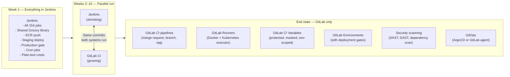

# CI/CD Migration Lab — Jenkins to GitLab


## 8 Years of Jenkins. 150 Jobs. 2 People Who Understand It.

---

> **Lumio — B2B SaaS, 120 engineers, Series C.**
>
> Lumio builds workflow automation software for mid-market companies. For eight years, they have run everything through a single Jenkins controller: builds, tests, Docker image pushes, staging deployments, production releases, database migrations, scheduled reports. It worked. They shipped.
>
> Now the cracks are showing. The Jenkins controller is a 4-core VM that the ops team is scared to touch because the last upgrade broke 23 pipelines and the rollback took six hours. There are 154 jobs spread across three folders no one fully understands. The shared library is 12,000 lines of Groovy that two engineers wrote over three years — and one of them just accepted an offer elsewhere. The other is burned out and has asked to be reassigned.
>
> New engineers spend their first week just trying to understand Jenkinsfiles. Security audit flagged that credentials are stored as plain text in 14 jobs. The DevEx team ran a survey: CI/CD is the number one developer pain point for the third quarter in a row.
>
> The VP of Engineering made the call: migrate to GitLab CI/CD.
>
> The mandate: *"Move everything to GitLab CI. Make pipelines self-service. Make secrets secure. Keep shipping — we cannot pause releases for a migration."*

---

## What makes this lab different

Most CI/CD tutorials start from scratch. This lab simulates a **real migration** — existing jobs, existing Groovy DSL, existing shared libraries, existing credentials, existing deployment workflows. You cannot rewrite everything at once. Releases must keep shipping while you migrate.

You will learn GitLab CI the way you learn it in a job: by translating something that already works into something better, one pipeline at a time.

Every phase solves a real migration problem: how do you move a parameterized build? A shared library? A deployment gate with manual approval? A cron job? A Docker build with registry authentication? You will answer each of these in order.

---

## The starting point — what Lumio has today

Lumio runs a Jenkins controller with the following setup:

```
jenkins/
├── jobs/
│   ├── lumio-api/
│   │   ├── Jenkinsfile              # Main API build, test, push
│   │   ├── Jenkinsfile.deploy       # Deploy to staging/prod with manual gate
│   │   └── Jenkinsfile.db-migrate   # Flyway database migration job
│   ├── lumio-frontend/
│   │   ├── Jenkinsfile              # React build, Lighthouse audit, S3 push
│   │   └── Jenkinsfile.e2e          # Playwright E2E against staging
│   ├── lumio-worker/
│   │   └── Jenkinsfile              # Background job processor build + deploy
│   └── infrastructure/
│       ├── Jenkinsfile.terraform    # Terraform plan/apply with approval gate
│       └── Jenkinsfile.nightly      # Nightly cleanup and cost reports
├── shared-library/
│   ├── vars/
│   │   ├── buildDocker.groovy       # Standard Docker build + ECR push
│   │   ├── deployToEnv.groovy       # Parameterized deploy wrapper
│   │   ├── runTests.groovy          # Test runner with JUnit reporting
│   │   └── notifySlack.groovy       # Slack notifications
│   └── src/
│       └── com/lumio/
│           ├── DockerUtils.groovy
│           ├── AwsUtils.groovy
│           └── SecretsUtils.groovy
└── credentials/
    └── (14 jobs with plain-text credentials in job config XML)
```

Jenkins plugins in use: 47. Plugins with security advisories pending: 11. Last time a plugin was updated: 4 months ago, and it broke the Slack integration for a week.

**The migration is not a rewrite. It is a parallel run: GitLab CI takes over one pipeline at a time, Jenkins is decommissioned only when the last job is gone.**

---

## Migration strategy — the Parallel Run pattern

Rather than a big-bang cutover, Lumio migrates one pipeline at a time while both systems run. Each pipeline gets:
1. A `.gitlab-ci.yml` equivalent written and tested in GitLab
2. A validation period where both pipelines run on every commit
3. A cutover date where Jenkins is disabled for that job
4. Removal from Jenkins once the GitLab version has been stable for two weeks



---

## Phases at a glance

| Phase | Title | What you migrate or build | Key GitLab CI concepts |
|---|---|---|---|
| 0 | Meet Jenkins | Run Lumio's Jenkins setup locally, understand what exists | Docker, Jenkins, Groovy DSL |
| 1 | GitLab Foundations | Set up GitLab (self-managed or .com), configure a project, first `.gitlab-ci.yml` | Pipelines, jobs, stages, runners |
| 2 | Pipeline Anatomy | Translate a basic Jenkinsfile line by line | `script`, `before_script`, `artifacts`, `rules` |
| 3 | Shared Libraries → `include` | Replace Groovy shared library calls with GitLab CI templates | `include`, `extends`, YAML anchors |
| 4 | Parallel Stages | Multi-stage build with parallel test jobs and fan-in | `needs`, `parallel`, `dependencies` |
| 5 | Secrets and Variables | Move credentials from Jenkins to GitLab CI variables | CI/CD variables, `vault` integration, masked/protected |
| 6 | Docker Build and Registry | Migrate Docker build jobs to GitLab with GitLab Container Registry | Docker-in-Docker, Kaniko, GitLab registry |
| 7 | Environments and Deployment Gates | Staging and production deploy pipelines with manual approval | `environment`, `when: manual`, protected environments |
| 8 | GitLab-Native Features | Security scanning, MR pipelines, Auto DevOps | SAST, DAST, dependency scanning, MR approval rules |
| 9 | GitLab Runners | Replace Jenkins agents with self-managed runners | Runner types, Kubernetes executor, runner autoscaling |
| 10 | GitOps and Infrastructure | Migrate Terraform and deployment jobs to GitLab | GitLab agent for Kubernetes, `terraform` CI/CD, environments |
| 11 | Observability | Pipeline metrics, failure analysis, cost per pipeline | Pipeline analytics, Prometheus, Grafana |
| 12 | Capstone — Decommission Jenkins | Final cutover: disable Jenkins, validate 100% GitLab, document the migration | Full parallel run teardown |

---

## Prerequisites

| Tool | Purpose |
|---|---|
| `docker` + `docker compose` | Run Jenkins and GitLab locally in Phase 0 and 1 |
| `git` | Version control — GitLab CI is triggered by git events |
| `gitlab-runner` | Install and register local runners for Phase 9 |
| `terraform` 1.7+ | Infrastructure pipelines in Phase 10 |
| `kubectl` | Kubernetes runner executor in Phase 9 |
| `helm` | Install GitLab Runner on Kubernetes |

**GitLab options:**
- **GitLab.com (recommended for most phases):** Free tier is sufficient through Phase 8. Ultimate trial covers SAST/DAST in Phase 8.
- **Self-managed (Phase 1 option):** Run GitLab Community Edition locally with Docker Compose. Requires 8 GB RAM minimum.

**No prior GitLab experience required.** No prior Jenkins expertise required either — Phase 0 walks you through the existing setup so you understand what you are migrating before you migrate it.

---

## The Groovy-to-YAML translation guide

The single most common migration task is reading a Jenkinsfile and writing the GitLab CI equivalent. Here is the conceptual map:

| Jenkins concept | GitLab CI equivalent | Notes |
|---|---|---|
| `pipeline {}` | Top-level `.gitlab-ci.yml` | GitLab has no wrapper block |
| `stage('Build')` | `stages: [build]` + job with `stage: build` | Stages declared separately |
| `steps { sh '...' }` | `script: [...]` | Direct shell in the job |
| `agent any` | Runner tag or `image:` | GitLab CI is always containerized |
| `agent { docker { image '...' } }` | `image: ...` | Per-job container image |
| `environment { FOO = 'bar' }` | `variables: FOO: bar` | Global or per-job |
| `when { branch 'main' }` | `rules: - if: $CI_COMMIT_BRANCH == "main"` | More expressive rules |
| `parameters {}` | `variables:` with `when: manual` trigger | Or pipeline schedules |
| `input 'Deploy?'` | `when: manual` on job | Manual approval gate |
| `@Library('shared-lib')` | `include: project: .../templates` | Or local `include:` |
| `parallel { stage('A') ... }` | `needs: []` with same stage | Fan-out pattern |
| `post { always { ... } }` | `after_script:` or `when: always` job | Per-job or pipeline-level |
| `archiveArtifacts` | `artifacts: paths:` | Native in GitLab CI |
| `junit 'results.xml'` | `artifacts: reports: junit:` | Auto-parsed in MR |
| `withCredentials([...])` | CI/CD Variables (masked/protected) | Never in plaintext |
| `cron('0 2 * * *')` | Pipeline schedules in UI or API | Or `rules: - if: $CI_PIPELINE_SOURCE == "schedule"` |

---

## Phase instructions

Each phase has its own folder with full instructions, a Jenkinsfile to migrate, the target `.gitlab-ci.yml`, validation steps, and a "what could go wrong" section.

| Phase | Folder |
|---|---|
| 0 — Meet Jenkins | [phase-0-meet-jenkins/](phase-0-meet-jenkins/README.md) |
| 1 — GitLab Foundations | [phase-1-gitlab-foundations/](phase-1-gitlab-foundations/README.md) |
| 2 — Pipeline Anatomy | [phase-2-pipeline-anatomy/](phase-2-pipeline-anatomy/README.md) |
| 3 — Shared Libraries | [phase-3-shared-libraries/](phase-3-shared-libraries/README.md) |
| 4 — Parallel Stages | [phase-4-parallel-stages/](phase-4-parallel-stages/README.md) |
| 5 — Secrets and Variables | [phase-5-secrets-variables/](phase-5-secrets-variables/README.md) |
| 6 — Docker and Registry | [phase-6-docker-registry/](phase-6-docker-registry/README.md) |
| 7 — Environments and Gates | [phase-7-environments/](phase-7-environments/README.md) |
| 8 — GitLab-Native Features | [phase-8-gitlab-native/](phase-8-gitlab-native/README.md) |
| 9 — GitLab Runners | [phase-9-runners/](phase-9-runners/README.md) |
| 10 — GitOps and Infrastructure | [phase-10-gitops/](phase-10-gitops/README.md) |
| 11 — Observability | [phase-11-observability/](phase-11-observability/README.md) |
| 12 — Capstone: Decommission Jenkins | [phase-12-capstone/](phase-12-capstone/README.md) |

---

## Repository structure

```
cicd-migration-lab-jenkins-to-gitlab/
├── lumio-app/                        # Sample application — what Lumio ships
│   ├── api/                          # Node.js API (the main service)
│   │   ├── src/
│   │   ├── Dockerfile
│   │   └── package.json
│   ├── frontend/                     # React frontend
│   │   ├── src/
│   │   └── Dockerfile
│   ├── worker/                       # Background job processor
│   │   └── Dockerfile
│   └── docker-compose.yml           # Run the full stack locally
├── jenkins/                         # Starting state — Jenkins setup
│   ├── docker-compose.yml           # Jenkins + agent with Docker
│   ├── casc/                        # Jenkins Configuration as Code (JCasC)
│   │   └── jenkins.yaml
│   ├── jobs/                        # All 154 Jenkinsfiles (representative set)
│   │   ├── lumio-api/
│   │   │   ├── Jenkinsfile
│   │   │   ├── Jenkinsfile.deploy
│   │   │   └── Jenkinsfile.db-migrate
│   │   ├── lumio-frontend/
│   │   │   ├── Jenkinsfile
│   │   │   └── Jenkinsfile.e2e
│   │   ├── lumio-worker/
│   │   │   └── Jenkinsfile
│   │   └── infrastructure/
│   │       ├── Jenkinsfile.terraform
│   │       └── Jenkinsfile.nightly
│   └── shared-library/              # The 12,000-line Groovy library
│       ├── vars/
│       │   ├── buildDocker.groovy
│       │   ├── deployToEnv.groovy
│       │   ├── runTests.groovy
│       │   └── notifySlack.groovy
│       └── src/com/lumio/
│           ├── DockerUtils.groovy
│           ├── AwsUtils.groovy
│           └── SecretsUtils.groovy
├── gitlab/                          # End state — GitLab CI setup
│   ├── templates/                   # Reusable CI templates (replaces shared library)
│   │   ├── docker-build.yml
│   │   ├── deploy.yml
│   │   ├── test.yml
│   │   └── notify.yml
│   └── runners/                     # Runner configuration
│       ├── docker-compose.yml       # Local runner for Phase 9
│       └── helm/                    # Kubernetes runner chart values
├── phase-0-meet-jenkins/
├── phase-1-gitlab-foundations/
├── phase-2-pipeline-anatomy/
├── phase-3-shared-libraries/
├── phase-4-parallel-stages/
├── phase-5-secrets-variables/
├── phase-6-docker-registry/
├── phase-7-environments/
├── phase-8-gitlab-native/
├── phase-9-runners/
├── phase-10-gitops/
├── phase-11-observability/
├── phase-12-capstone/
└── README.md
```

---

## GitLab certifications and learning path

| Certification / Path | After completing | Key coverage in this lab |
|---|---|---|
| **GitLab Certified CI/CD Associate** | Phase 7 | Pipelines, jobs, stages, rules, artifacts, environments, manual gates |
| **GitLab Certified CI/CD Specialist** | Phase 9 | Runners, executors, caching, Docker-in-Docker, Kubernetes executor |
| **GitLab Certified Security Specialist** | Phase 8 | SAST, DAST, dependency scanning, container scanning, MR approval rules |
| **GitLab Certified GitOps Associate** | Phase 10 | GitLab agent for Kubernetes, environment tracking, Terraform integration |

---

## How this lab compares to the others

| | Jenkins to GitLab Migration Lab | AWS Cloud Migration Lab | GKE Platform Engineering Lab |
|---|---|---|---|
| **Starting point** | An existing CI/CD setup with accumulated debt | An existing monolithic application | Blank repository |
| **Theme** | Migrate and modernize CI/CD | Migrate and modernize infrastructure | Build a platform from scratch |
| **Migration pattern** | Parallel run (both systems live during migration) | Strangler Fig (traffic shifted incrementally) | Greenfield build |
| **Key challenge** | Groovy-to-YAML translation, credential security, runner management | AWS service mapping, cost control, zero-downtime migration | Kubernetes mastery, GitOps discipline |
| **Certification target** | GitLab CI/CD Associate, Specialist, Security Specialist | AWS SAA, DVA, SOA, SAP | CKA, CKS |
| **Infrastracture cost** | Near zero (GitLab.com free tier, local Docker) | $3–36/day (AWS resources) | $5–20/day (GKE cluster) |

---

## A note on the Groovy debt

One of the subtler lessons in this lab is about the nature of CI/CD complexity. Jenkins shared libraries let engineers build powerful abstractions — but those abstractions accumulate. When the engineers who wrote them leave, the library becomes archaeology.

GitLab CI uses YAML, not a general-purpose language. That is both its constraint and its virtue. You cannot build a 12,000-line YAML library the same way you can build a 12,000-line Groovy one — not because YAML is less capable, but because its declarative nature limits the depth of abstraction you can accidentally create. Pipelines stay readable. New engineers can understand them in an afternoon.

The migration is not just a syntax change. It is a reduction in complexity that will outlast the effort of the migration itself.

---

*Inspired by the [AWS Cloud Migration Lab](../cloud-migration-lab-aws) and the [GKE Platform Engineering Lab](../platform-engineering-lab-gke).*
