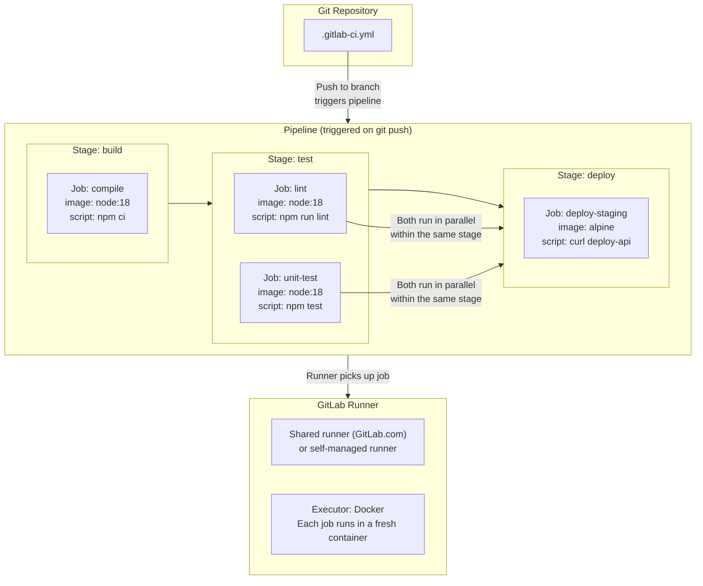
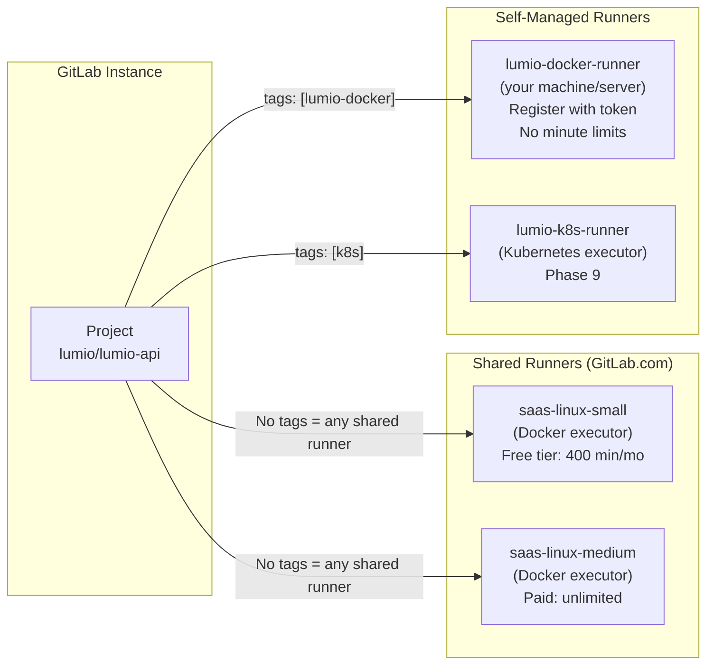
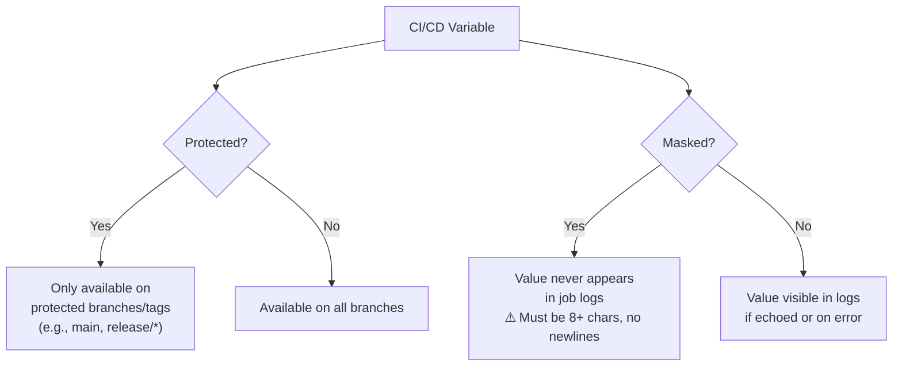

# Phase 1 — GitLab Foundations

> **GitLab CI concepts introduced:** Pipelines, Jobs, Stages, Runners, `.gitlab-ci.yml` | **Cost:** $0 (GitLab.com free tier)

---

## The Problem

You cannot migrate Lumio's pipelines to GitLab CI without first having a working GitLab setup. Before writing a single line of YAML, you need to answer:

1. Where will GitLab run — GitLab.com or self-managed?
2. How does a GitLab project relate to a Jenkins folder?
3. What does a minimal `.gitlab-ci.yml` look like, and how do you trigger it?
4. Where do pipelines run — who provides the runners?
5. How do you configure variables that pipelines can read?

This phase establishes the GitLab foundation. By the end, you will have a GitLab project for `lumio-api`, a working pipeline that passes, and a clear mental model of how GitLab CI is structured.

No Jenkins content from here onward — except for comparison.

---

## Option A — GitLab.com (Recommended)

GitLab.com provides free shared runners, free storage for container images, and enough free CI minutes per month for this entire lab. No infrastructure to manage.

1. Create an account at [https://gitlab.com](https://gitlab.com) if you do not have one.
2. Create a new group called `lumio` (or use your personal namespace).
3. Proceed to Challenge 1.

## Option B — Self-Managed GitLab with Docker Compose

If you need GitLab to run entirely locally (air-gapped environment, proxy restrictions, or just want to see the full stack), use this setup.

> **Requirements:** 8 GB RAM minimum. The first start takes 5–10 minutes.

```yaml
# gitlab/docker-compose.yml
version: "3.8"

services:
  gitlab:
    image: gitlab/gitlab-ce:latest
    container_name: lumio-gitlab
    restart: unless-stopped
    hostname: "localhost"
    ports:
      - "8929:8929"   # HTTP — access at http://localhost:8929
      - "8443:443"    # HTTPS (optional, needs cert config)
      - "2222:22"     # SSH for git operations
    environment:
      GITLAB_OMNIBUS_CONFIG: |
        external_url 'http://localhost:8929'
        gitlab_rails['gitlab_shell_ssh_port'] = 2222
        # Disable unused services to reduce RAM usage
        prometheus_monitoring['enable'] = false
        alertmanager['enable'] = false
        node_exporter['enable'] = false
        redis_exporter['enable'] = false
        postgres_exporter['enable'] = false
        gitlab_exporter['enable'] = false
        grafana['enable'] = false
    volumes:
      - gitlab_config:/etc/gitlab
      - gitlab_logs:/var/log/gitlab
      - gitlab_data:/var/opt/gitlab
    shm_size: "256m"

  gitlab-runner:
    image: gitlab/gitlab-runner:latest
    container_name: lumio-gitlab-runner
    restart: unless-stopped
    volumes:
      - /var/run/docker.sock:/var/run/docker.sock
      - runner_config:/etc/gitlab-runner
    depends_on:
      - gitlab

volumes:
  gitlab_config:
  gitlab_logs:
  gitlab_data:
  runner_config:
```

```bash
cd gitlab
docker compose up -d
# Wait for GitLab to start (watch for "gitlab Reconfigured!" in logs)
docker compose logs -f gitlab | grep -E "(Reconfigured|ERROR)"
```

Expected output after ~5 minutes:

```
lumio-gitlab  | gitlab Reconfigured!
```

Get the initial root password:

```bash
docker exec lumio-gitlab cat /etc/gitlab/initial_root_password
```

Access GitLab at [http://localhost:8929](http://localhost:8929) — log in with `root` and the password above.

---

## The Anatomy of a GitLab CI Pipeline

Before writing any YAML, understand how GitLab CI is structured:



Key differences from Jenkins you will notice immediately:

| Concept | Jenkins | GitLab CI |
|---|---|---|
| Where config lives | Job config in Jenkins UI or SCM | Always in `.gitlab-ci.yml` in the repo |
| Trigger | Webhook or polling | Every push, automatically |
| Agent selection | `agent { label 'docker-agent' }` | Runner tags or `image:` |
| Stage definition | `stage('Build') { steps { ... } }` | Stages declared in a list; jobs reference them |
| Container per job | Optional (via Docker agent) | Default — every job is a container |

---

## Challenge 1 — Create a GitLab Project for `lumio-api`

**Goal:** Create the GitLab project that will host `lumio-api`'s CI pipeline and understand how it maps to the Jenkins folder structure.

### Steps

**1. Create the project via the GitLab UI.**

- Navigate to your group (e.g., `https://gitlab.com/lumio`)
- Click **New project** → **Create blank project**
- Project name: `lumio-api`
- Visibility: Private
- Uncheck "Initialize repository with a README" (you will push the existing app)
- Click **Create project**

Alternatively, use the `glab` CLI:

```bash
# Install glab: https://gitlab.com/gitlab-org/cli
glab auth login

glab project create lumio-api \
  --group lumio \
  --private \
  --no-readme
```

Expected output:

```
✓ Created project lumio/lumio-api
  Git URL: https://gitlab.com/lumio/lumio-api.git
```

**2. Push the application code to the new project.**

```bash
cd lumio-app/api

git init
git remote add origin https://gitlab.com/lumio/lumio-api.git
git add .
git commit -m "initial: add lumio-api source"
git push -u origin main
```

**3. Understand the project structure vs Jenkins.**

| Jenkins concept | GitLab equivalent |
|---|---|
| Jenkins folder `lumio-api/` | GitLab group `lumio/` |
| Jenkins job `lumio-api-build` | GitLab CI job `build` in `.gitlab-ci.yml` |
| Jenkins job `lumio-api-deploy-staging` | GitLab CI job `deploy-staging` with `environment: staging` |
| Jenkins job `lumio-api-db-migrate` | GitLab CI job `db-migrate` with `when: manual` |
| Jenkins shared library | GitLab CI templates project (Phase 3) |
| Jenkins credentials store | GitLab CI variables (Phase 5) |

**4. Configure project-level settings** — navigate to **Settings → General → Visibility** and confirm the project is private. Navigate to **Settings → CI/CD** and confirm pipelines are enabled.

---

## Challenge 2 — Write Your First `.gitlab-ci.yml`

**Goal:** Create a "hello world" pipeline with three stages, push it, and watch it run.

### Steps

**1. Create `.gitlab-ci.yml` at the root of the `lumio-api` repository.**

```yaml
# .gitlab-ci.yml — hello world pipeline for lumio-api

stages:
  - build
  - test
  - deploy

build-job:
  stage: build
  image: node:18-alpine
  script:
    - echo "Stage: build"
    - node --version
    - echo "Building lumio-api..."
    - echo "Build complete."

test-job:
  stage: test
  image: node:18-alpine
  script:
    - echo "Stage: test"
    - echo "Running tests for lumio-api..."
    - echo "All tests passed."

deploy-job:
  stage: deploy
  image: alpine:3.19
  script:
    - echo "Stage: deploy"
    - echo "Deploying lumio-api to staging..."
    - echo "Deploy complete."
```

**2. Commit and push.**

```bash
git add .gitlab-ci.yml
git commit -m "ci: add hello world pipeline"
git push
```

**3. Navigate to the pipeline in the GitLab UI.**

In your project: **Build → Pipelines**. You should see a new pipeline running. Click on it to see the stage breakdown.

Click on `build-job` to see the live log output:

```
Running with gitlab-runner 16.8.0 (c6e7ad39)
  on blue-3.saas-linux-small-amd64.runners-manager.gitlab.com/default XxUrkriX
Preparing the "docker+machine" executor
Using Docker executor with image node:18-alpine ...
Pulling docker image node:18-alpine ...
Using docker image sha256:... for node:18-alpine with digest node@sha256:...

Running on runner-XxUrkriX-project-1234-concurrent-0 via runner-XxUrkriX-... 
Executing "step_script" stage of the job script

$ echo "Stage: build"
Stage: build
$ node --version
v18.19.1
$ echo "Building lumio-api..."
Building lumio-api...
$ echo "Build complete."
Build complete.
Job succeeded
```

**4. Observe the pipeline status icons.** Each stage shows a colored circle:
- Green checkmark: passed
- Red X: failed
- Yellow spinner: running
- Gray circle: pending / not yet started

**5. Navigate back to the pipeline view** and observe that `test-job` only started *after* `build-job` completed successfully. `deploy-job` started only after `test-job` completed. This is stage ordering.

---

## Challenge 3 — Understand Runners

**Goal:** Identify which runners are available for your project and understand the difference between shared runners and self-managed runners.

### Steps

**1. Check which runners are available for your project.**

Navigate to **Settings → CI/CD → Runners**.

On GitLab.com you will see:

```
Available shared runners (3 available)

  blue-3.saas-linux-small-amd64.runners-manager.gitlab.com
  ✓ Active  |  Linux  |  Docker  |  Tags: (none)

  saas-linux-medium-amd64.runners-manager.gitlab.com
  ✓ Active  |  Linux  |  Docker  |  Tags: (none)

  saas-macos-medium-m1.runners-manager.gitlab.com
  ✓ Active  |  macOS  |  Shell  |  Tags: saas-macos-medium-m1
```

**2. Understand runner types.**



| Runner type | When to use | Cost |
|---|---|---|
| Shared runners (GitLab.com) | Most jobs in this lab (Phases 1–8) | Free up to 400 min/month |
| Self-managed — Docker executor | When you need custom images, more RAM, no minute limits | Your infrastructure |
| Self-managed — Kubernetes executor | Production runner setup, autoscaling | Phase 9 |

**3. Check runner tags in a job.** If a job has no `tags:` key, it runs on any available runner. If it specifies `tags: [docker]`, only runners with that tag will pick it up.

```yaml
# Job with no tag — runs on any shared runner
build-job:
  stage: build
  image: node:18-alpine
  script:
    - npm ci

# Job that requires a specific runner tag
build-job-self-managed:
  stage: build
  image: node:18-alpine
  tags:
    - lumio-docker
  script:
    - npm ci
```

**4. (Optional) Register a self-managed runner for your project.**

```bash
# Install gitlab-runner locally
# macOS: brew install gitlab-runner
# Linux: https://docs.gitlab.com/runner/install/linux-repository.html

# Get the registration token from: Settings → CI/CD → Runners → New project runner
gitlab-runner register \
  --non-interactive \
  --url "https://gitlab.com" \
  --token "glrt-YOUR_TOKEN_HERE" \
  --executor "docker" \
  --docker-image "alpine:3.19" \
  --description "lumio-local-runner" \
  --tag-list "lumio-docker,local"
```

Expected output:

```
Runner registered successfully. Feel free to start it, but if it's running
already the config should be automatically reloaded!
```

---

## Challenge 4 — Configure CI/CD Variables

**Goal:** Add project-level CI/CD variables and understand masked vs protected vs plain.

### Steps

**1. Navigate to CI/CD variables in the GitLab UI.**

**Settings → CI/CD → Variables → Add variable**

Add the following variables:

| Key | Value | Type | Protected | Masked | Scope |
|---|---|---|---|---|---|
| `APP_NAME` | `lumio-api` | Variable | No | No | All |
| `DOCKER_REGISTRY` | `registry.gitlab.com` | Variable | No | No | All |
| `NODE_ENV` | `test` | Variable | No | No | All |

**2. Understand the variable flags.**



| Flag | Use for | Example |
|---|---|---|
| Plain | Non-sensitive config | `APP_NAME=lumio-api` |
| Masked | Secrets that should never appear in logs | `DB_PASSWORD`, webhook URLs |
| Protected + Masked | Production secrets that should only run on protected branches | `PROD_DEPLOY_TOKEN` |

**3. Use a variable in a job.** Update `.gitlab-ci.yml`:

```yaml
build-job:
  stage: build
  image: node:18-alpine
  variables:
    CACHE_KEY: "lumio-api-${CI_COMMIT_REF_SLUG}"
  script:
    - echo "App name: $APP_NAME"          # from project variable
    - echo "Registry: $DOCKER_REGISTRY"   # from project variable
    - echo "Branch: $CI_COMMIT_BRANCH"    # built-in GitLab CI variable
    - echo "Commit SHA: $CI_COMMIT_SHA"   # built-in GitLab CI variable
```

**4. Push and check the job output.**

Expected log output:

```
$ echo "App name: $APP_NAME"
App name: lumio-api
$ echo "Registry: $DOCKER_REGISTRY"
Registry: registry.gitlab.com
$ echo "Branch: $CI_COMMIT_BRANCH"
Branch: main
$ echo "Commit SHA: $CI_COMMIT_SHA"
Commit SHA: a3f8d21c9e4b7f1a2e5d8c3b6f0a9e2d5c8b1f4a
```

**5. Reference GitLab's predefined CI/CD variables** — GitLab provides 50+ variables automatically in every job. The most useful ones during migration:

| Variable | Value example | Jenkins equivalent |
|---|---|---|
| `CI_COMMIT_SHA` | `a3f8d21c...` | `$GIT_COMMIT` |
| `CI_COMMIT_SHORT_SHA` | `a3f8d21c` | `${GIT_COMMIT[0..7]}` |
| `CI_COMMIT_BRANCH` | `main` | `$BRANCH_NAME` |
| `CI_COMMIT_TAG` | `v1.4.2` | `$TAG_NAME` |
| `CI_PIPELINE_ID` | `12345678` | `$BUILD_NUMBER` |
| `CI_PROJECT_NAME` | `lumio-api` | `$JOB_NAME` (partial) |
| `CI_REGISTRY_IMAGE` | `registry.gitlab.com/lumio/lumio-api` | _(no equivalent)_ |
| `CI_ENVIRONMENT_NAME` | `staging` | _(no equivalent)_ |

---

## Challenge 5 — Control Pipeline Triggers with `rules`

**Goal:** Create a pipeline that behaves differently depending on what triggered it — branch push, merge request, or tag.

### Steps

**1. Replace the hello-world pipeline with a rules-based pipeline.**

```yaml
# .gitlab-ci.yml — rules-based pipeline

stages:
  - lint
  - test
  - build
  - deploy

# --- Lint: only runs on merge requests ---
lint:
  stage: lint
  image: node:18-alpine
  rules:
    - if: $CI_PIPELINE_SOURCE == "merge_request_event"
  script:
    - echo "Running ESLint on MR: $CI_MERGE_REQUEST_IID"
    - echo "Source branch: $CI_MERGE_REQUEST_SOURCE_BRANCH_NAME"
    - echo "Linting complete."

# --- Tests: run on every push ---
unit-test:
  stage: test
  image: node:18-alpine
  rules:
    - if: $CI_PIPELINE_SOURCE == "merge_request_event"
    - if: $CI_COMMIT_BRANCH == "main"
    - if: $CI_COMMIT_BRANCH =~ /^release\/.*/
  script:
    - echo "Running unit tests..."
    - echo "Tests passed."

# --- Build: only on main and release branches ---
build-docker:
  stage: build
  image: docker:24
  rules:
    - if: $CI_COMMIT_BRANCH == "main"
    - if: $CI_COMMIT_BRANCH =~ /^release\/.*/
  script:
    - echo "Building Docker image: $CI_REGISTRY_IMAGE:$CI_COMMIT_SHORT_SHA"

# --- Deploy staging: only on main ---
deploy-staging:
  stage: deploy
  image: alpine:3.19
  rules:
    - if: $CI_COMMIT_BRANCH == "main"
  script:
    - echo "Deploying to staging..."
    - echo "Done."

# --- Deploy production: only on version tags, manual trigger ---
deploy-production:
  stage: deploy
  image: alpine:3.19
  rules:
    - if: $CI_COMMIT_TAG =~ /^v[0-9]+\.[0-9]+\.[0-9]+$/
      when: manual
  script:
    - echo "Deploying tag $CI_COMMIT_TAG to production..."
    - echo "Done."
```

**2. Commit and push to `main`.**

```bash
git add .gitlab-ci.yml
git commit -m "ci: add rules-based pipeline"
git push
```

Observe in the pipeline UI which jobs ran and which were skipped:

```
Pipeline #12345678 — main — a3f8d21c

  lint          [skipped — only runs on MR]
  unit-test     [passed]
  build-docker  [passed]
  deploy-staging [passed]
  deploy-production [skipped — only runs on version tags]
```

**3. Create a merge request and observe different behavior.**

```bash
git checkout -b feature/test-rules
echo "// test" >> src/index.js
git add src/index.js
git commit -m "test: trigger MR pipeline"
git push -u origin feature/test-rules
```

Create a merge request via the UI or:

```bash
glab mr create --title "Test: rules pipeline" --description "Testing CI rules"
```

Observe the pipeline on the MR:

```
Pipeline for merge request !1 — feature/test-rules → main

  lint          [passed — MR trigger]
  unit-test     [passed — MR trigger]
  build-docker  [skipped — main/release only]
  deploy-staging [skipped — main only]
  deploy-production [skipped — tags only]
```

**4. Understand how rules evaluate.** Rules are evaluated top to bottom. The first matching rule determines the job's behavior. If no rule matches, the job is excluded from the pipeline.

```yaml
rules:
  - if: $CI_COMMIT_BRANCH == "main"     # Evaluated first
    when: on_success                     # Default: run if previous jobs passed
  - if: $CI_PIPELINE_SOURCE == "merge_request_event"
    when: on_success
  - when: never                          # Catch-all: skip if none of the above matched
```

This is the GitLab CI equivalent of Jenkins' `when { ... }` conditions — but it handles merge requests natively, which Jenkins cannot do without additional plugins.

---

## Outcome

By the end of Phase 1, Lumio has a functional GitLab setup:

| Item | Status |
|---|---|
| GitLab project `lumio/lumio-api` | Created, code pushed |
| First `.gitlab-ci.yml` | Committed and running |
| Pipeline stages | `lint` → `test` → `build` → `deploy` |
| CI/CD variables configured | `APP_NAME`, `DOCKER_REGISTRY`, `NODE_ENV` |
| Runner availability confirmed | Shared runners active (or self-managed registered) |
| Rules understood | MR-only lint, main-only deploy, tag-only production |
| Jenkins comparison table | Documented |

The GitLab foundation is operational. Phase 2 translates the actual Jenkinsfile for `lumio-api` line by line.

---

[Back to Phase 0 — Meet Jenkins](../phase-0-meet-jenkins/README.md) | [Back to main README](../README.md) | [Next: Phase 2 — Pipeline Anatomy](../phase-2-pipeline-anatomy/README.md)
