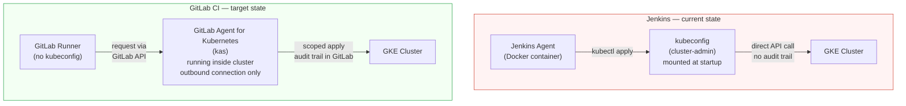
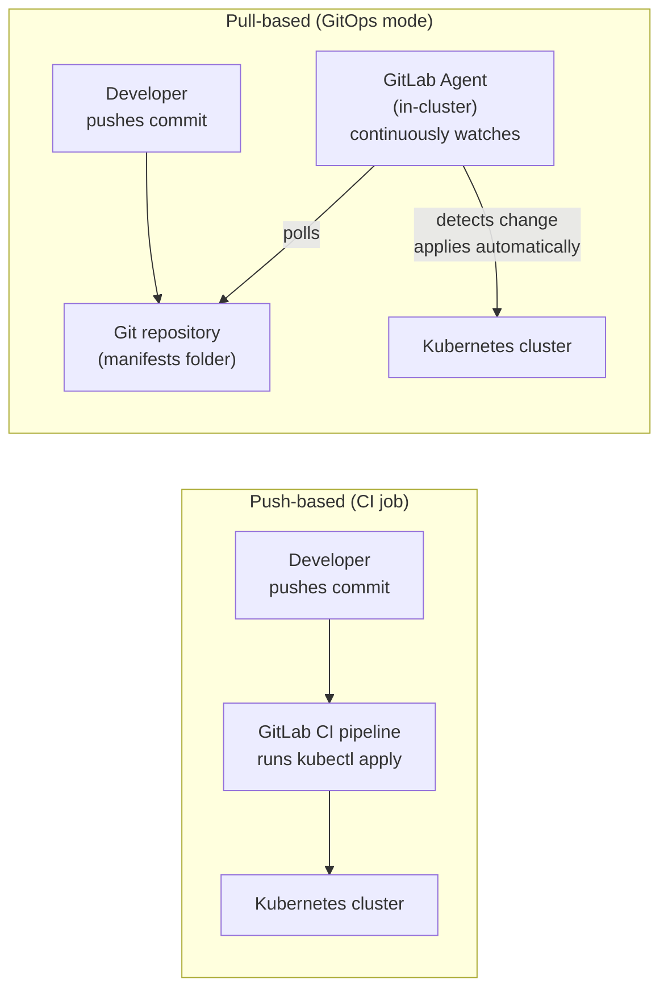

# Phase 10 — GitOps and Infrastructure: Migrating Infrastructure Pipelines

> **GitLab CI concepts introduced:** GitLab Agent for Kubernetes (KAS), GitLab Terraform integration, environment tracking, auto-stop environments | **Cost:** $0

---

## The problem

Two Jenkins jobs remain unaccounted for in Lumio's parallel run: `Jenkinsfile.terraform` and the Kubernetes deployment pipeline embedded in `Jenkinsfile.deploy`.

Both have serious security problems.

**`Jenkinsfile.terraform`** runs `terraform plan` and `terraform apply` using static AWS credentials stored directly in Jenkins credentials store. These credentials are `AdministratorAccess` scoped — because three years ago no one had time to scope them properly, and nobody touched it since. The Terraform state lives in an S3 bucket that is also accessed with those same credentials. If Jenkins is compromised, an attacker has full AWS access.

**The Kubernetes deployment pipeline** runs `kubectl apply` from a Jenkins agent that has a kubeconfig file mounted at startup. That kubeconfig grants `cluster-admin` to the agent's service account — again, because it was the path of least resistance. There is no audit trail for who deployed what, when, and from which pipeline.

The GitLab migration fixes both:
- The **GitLab Agent for Kubernetes (KAS)** replaces the kubeconfig credential. The agent runs inside the cluster and establishes an outbound connection to GitLab. CI jobs authenticate through GitLab, not through a kubeconfig. Blast radius is scoped to the project.
- **GitLab's native Terraform CI/CD integration** stores Terraform state inside GitLab (no S3 bucket needed) and integrates `terraform plan` output directly into merge request comments.



**What changes:**
- Jenkins held the keys and pushed to Kubernetes. GitLab CI holds nothing — the agent inside the cluster pulls and applies.
- Terraform state moves from S3 to GitLab's managed state backend. No AWS credentials needed for state management.
- Every deployment is linked to a pipeline, a merge request, and a GitLab user. Full traceability.

---

## Challenge 1 — Install the GitLab Agent for Kubernetes (KAS)

**Goal:** Deploy the GitLab Kubernetes Agent on the GKE staging cluster and establish a secure connection to GitLab.

The GitLab Agent for Kubernetes (KAS) is an in-cluster component that creates a persistent, outbound-only tunnel from your cluster to GitLab. CI jobs do not need a kubeconfig credential — they request access through GitLab's API and the agent proxies `kubectl` commands.

**Step 1: Create the agent configuration file in your GitLab repository.**

In your `lumio-api` repository, create the following file. The path is the agent's registered name:

```
.gitlab/agents/gke-staging/config.yaml
```

```yaml
# .gitlab/agents/gke-staging/config.yaml
# This file defines which GitLab projects are allowed to use this agent
# for CI/CD operations (kubectl access via the tunnel).

ci_access:
  projects:
    - id: lumio/lumio-api
    - id: lumio/lumio-frontend
    - id: lumio/lumio-worker
```

Commit and push this file. GitLab registers the agent as soon as the config file appears.

**Step 2: Register the agent in the GitLab UI.**

Navigate to your project's **Infrastructure > Kubernetes clusters > Connect a cluster (agent)**.

Select `gke-staging` from the dropdown (GitLab reads agent names from `.gitlab/agents/*/config.yaml` automatically).

GitLab generates a one-time agent token. Copy it — you will not see it again.

**Step 3: Install the agent in the GKE cluster using Helm.**

```bash
# Add the GitLab Helm chart repository
helm repo add gitlab https://charts.gitlab.io
helm repo update

# Create a dedicated namespace for the agent
kubectl create namespace gitlab-agent

# Install the agent
helm install gitlab-agent gitlab/gitlab-agent \
  --namespace gitlab-agent \
  --set image.tag=v16.11.0 \
  --set config.token=<YOUR_AGENT_TOKEN> \
  --set config.kasAddress=wss://kas.gitlab.com
```

Expected output:

```
NAME: gitlab-agent
LAST DEPLOYED: Mon Apr 22 10:15:33 2024
NAMESPACE: gitlab-agent
STATUS: deployed
REVISION: 1
```

**Step 4: Verify the connection in GitLab.**

```bash
kubectl get pods -n gitlab-agent
```

```
NAME                            READY   STATUS    RESTARTS   AGE
gitlab-agent-7d8f9b5c4-xk9pz   1/1     Running   0          45s
```

In the GitLab UI, navigate to **Infrastructure > Kubernetes clusters**. The `gke-staging` agent should show a green **Connected** status. If it shows **Never connected**, check the agent token and the `kasAddress` value.

**Step 5: Verify that the agent has no cluster-admin.**

The Helm chart creates a `ServiceAccount` and a `ClusterRole` for the agent. By default this role is scoped to what the agent needs for the GitOps sync — not cluster-admin.

```bash
kubectl get clusterrolebinding -n gitlab-agent | grep gitlab
```

```
gitlab-agent-gitlab-agent   ClusterRole/gitlab-agent-gitlab-agent   45s
```

Compare this with the old Jenkins kubeconfig: the Jenkins agent's service account had `cluster-admin`. The GitLab agent does not.

---

## Challenge 2 — Migrate Kubernetes Deployments

**Goal:** Replace the Jenkins `kubectl apply` step (kubeconfig credential) with a GitLab CI job that uses the KAS tunnel for scoped, auditable Kubernetes access.

**The old Jenkinsfile.deploy approach:**

```groovy
// jenkins/jobs/lumio-api/Jenkinsfile.deploy  (BEFORE — do not copy)
pipeline {
    agent any
    stages {
        stage('Deploy to staging') {
            steps {
                withKubeConfig([credentialsId: 'gke-staging-admin']) {
                    sh 'kubectl apply -k k8s/overlays/staging'
                    sh 'kubectl rollout status deployment/lumio-api -n staging'
                }
            }
        }
    }
}
```

This kubeconfig credential grants cluster-admin. It is stored in Jenkins and passed into the container at runtime. Anyone with Jenkins access can extract it.

**Step 1: Write the GitLab CI equivalent.**

```yaml
# .gitlab-ci.yml (relevant deploy section)
deploy:staging:
  stage: deploy
  image: bitnami/kubectl:1.29
  environment:
    name: staging
    url: https://staging.lumio.io
    kubernetes:
      namespace: staging    # Scope access to this namespace only
  script:
    - kubectl apply -k k8s/overlays/staging
    - kubectl rollout status deployment/lumio-api -n staging --timeout=120s
  rules:
    - if: $CI_COMMIT_BRANCH == "main"
```

No kubeconfig variable is needed. When `environment.kubernetes.namespace` is set and the agent is connected, GitLab CI automatically injects a scoped `KUBECONFIG` into the job. The agent proxies commands to that namespace only.

**Step 2: Run the pipeline and observe the deployment.**

Expected job log:

```
$ kubectl apply -k k8s/overlays/staging
namespace/staging unchanged
configmap/lumio-api-config configured
deployment.apps/lumio-api configured
service/lumio-api unchanged

$ kubectl rollout status deployment/lumio-api -n staging --timeout=120s
Waiting for deployment "lumio-api" rollout to finish: 1 out of 3 new replicas have been updated...
Waiting for deployment "lumio-api" rollout to finish: 2 out of 3 new replicas have been updated...
deployment "lumio-api" successfully rolled out
```

**Step 3: Check the audit trail in GitLab.**

Navigate to your project's **Deployments > Environments > staging**. You will see every deployment with:
- The pipeline that triggered it
- The commit SHA
- The GitLab user who approved it (if manual gate is configured)
- The timestamp

Jenkins had none of this — you had to dig through build logs to reconstruct who deployed what.

---

## Challenge 3 — GitLab Terraform Integration

**Goal:** Migrate `Jenkinsfile.terraform` to GitLab CI, replacing the S3 state backend and static AWS credentials with GitLab's native Terraform state backend.

**The old Jenkinsfile.terraform:**

```groovy
// jenkins/jobs/infrastructure/Jenkinsfile.terraform  (BEFORE — do not copy)
pipeline {
    agent { docker { image 'hashicorp/terraform:1.7' } }
    environment {
        AWS_ACCESS_KEY_ID     = credentials('aws-terraform-access-key')
        AWS_SECRET_ACCESS_KEY = credentials('aws-terraform-secret-key')
        AWS_DEFAULT_REGION    = 'eu-west-1'
    }
    stages {
        stage('Init')    { steps { sh 'terraform init' } }
        stage('Plan')    { steps { sh 'terraform plan -out=tfplan' } }
        stage('Apply')   {
            when { branch 'main' }
            input { message 'Apply this plan?' }
            steps { sh 'terraform apply tfplan' }
        }
    }
}
```

Two problems: credentials are static (`AdministratorAccess`), and the state backend is S3 (requires those same credentials).

**Step 1: Configure the GitLab Terraform state backend.**

GitLab provides a managed HTTP backend for Terraform state. No S3 bucket, no separate credentials.

```hcl
# infrastructure/terraform/backend.tf
terraform {
  backend "http" {}

  required_providers {
    google = {
      source  = "hashicorp/google"
      version = "~> 5.0"
    }
  }
}
```

The backend is configured at runtime via environment variables injected by GitLab CI (see Step 3).

**Step 2: Write the GitLab CI pipeline.**

```yaml
# infrastructure/.gitlab-ci.yml
# Uses the official GitLab Terraform image which includes all required tools
# and sets TF_ADDRESS automatically when using the GitLab state backend.

image: registry.gitlab.com/gitlab-org/terraform-images/stable:latest

variables:
  TF_ROOT: ${CI_PROJECT_DIR}/infrastructure/terraform
  TF_STATE_NAME: lumio-gke-production

cache:
  key: terraform-${CI_COMMIT_REF_SLUG}
  paths:
    - ${TF_ROOT}/.terraform/

stages:
  - validate
  - plan
  - apply

fmt:
  stage: validate
  script:
    - cd ${TF_ROOT}
    - terraform fmt -check -recursive
  allow_failure: true

validate:
  stage: validate
  script:
    - cd ${TF_ROOT}
    - gitlab-terraform init
    - gitlab-terraform validate

plan:
  stage: plan
  script:
    - cd ${TF_ROOT}
    - gitlab-terraform plan
    - gitlab-terraform plan-json
  artifacts:
    name: plan
    paths:
      - ${TF_ROOT}/plan.cache
    reports:
      terraform: ${TF_ROOT}/plan.json   # This populates the MR widget

apply:
  stage: apply
  script:
    - cd ${TF_ROOT}
    - gitlab-terraform apply
  dependencies:
    - plan
  rules:
    - if: $CI_COMMIT_BRANCH == "main"
      when: manual
```

**Step 3: Configure the state backend variables.**

In **Settings > CI/CD > Variables**, add these (they are automatically used by `gitlab-terraform`):

| Variable | Value | Notes |
|---|---|---|
| `TF_HTTP_ADDRESS` | `https://gitlab.com/api/v4/projects/${CI_PROJECT_ID}/terraform/state/${TF_STATE_NAME}` | Set automatically by the image |
| `TF_HTTP_USERNAME` | `gitlab-ci-token` | Set automatically |
| `TF_HTTP_PASSWORD` | `${CI_JOB_TOKEN}` | Set automatically — no static credentials |

The `gitlab-terraform` wrapper sets all of these automatically. You do not need to configure them manually. The state is stored in GitLab and scoped to the project.

**Step 4: Initialize and verify.**

Expected output from `gitlab-terraform init`:

```
Initializing the backend...

Successfully configured the backend "http"! Terraform will automatically
use this backend unless the backend configuration changes.

Initializing provider plugins...
- Finding hashicorp/google versions matching "~> 5.0"...
- Installing hashicorp/google v5.28.0...

Terraform has been successfully initialized!
```

---

## Challenge 4 — Terraform Plan in MR Comments

**Goal:** Configure the pipeline so that every merge request automatically receives a comment showing the `terraform plan` output, with a visual summary of resources to be added, changed, or destroyed.

GitLab parses the `plan.json` artifact (produced by `gitlab-terraform plan-json`) and renders it as a widget directly in the merge request UI. Engineers see exactly what will change before they approve.

**Step 1: Confirm the `reports: terraform` artifact is set.**

The pipeline from Challenge 3 already includes this. The key line is:

```yaml
  artifacts:
    reports:
      terraform: ${TF_ROOT}/plan.json
```

Without this, the MR widget does not appear.

**Step 2: Open a merge request that modifies Terraform.**

Create a branch, change something in `infrastructure/terraform/main.tf` — for example, scale the node pool:

```hcl
# infrastructure/terraform/main.tf
resource "google_container_node_pool" "lumio_nodes" {
  name       = "lumio-node-pool"
  cluster    = google_container_cluster.lumio.name
  node_count = 4    # was 3
  # ...
}
```

Push the branch and open an MR. Wait for the `plan` job to complete.

**Step 3: Observe the MR widget.**

In the merge request, scroll to the **Changes** tab. You will see a **Terraform** expandable section:

```
Terraform: 1 resource to change

  ~ google_container_node_pool.lumio_nodes
      node_count: 3 → 4
```

This is the plan output rendered from `plan.json`. No manual step required. No copy-pasting from the pipeline log.

**Step 4: Gate the apply on merge.**

The `apply` job has `when: manual` and only runs on `main`. After the MR is merged:

1. Navigate to the pipeline for the merge commit on `main`.
2. Find the `apply` job in the `apply` stage. It shows as **blocked (manual)**.
3. Click the play button to trigger `terraform apply`.

Expected output:

```
google_container_node_pool.lumio_nodes: Modifying...
google_container_node_pool.lumio_nodes: Still modifying... [10s elapsed]
google_container_node_pool.lumio_nodes: Modifications complete after 47s

Apply complete! Resources: 0 added, 1 changed, 0 destroyed.
```

---

## Challenge 5 — Auto-Stop Environments for Feature Branches

**Goal:** Configure review environments that are automatically created for every merge request and destroyed after 24 hours (or when the MR closes), preventing resource sprawl.

In Phase 7, you set up staging and production environments with manual approval gates. Those are long-lived environments. Review environments are different: they are ephemeral, spun up for the duration of a merge request and then discarded.

**Step 1: Add a review environment deployment job.**

```yaml
# .gitlab-ci.yml — review environment section
deploy:review:
  stage: deploy
  image: bitnami/kubectl:1.29
  environment:
    name: review/$CI_COMMIT_REF_SLUG         # Unique environment per branch
    url: https://${CI_ENVIRONMENT_SLUG}.review.lumio.io
    on_stop: stop:review                      # Reference the cleanup job
    auto_stop_in: 1 day                       # Destroyed after 24h if not stopped sooner
    kubernetes:
      namespace: review-${CI_ENVIRONMENT_SLUG}
  script:
    - kubectl create namespace review-${CI_ENVIRONMENT_SLUG} --dry-run=client -o yaml | kubectl apply -f -
    - kubectl apply -k k8s/overlays/review -n review-${CI_ENVIRONMENT_SLUG}
    - kubectl rollout status deployment/lumio-api -n review-${CI_ENVIRONMENT_SLUG}
  rules:
    - if: $CI_PIPELINE_SOURCE == "merge_request_event"

stop:review:
  stage: deploy
  image: bitnami/kubectl:1.29
  environment:
    name: review/$CI_COMMIT_REF_SLUG
    action: stop                              # This job marks the environment as stopped
  script:
    - kubectl delete namespace review-${CI_ENVIRONMENT_SLUG} --ignore-not-found
  rules:
    - if: $CI_PIPELINE_SOURCE == "merge_request_event"
      when: manual
```

**Step 2: Open a merge request and watch the environment appear.**

After the pipeline runs, navigate to **Deployments > Environments**. You will see a new row under `review/`:

```
review/feature-invoice-export    Active    https://feature-invoice-export.review.lumio.io    Expires in 23h 58m
```

**Step 3: Verify auto-stop behavior.**

After 24 hours (or when you close the MR), GitLab automatically triggers the `stop:review` job. The environment transitions to **Stopped** and the namespace is deleted.

You can also trigger the stop manually: in the **Environments** list, click the **Stop** button next to the review environment.

**Step 4: Compare with Jenkins.**

Jenkins had no concept of ephemeral environments tied to pull requests. Review environments were either manually provisioned (and often forgotten) or did not exist at all. Lumio's ops team frequently found abandoned Kubernetes namespaces consuming resources from months-old branches. Auto-stop eliminates this.

---

## Challenge 6 — GitOps Mode: Pull-Based Deployments

**Goal:** Configure the GitLab Kubernetes Agent in GitOps mode to automatically sync a folder of Kubernetes manifests from Git, without requiring a CI pipeline job to run `kubectl apply`.

So far, every deployment in this lab has been **push-based**: a CI job runs `kubectl apply`. This works well but has a drawback — the deployment only happens when the pipeline runs. If someone manually changes a resource in the cluster (drift), GitLab does not know about it.

**GitOps mode** inverts this. The agent watches a folder in Git and continuously reconciles the cluster state to match. No pipeline needed. Drift is automatically corrected.

**Step 1: Add a GitOps sync configuration to the agent config.**

```yaml
# .gitlab/agents/gke-staging/config.yaml
ci_access:
  projects:
    - id: lumio/lumio-api
    - id: lumio/lumio-frontend
    - id: lumio/lumio-worker

gitops:
  manifest_projects:
    - id: lumio/lumio-manifests          # A separate repo holding only K8s manifests
      default_namespace: staging
      paths:
        - glob: 'clusters/staging/**'    # Watch this folder recursively
      reconcile_timeout: 3600s
```

**Step 2: Understand the two modes side-by-side.**



**Step 3: When to use each mode.**

| Use case | Push-based (CI job) | Pull-based (GitOps) |
|---|---|---|
| Application deployments tied to a pipeline | Yes | Possible but adds complexity |
| Infrastructure manifests (CRDs, namespaces, RBAC) | Risky without review gate | Better — continuous reconciliation |
| Environments requiring manual approval | Yes (`when: manual`) | No — GitOps applies immediately |
| Drift detection and correction | No | Yes |
| Lumio production application | Push-based (Phase 7 gates still apply) | Not used — manual gate is required |
| Lumio cluster infrastructure | Either | Pull-based preferred |

**Step 4: Verify the GitOps sync is working.**

Manually delete a deployment that the agent manages:

```bash
kubectl delete deployment lumio-api -n staging
```

Watch the agent restore it within the reconcile timeout (default 5 minutes):

```bash
kubectl get deployment lumio-api -n staging --watch
```

```
NAME        READY   UP-TO-DATE   AVAILABLE   AGE
lumio-api   0/3     0            0           5s
lumio-api   1/3     3            1           15s
lumio-api   3/3     3            3           28s
```

The agent reconciled the drift without any pipeline run.

---

## Outcome

After completing Phase 10, Lumio's infrastructure and deployment pipelines are fully migrated to GitLab:

| Before (Jenkins) | After (GitLab CI + KAS) |
|---|---|
| kubeconfig with cluster-admin in Jenkins credentials | GitLab agent with namespace-scoped access, no kubeconfig needed |
| Terraform state in S3 (requires static AWS credentials) | Terraform state in GitLab (uses CI job token, no static credentials) |
| `terraform plan` output buried in Jenkins build log | `terraform plan` rendered as MR widget, visible before merge |
| No ephemeral review environments | Auto-stop review environments per MR, destroyed after 24h |
| No drift detection | GitOps mode continuously reconciles cluster state to Git |
| Deployments untraceable (no link to commit, user, or MR) | Every deployment linked to pipeline, commit, MR, and user in GitLab |

**Jobs migrated this phase:** `Jenkinsfile.terraform`, Kubernetes deployment pipeline (`Jenkinsfile.deploy` infrastructure section)

**Remaining Jenkins jobs:** `lumio-frontend/Jenkinsfile.e2e`, `infrastructure/Jenkinsfile.nightly`

---

[Back to main README](../README.md) | [Previous: Phase 9 — GitLab Runners](../phase-9-runners/README.md) | [Next: Phase 11 — Observability](../phase-11-observability/README.md)
