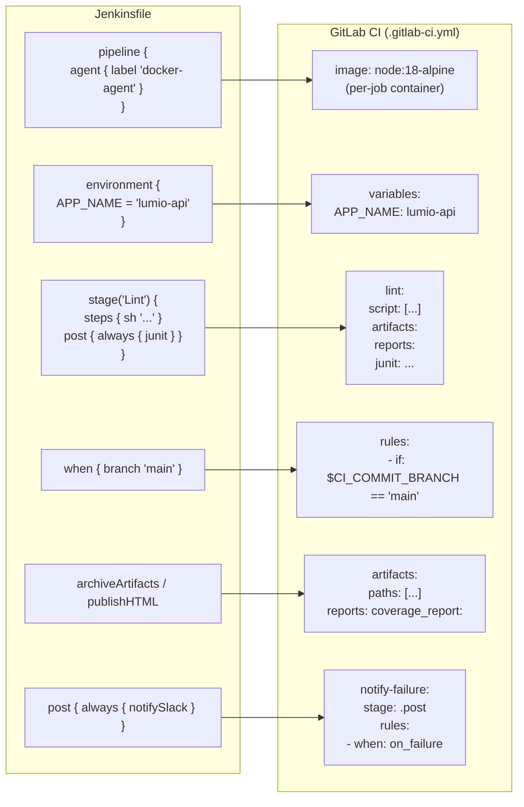

# Phase 2 — Pipeline Anatomy: Translating Your First Jenkinsfile

> **GitLab CI concepts introduced:** `script`, `before_script`, `after_script`, `artifacts`, `cache`, `rules`, `variables` | **Cost:** $0

---

## The Problem

Phase 1 gave you a working GitLab project with a hello-world pipeline. Now comes the real work: the actual Jenkinsfile for `lumio-api` runs 60 lines of Groovy that build, test, lint, and deploy a Node.js application. Every line needs a GitLab CI equivalent.

The translation is not one-to-one. Jenkins was designed around a sequential imperative model — "do this, then that, then if it fails do this other thing." GitLab CI is declarative — you describe *what* should run and *under what conditions*, not *how* to orchestrate it.

This phase translates the `lumio-api` Jenkinsfile challenge by challenge, from the outermost wrapper down to the `post {}` block. By the end you will have a fully functional `.gitlab-ci.yml` that replicates everything the Jenkinsfile does — and does some of it better.

---

## The Source: `lumio-api` Jenkinsfile

This is the Jenkinsfile you found in Phase 0. Read it carefully before translating it — every section will be covered in the challenges below.

```groovy
// jenkins/jobs/lumio-api/Jenkinsfile
@Library('lumio-shared@main') _

pipeline {
    agent { label 'docker-agent' }

    environment {
        APP_NAME    = 'lumio-api'
        ECR_REPO    = '123456789.dkr.ecr.eu-west-1.amazonaws.com/lumio-api'
        NODE_ENV    = 'test'
        COVERAGE_THRESHOLD = '80'
    }

    options {
        timeout(time: 30, unit: 'MINUTES')
        buildDiscarder(logRotator(numToKeepStr: '20'))
    }

    stages {
        stage('Install') {
            steps {
                sh 'npm ci --prefer-offline'
            }
        }

        stage('Lint') {
            steps {
                sh 'npm run lint -- --format=junit --output-file=reports/eslint.xml'
            }
            post {
                always {
                    junit 'reports/eslint.xml'
                }
            }
        }

        stage('Test') {
            steps {
                sh 'npm test -- --ci --coverage --reporters=default --reporters=jest-junit'
            }
            post {
                always {
                    junit 'test-results/junit.xml'
                    publishHTML([
                        reportDir:   'coverage/lcov-report',
                        reportFiles: 'index.html',
                        reportName:  'Coverage Report'
                    ])
                }
            }
        }

        stage('Build Docker') {
            when { anyOf { branch 'main'; branch pattern: 'release/.*', comparator: 'REGEXP' } }
            steps {
                buildDocker(
                    imageName: env.ECR_REPO,
                    tag:       env.GIT_COMMIT[0..7]
                )
            }
        }

        stage('Deploy Staging') {
            when { branch 'main' }
            steps {
                deployToEnv(
                    app:   env.APP_NAME,
                    env:   'staging',
                    image: "${env.ECR_REPO}:${env.GIT_COMMIT[0..7]}"
                )
            }
        }
    }

    post {
        always {
            notifySlack(status: currentBuild.result ?: 'SUCCESS')
            cleanWs()
        }
        failure {
            mail to: 'devops@lumio.io',
                 subject: "FAILED: ${env.JOB_NAME} #${env.BUILD_NUMBER}",
                 body: "See: ${env.BUILD_URL}"
        }
    }
}
```

---

## The Target: Equivalent `.gitlab-ci.yml`

Here is the complete translation you will build challenge by challenge. Read it now to see the shape of where you are going, then work through each challenge to understand *why* each section is written the way it is.

```yaml
# .gitlab-ci.yml — lumio-api (migrated from Jenkinsfile)

stages:
  - install
  - lint
  - test
  - build
  - deploy

variables:
  APP_NAME: "lumio-api"
  ECR_REPO: "123456789.dkr.ecr.eu-west-1.amazonaws.com/lumio-api"
  NODE_ENV: "test"
  COVERAGE_THRESHOLD: "80"

# --- Shared cache for node_modules ---
.node-cache: &node-cache
  cache:
    key:
      files:
        - package-lock.json
    paths:
      - node_modules/
    policy: pull

install:
  stage: install
  image: node:18-alpine
  cache:
    key:
      files:
        - package-lock.json
    paths:
      - node_modules/
    policy: push  # populate the cache
  script:
    - npm ci --prefer-offline
  timeout: 10 minutes

lint:
  stage: lint
  image: node:18-alpine
  <<: *node-cache
  script:
    - npm run lint -- --format=junit --output-file=reports/eslint.xml
  artifacts:
    when: always
    reports:
      junit: reports/eslint.xml
    expire_in: 7 days
  timeout: 10 minutes

test:
  stage: test
  image: node:18-alpine
  <<: *node-cache
  variables:
    JEST_JUNIT_OUTPUT_DIR: test-results
    JEST_JUNIT_OUTPUT_NAME: junit.xml
  script:
    - npm test -- --ci --coverage --reporters=default --reporters=jest-junit
  artifacts:
    when: always
    reports:
      junit: test-results/junit.xml
      coverage_report:
        coverage_format: cobertura
        path: coverage/cobertura-coverage.xml
    paths:
      - coverage/lcov-report/
    expire_in: 7 days
  coverage: '/Statements\s*:\s*(\d+(?:\.\d+)?)%/'
  timeout: 15 minutes

build-docker:
  stage: build
  image: docker:24
  services:
    - docker:24-dind
  rules:
    - if: $CI_COMMIT_BRANCH == "main"
    - if: $CI_COMMIT_BRANCH =~ /^release\/.*/
  variables:
    DOCKER_TLS_CERTDIR: "/certs"
    IMAGE_TAG: "$ECR_REPO:$CI_COMMIT_SHORT_SHA"
  before_script:
    - aws ecr get-login-password --region eu-west-1
        | docker login --username AWS --password-stdin $ECR_REPO
  script:
    - docker build -t $IMAGE_TAG -t $ECR_REPO:latest .
    - docker push $IMAGE_TAG
    - docker push $ECR_REPO:latest
  timeout: 20 minutes

deploy-staging:
  stage: deploy
  image: alpine:3.19
  rules:
    - if: $CI_COMMIT_BRANCH == "main"
  environment:
    name: staging
    url: https://staging.lumio.io
  before_script:
    - apk add --no-cache curl
  script:
    - |
      curl -X POST \
        -H "Authorization: Bearer $DEPLOY_TOKEN_STAGING" \
        -H "Content-Type: application/json" \
        -d "{\"image\": \"$ECR_REPO:$CI_COMMIT_SHORT_SHA\", \"app\": \"$APP_NAME\"}" \
        https://deploy.lumio.io/api/v1/deploy/staging
  timeout: 10 minutes

# --- Notifications (replaces notifySlack post block) ---
notify-failure:
  stage: .post
  image: alpine:3.19
  rules:
    - when: on_failure
  before_script:
    - apk add --no-cache curl
  script:
    - |
      curl -s -X POST $SLACK_WEBHOOK_URL \
        -H 'Content-type: application/json' \
        --data "{
          \"attachments\": [{
            \"color\": \"danger\",
            \"text\": \"$APP_NAME pipeline FAILED — $CI_PIPELINE_URL\"
          }]
        }"
```

---

## Jenkins → GitLab CI Concept Map



---

## Challenge 1 — Translate `pipeline { agent ... }` to Job-Level Images

**Goal:** Understand why GitLab CI has no global agent and how to replicate per-job container behavior.

### Steps

**1. Compare the Jenkins agent declaration with GitLab CI's approach.**

In Jenkins, `agent { label 'docker-agent' }` selects which agent node runs the entire pipeline. You can override it per stage with `agent { docker { image '...' } }`.

In GitLab CI, there is no global agent. Every job runs in its own container. You specify the container image with `image:`:

```yaml
# Jenkins approach: one agent for the whole pipeline
pipeline {
    agent { label 'docker-agent' }  # All stages run here
    stages {
        stage('Install') {
            # Runs on the docker-agent node
        }
        stage('Build Docker') {
            agent { docker { image 'docker:24' } }  # Override for this stage
        }
    }
}
```

```yaml
# GitLab CI approach: each job declares its own container
install:
  stage: install
  image: node:18-alpine   # This job runs in node:18-alpine
  script:
    - npm ci

build-docker:
  stage: build
  image: docker:24        # This job runs in docker:24
  script:
    - docker build .
```

**2. Add the four jobs with their images to `.gitlab-ci.yml`.**

```yaml
stages:
  - install
  - lint
  - test
  - build
  - deploy

install:
  stage: install
  image: node:18-alpine
  script:
    - node --version
    - npm ci --prefer-offline

lint:
  stage: lint
  image: node:18-alpine
  script:
    - npm run lint

test:
  stage: test
  image: node:18-alpine
  script:
    - npm test -- --ci

build-docker:
  stage: build
  image: docker:24
  script:
    - echo "Docker build would happen here"
```

**3. Push and verify all four jobs appear in the pipeline.**

```bash
git add .gitlab-ci.yml
git commit -m "ci: translate agent and stages"
git push
```

Expected pipeline output in the UI:

```
Pipeline #12345679 — main

  install   ✓ 23s    node:18-alpine
  lint      ✓ 18s    node:18-alpine
  test      ✓ 42s    node:18-alpine
  build     ✓ 11s    docker:24
```

**4. Note the key difference.** In Jenkins, if the docker-agent dies, the entire pipeline dies. In GitLab CI, each job starts fresh in its own container — there is no shared state between jobs unless you explicitly pass it via `artifacts:` or `cache:`.

---

## Challenge 2 — Translate `environment {}` to `variables:`

**Goal:** Move Jenkins environment variables to GitLab CI variables and understand scope (global vs job-level).

### Steps

**1. Compare scope in Jenkins vs GitLab CI.**

```groovy
// Jenkins: environment block is global to the pipeline
pipeline {
    environment {
        APP_NAME = 'lumio-api'    // available in all stages
        NODE_ENV = 'test'
    }
    stages {
        stage('Test') {
            environment {
                NODE_ENV = 'development'  // overrides global for this stage only
            }
        }
    }
}
```

```yaml
# GitLab CI: variables can be declared at top level (global) or per job
variables:
  APP_NAME: "lumio-api"   # global — available in all jobs
  NODE_ENV: "test"        # global default

test:
  stage: test
  variables:
    NODE_ENV: "development"   # overrides global for this job only
  script:
    - echo $NODE_ENV          # prints: development

lint:
  stage: lint
  script:
    - echo $NODE_ENV          # prints: test (global)
```

**2. Update `.gitlab-ci.yml` with global variables.**

```yaml
stages:
  - install
  - lint
  - test
  - build
  - deploy

variables:
  APP_NAME: "lumio-api"
  ECR_REPO: "123456789.dkr.ecr.eu-west-1.amazonaws.com/lumio-api"
  NODE_ENV: "test"
  COVERAGE_THRESHOLD: "80"

install:
  stage: install
  image: node:18-alpine
  script:
    - echo "APP_NAME=$APP_NAME"
    - echo "NODE_ENV=$NODE_ENV"
    - npm ci --prefer-offline
```

**3. Push and verify variables are available in job logs.**

Expected log output:

```
$ echo "APP_NAME=$APP_NAME"
APP_NAME=lumio-api
$ echo "NODE_ENV=$NODE_ENV"
NODE_ENV=test
```

**4. Variable precedence order** — when the same variable is defined in multiple places, GitLab CI resolves it in this order (highest priority first):

| Source | Example | Wins over |
|---|---|---|
| Trigger variable (API/webhook) | `curl .../trigger?token=...&variables[X]=y` | Everything |
| Manual pipeline variable (UI) | Set when clicking "Run pipeline" | Everything except trigger |
| Job-level `variables:` | `variables: NODE_ENV: development` | Global |
| Global `variables:` in YAML | `variables: NODE_ENV: test` | Project/group settings |
| Project CI/CD variables (Settings) | Set in Settings → CI/CD | Instance variables |
| Group CI/CD variables | Set in group Settings | Instance variables |
| Instance variables | Set by GitLab admin | Nothing |

---

## Challenge 3 — Translate `archiveArtifacts` to `artifacts: paths:`

**Goal:** Preserve build output across jobs and make it downloadable from the GitLab UI and API.

### Steps

**1. Compare artifact handling in Jenkins vs GitLab CI.**

```groovy
// Jenkins: archiveArtifacts saves files after a stage
stage('Build') {
    steps {
        sh 'npm run build'
        archiveArtifacts artifacts: 'dist/**/*', fingerprint: true
    }
}
```

```yaml
# GitLab CI: artifacts: paths: is declared in the job
build:
  stage: build
  image: node:18-alpine
  script:
    - npm run build
  artifacts:
    paths:
      - dist/
    expire_in: 7 days   # Jenkins has no built-in expiry
```

**2. Add artifact configuration to the `test` job.**

```yaml
test:
  stage: test
  image: node:18-alpine
  script:
    - npm test -- --ci --coverage
  artifacts:
    when: always           # Save even if tests fail
    paths:
      - coverage/lcov-report/    # HTML coverage report
      - test-results/            # Raw test output
    expire_in: 7 days
```

**3. Push, run the pipeline, then download the artifact from the UI.**

After the pipeline completes, navigate to the `test` job and look for the **Browse** button on the right panel. Download the coverage report.

Alternatively, download via the GitLab API:

```bash
# Get the latest pipeline ID
PIPELINE_ID=$(curl -s \
  -H "PRIVATE-TOKEN: $GITLAB_TOKEN" \
  "https://gitlab.com/api/v4/projects/lumio%2Flumio-api/pipelines?ref=main&per_page=1" \
  | python3 -c "import json,sys; print(json.load(sys.stdin)[0]['id'])")

echo "Latest pipeline: $PIPELINE_ID"

# Get job ID for the test job
JOB_ID=$(curl -s \
  -H "PRIVATE-TOKEN: $GITLAB_TOKEN" \
  "https://gitlab.com/api/v4/projects/lumio%2Flumio-api/pipelines/${PIPELINE_ID}/jobs" \
  | python3 -c "
import json, sys
jobs = json.load(sys.stdin)
test_job = next(j for j in jobs if j['name'] == 'test')
print(test_job['id'])
")

echo "Test job ID: $JOB_ID"

# Download artifacts
curl -L \
  -H "PRIVATE-TOKEN: $GITLAB_TOKEN" \
  -o coverage-report.zip \
  "https://gitlab.com/api/v4/projects/lumio%2Flumio-api/jobs/${JOB_ID}/artifacts"

unzip coverage-report.zip -d coverage-report
```

Expected output:

```
Latest pipeline: 12345679
Test job ID: 98765432
  % Total    % Received  ...
Archive:  coverage-report.zip
  inflating: coverage/lcov-report/index.html
  inflating: coverage/lcov-report/lumio-api/src/index.js.html
  ...
```

**4. Understand artifact passing between jobs.** By default, GitLab CI passes artifacts from earlier stages to later stages automatically. To prevent a job from receiving artifacts from a previous job:

```yaml
deploy-staging:
  stage: deploy
  dependencies: []   # Do not download any artifacts from previous jobs
  script:
    - echo "deploy"
```

---

## Challenge 4 — Translate `when { branch 'main' }` to `rules:`

**Goal:** Replicate Jenkins branch conditions, and learn three additional `rules` patterns that have no Jenkins equivalent.

### Steps

**1. Compare branch conditions.**

```groovy
// Jenkins: when block with branch condition
stage('Build Docker') {
    when {
        anyOf {
            branch 'main'
            branch pattern: 'release/.*', comparator: 'REGEXP'
        }
    }
    steps {
        buildDocker(...)
    }
}
```

```yaml
# GitLab CI: rules with if conditions
build-docker:
  stage: build
  image: docker:24
  rules:
    - if: $CI_COMMIT_BRANCH == "main"
    - if: $CI_COMMIT_BRANCH =~ /^release\/.*/
  script:
    - docker build .
```

**2. Three essential `rules` patterns.**

**Pattern A — Branch rules (equivalent to Jenkins `when { branch }`)**

```yaml
deploy-staging:
  rules:
    - if: $CI_COMMIT_BRANCH == "main"
      when: on_success
    - when: never   # skip on all other branches
```

**Pattern B — Merge request rules (no Jenkins equivalent without plugins)**

```yaml
lint:
  rules:
    # Run on merge requests only — shows results in MR UI
    - if: $CI_PIPELINE_SOURCE == "merge_request_event"
      when: on_success
    - when: never
```

**Pattern C — Tag rules (for production deployments)**

```yaml
deploy-production:
  rules:
    # Only run when a semantic version tag is pushed, require manual trigger
    - if: $CI_COMMIT_TAG =~ /^v[0-9]+\.[0-9]+\.[0-9]+$/
      when: manual
      allow_failure: false  # Pipeline stays "blocked" until this is manually triggered
    - when: never
```

**3. Add all three patterns to `.gitlab-ci.yml`.**

```yaml
lint:
  stage: lint
  image: node:18-alpine
  rules:
    - if: $CI_PIPELINE_SOURCE == "merge_request_event"
  script:
    - npm run lint

test:
  stage: test
  image: node:18-alpine
  rules:
    - if: $CI_PIPELINE_SOURCE == "merge_request_event"
    - if: $CI_COMMIT_BRANCH == "main"
    - if: $CI_COMMIT_BRANCH =~ /^release\/.*/
  script:
    - npm test -- --ci

build-docker:
  stage: build
  image: docker:24
  rules:
    - if: $CI_COMMIT_BRANCH == "main"
    - if: $CI_COMMIT_BRANCH =~ /^release\/.*/
  script:
    - echo "docker build"

deploy-staging:
  stage: deploy
  image: alpine:3.19
  rules:
    - if: $CI_COMMIT_BRANCH == "main"
  script:
    - echo "deploy to staging"

deploy-production:
  stage: deploy
  image: alpine:3.19
  rules:
    - if: $CI_COMMIT_TAG =~ /^v[0-9]+\.[0-9]+\.[0-9]+$/
      when: manual
    - when: never
  script:
    - echo "deploy to production"
```

**4. Rules evaluation order.** Rules are tested from top to bottom. The first rule that matches is used. If a rule has `when: never`, the job is excluded.

```yaml
# Example: understanding evaluation order
my-job:
  rules:
    - if: $CI_COMMIT_BRANCH == "main"     # Check 1: is this main?
      when: on_success                     # → yes: run normally
    - if: $CI_COMMIT_TAG                  # Check 2: is this a tag?
      when: manual                         # → yes: run manually
    # No match for feature branches → job is excluded from pipeline
```

---

## Challenge 5 — Translate `post { always { junit ... } }` to `artifacts: reports:`

**Goal:** Publish test results so they appear in the GitLab pipeline UI, in merge request widgets, and in the "Tests" tab.

### Steps

**1. Compare test result publishing.**

```groovy
// Jenkins: post block with junit publisher
stage('Test') {
    steps {
        sh 'npm test -- --reporters=jest-junit'
    }
    post {
        always {
            junit 'test-results/junit.xml'
        }
    }
}
```

```yaml
# GitLab CI: artifacts with reports section
test:
  stage: test
  image: node:18-alpine
  script:
    - npm test -- --ci --reporters=default --reporters=jest-junit
  artifacts:
    when: always   # Equivalent to Jenkins post { always { ... } }
    reports:
      junit: test-results/junit.xml
    expire_in: 7 days
```

**2. Update the `test` job to publish JUnit results and a coverage report.**

```yaml
test:
  stage: test
  image: node:18-alpine
  variables:
    JEST_JUNIT_OUTPUT_DIR: "test-results"
    JEST_JUNIT_OUTPUT_NAME: "junit.xml"
  script:
    - npm install jest-junit --no-save
    - >
      npm test --
      --ci
      --coverage
      --coverageReporters=cobertura
      --coverageReporters=lcov
      --reporters=default
      --reporters=jest-junit
  artifacts:
    when: always
    reports:
      junit: test-results/junit.xml
      coverage_report:
        coverage_format: cobertura
        path: coverage/cobertura-coverage.xml
    paths:
      - coverage/lcov-report/
    expire_in: 7 days
  coverage: '/Statements\s*:\s*(\d+(?:\.\d+)?)%/'
```

**3. Push and observe the test results in the GitLab UI.**

After the pipeline runs:

- Navigate to the pipeline page. Click the **Tests** tab.

Expected UI output:

```
Tests
  lumio-api test suite                      12 passed / 0 failed / 0 skipped

  ✓  renders the homepage                   142ms
  ✓  returns 200 on GET /health             23ms
  ✓  returns 401 on missing auth token      18ms
  ✓  creates a new workflow                 234ms
  ✓  rejects invalid workflow payload       19ms
  ✓  lists workflows for authenticated user 67ms
  ✓  deletes workflow by id                 45ms
  ✓  returns 404 on unknown route           12ms
  ✓  handles database timeout gracefully    312ms
  ✓  rate limits after 100 requests         89ms
  ✓  validates request schema               31ms
  ✓  logs structured JSON on each request   22ms

Coverage: 84.2%
```

**4. Observe test results in merge requests.**

When a merge request pipeline runs with `artifacts: reports: junit:`, GitLab automatically shows a test summary widget in the MR:

```
Test summary
  No changed test results

  12 passed (was 12)
  Coverage: 84.2% (was 83.1% +1.1%)
```

This replaces the Jenkins need to navigate to the job, find the JUnit report, and manually compare with the previous build.

**5. Understand the `when: always` equivalent.**

| Jenkins | GitLab CI |
|---|---|
| `post { always { ... } }` | `artifacts: when: always` (for saving files) |
| `post { always { ... } }` | `after_script:` (for running commands) |
| `post { failure { ... } }` | `after_script:` + checking `$CI_JOB_STATUS` |
| `post { success { ... } }` | `after_script:` + checking `$CI_JOB_STATUS` |
| A separate job with `when: on_failure` | Stage `.post` job with `rules: - when: on_failure` |

```yaml
# after_script always runs, regardless of script: exit code
test:
  stage: test
  script:
    - npm test
  after_script:
    - echo "This runs whether tests passed or failed"
    - echo "Job status: $CI_JOB_STATUS"   # success, failed, or cancelled
```

---

## Challenge 6 (Bonus) — Handle Groovy Patterns That Have No YAML Equivalent

**Goal:** Identify three Groovy patterns in the Jenkinsfile that cannot be translated directly to YAML, and learn how to handle them with `script:` bash.

### Steps

**Pattern 1 — Dynamic if/else logic inside a stage**

Some Jenkinsfiles use Groovy `if/else` to conditionally change behavior within a single stage:

```groovy
// Jenkins: Groovy if/else inside a stage
stage('Deploy') {
    steps {
        script {
            if (env.BRANCH_NAME == 'main') {
                deployToEnv(env: 'staging')
            } else if (env.BRANCH_NAME.startsWith('release/')) {
                deployToEnv(env: 'staging', notify: true)
            } else {
                echo "Skipping deploy for branch ${env.BRANCH_NAME}"
            }
        }
    }
}
```

GitLab CI solution — use `rules:` for the job-level condition, and bash conditionals for any remaining logic inside `script:`:

```yaml
deploy-staging:
  stage: deploy
  image: alpine:3.19
  rules:
    - if: $CI_COMMIT_BRANCH == "main"
    - if: $CI_COMMIT_BRANCH =~ /^release\/.*/
  script:
    - |
      if [ "$CI_COMMIT_BRANCH" = "main" ]; then
        echo "Deploying main to staging (no notification)"
        curl -X POST "$DEPLOY_API/staging" -d "{\"notify\": false}"
      else
        echo "Deploying release branch to staging (with notification)"
        curl -X POST "$DEPLOY_API/staging" -d "{\"notify\": true}"
      fi
```

**Pattern 2 — Complex variable interpolation**

Groovy allows arbitrary expressions in strings:

```groovy
// Jenkins: Groovy string interpolation with method calls
def shortSha = env.GIT_COMMIT[0..7]
def imageTag = "${env.ECR_REPO}:${shortSha}-${env.BUILD_NUMBER}"
def branchSlug = env.BRANCH_NAME.replaceAll('/', '-').toLowerCase()
```

GitLab CI solution — use bash string manipulation in `before_script:` or `script:`:

```yaml
build-docker:
  stage: build
  image: docker:24
  before_script:
    # GitLab provides CI_COMMIT_SHORT_SHA (8 chars) already — no need to slice
    - IMAGE_TAG="${ECR_REPO}:${CI_COMMIT_SHORT_SHA}-${CI_PIPELINE_IID}"
    # Branch slug: GitLab provides CI_COMMIT_REF_SLUG (lowercase, slashes replaced)
    - BRANCH_SLUG="${CI_COMMIT_REF_SLUG}"
    - echo "Building $IMAGE_TAG for branch $BRANCH_SLUG"
  script:
    - docker build -t "$IMAGE_TAG" .
    - docker push "$IMAGE_TAG"
```

**Pattern 3 — try/catch error handling**

```groovy
// Jenkins: try/catch to mark build unstable instead of failed
stage('Test') {
    steps {
        script {
            try {
                sh 'npm test'
            } catch (err) {
                currentBuild.result = 'UNSTABLE'
                echo "Tests failed but continuing: ${err}"
            }
        }
    }
}
```

GitLab CI solution — use `allow_failure:` for a job that should not block the pipeline, or use bash `set +e` to suppress individual command failures:

```yaml
test:
  stage: test
  image: node:18-alpine
  script:
    - set +e                          # Don't exit on test failure
    - npm test -- --ci
    - TEST_EXIT_CODE=$?
    - set -e                          # Re-enable exit on error
    - |
      if [ $TEST_EXIT_CODE -ne 0 ]; then
        echo "WARNING: Tests failed — pipeline will continue as unstable"
        # GitLab has no "UNSTABLE" status — use allow_failure instead
      fi
  allow_failure: true   # Equivalent to Jenkins UNSTABLE — pipeline continues
  artifacts:
    when: always
    reports:
      junit: test-results/junit.xml
```

Or for a cleaner approach that mirrors the "unstable but visible" state:

```yaml
test:
  stage: test
  image: node:18-alpine
  script:
    - npm test -- --ci
  artifacts:
    when: always
    reports:
      junit: test-results/junit.xml
  # If tests fail, the job is red but the pipeline continues
  allow_failure:
    exit_codes: 1   # Only allow failure on exit code 1 (test failures), not 2+ (crashes)
```

---

## Outcome

Every element of the `lumio-api` Jenkinsfile now has a GitLab CI equivalent:

| Jenkinsfile element | GitLab CI equivalent | Challenge |
|---|---|---|
| `pipeline { agent { label 'docker-agent' } }` | `image:` per job | Challenge 1 |
| `environment { APP_NAME = '...' }` | `variables: APP_NAME: ...` (global) | Challenge 2 |
| `environment { }` in a stage | `variables:` inside the job | Challenge 2 |
| `sh '...'` | `script: [...]` | Challenge 1 |
| `archiveArtifacts artifacts: 'dist/**'` | `artifacts: paths: [dist/]` | Challenge 3 |
| `junit 'results.xml'` | `artifacts: reports: junit: results.xml` | Challenge 5 |
| `publishHTML(...)` | `artifacts: paths: [coverage/]` | Challenge 5 |
| `when { branch 'main' }` | `rules: - if: $CI_COMMIT_BRANCH == "main"` | Challenge 4 |
| `when { branch pattern: 'release/.*' }` | `rules: - if: $CI_COMMIT_BRANCH =~ /^release\/.*/` | Challenge 4 |
| `post { always { ... } }` | `artifacts: when: always` or `after_script:` | Challenge 5 |
| `post { failure { mail ... } }` | Job with `rules: - when: on_failure` in `.post` stage | Challenge 5 |
| Groovy `if/else` inside step | bash `if/else` inside `script:` | Challenge 6 |
| Groovy string slicing | `$CI_COMMIT_SHORT_SHA` or bash substitution | Challenge 6 |
| `currentBuild.result = 'UNSTABLE'` | `allow_failure: true` | Challenge 6 |

The `lumio-api` pipeline is fully translated. Phase 3 replaces the shared library calls (`buildDocker()`, `deployToEnv()`) with reusable GitLab CI templates.

---

[Back to Phase 1 — GitLab Foundations](../phase-1-gitlab-foundations/README.md) | [Back to main README](../README.md) | [Next: Phase 3 — Shared Libraries → Templates](../phase-3-shared-libraries/README.md)
