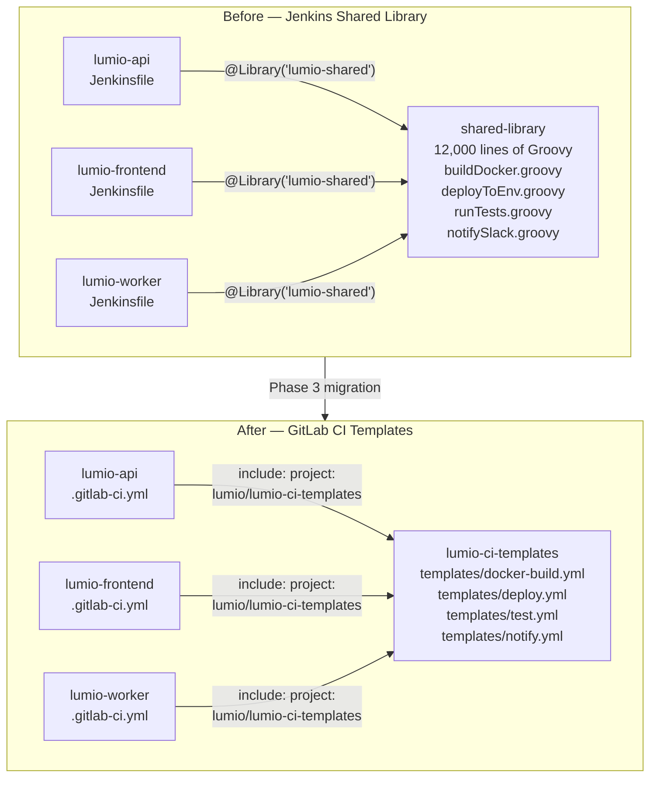
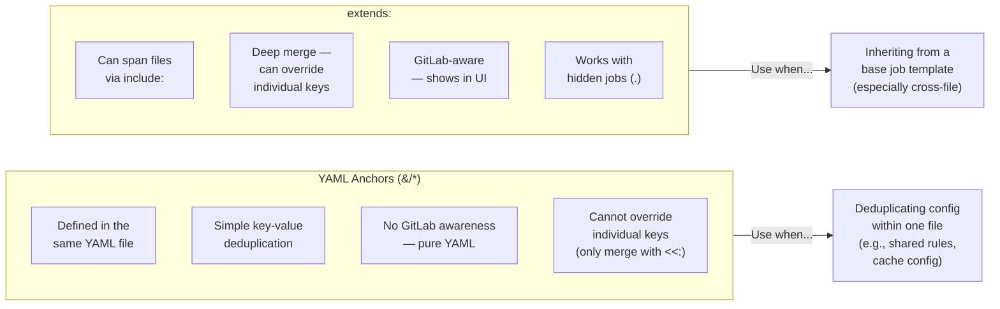
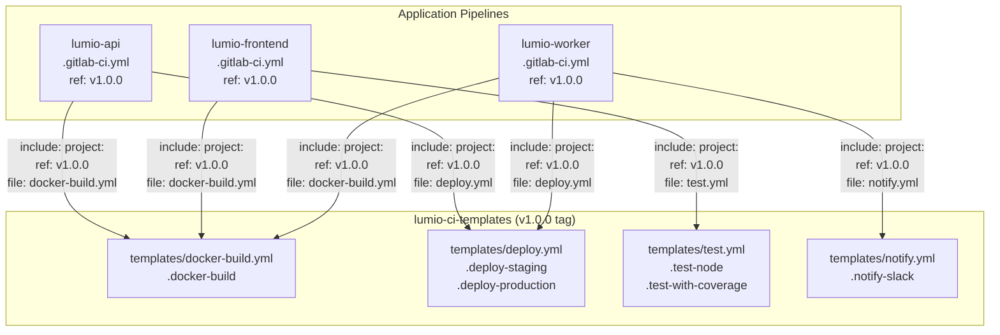

# Phase 3 — Shared Libraries → GitLab CI Templates

> **GitLab CI concepts introduced:** `include` (local, project, remote, template), `extends`, YAML anchors (`&`/`*`), hidden jobs (`.job`) | **Cost:** $0

---

## The Problem

Phase 2 translated the `lumio-api` Jenkinsfile line by line. But the most important lines were never translated:

```groovy
buildDocker(imageName: env.ECR_REPO, tag: env.GIT_COMMIT[0..7])
deployToEnv(app: env.APP_NAME, env: 'staging', image: "...")
```

These calls go into the 12,000-line Groovy shared library. To finish the translation, you need to replace the shared library itself.

Lumio has three applications — `lumio-api`, `lumio-frontend`, and `lumio-worker` — and every one of them calls `buildDocker()` and `deployToEnv()`. If you copy the Docker build logic into all three `.gitlab-ci.yml` files, you have a maintenance problem: update the logic once, update it three times.

The solution is GitLab CI templates: reusable YAML fragments stored in a dedicated project, included by reference in every consumer pipeline. This is the GitLab equivalent of a Jenkins shared library — without the Groovy.



---

## The Source: Groovy Shared Library

Before writing templates, read what you are replacing.

```groovy
// jenkins/shared-library/vars/buildDocker.groovy
import com.lumio.DockerUtils
import com.lumio.AwsUtils

def call(Map config = [:]) {
    def imageName  = config.imageName  ?: error("buildDocker: imageName required")
    def tag        = config.tag        ?: env.GIT_COMMIT[0..7]
    def dockerfile = config.dockerfile ?: 'Dockerfile'
    def buildArgs  = config.buildArgs  ?: [:]
    def push       = config.push       ?: true

    stage("Docker Build: ${imageName}:${tag}") {
        AwsUtils.ecrLogin(this)
        def buildArgStr = buildArgs.collect { k, v -> "--build-arg ${k}=${v}" }.join(' ')
        sh "docker build -f ${dockerfile} -t ${imageName}:${tag} -t ${imageName}:latest ${buildArgStr} ."
        if (push) {
            sh "docker push ${imageName}:${tag}"
            sh "docker push ${imageName}:latest"
        }
    }
    DockerUtils.cleanupLocalImage(this, imageName, tag)
    return "${imageName}:${tag}"
}
```

```groovy
// jenkins/shared-library/vars/deployToEnv.groovy
import com.lumio.AwsUtils

def call(Map config = [:]) {
    def app    = config.app    ?: error("deployToEnv: app required")
    def env    = config.env    ?: error("deployToEnv: env required")
    def image  = config.image  ?: error("deployToEnv: image required")
    def region = config.region ?: 'eu-west-1'

    stage("Deploy ${app} to ${env}") {
        if (env == 'production') {
            input message: "Deploy ${image} to PRODUCTION?", ok: "Deploy"
        }
        withCredentials([string(credentialsId: "deploy-token-${env}", variable: 'DEPLOY_TOKEN')]) {
            sh """
                curl -X POST \
                  -H "Authorization: Bearer ${DEPLOY_TOKEN}" \
                  -H "Content-Type: application/json" \
                  -d '{"image": "${image}", "app": "${app}"}' \
                  https://deploy.lumio.io/api/v1/deploy/${env}
            """
        }
    }
}
```

---

## Challenge 1 — Create the `lumio-ci-templates` Project

**Goal:** Set up a dedicated GitLab project for shared CI templates and understand why a separate project is better than `include: local`.

### Steps

**1. Create the templates project in the `lumio` group.**

```bash
glab project create lumio-ci-templates \
  --group lumio \
  --private \
  --no-readme
```

Or via the UI: **lumio group → New project → lumio-ci-templates**.

**2. Initialize the project with the required directory structure.**

```bash
cd /tmp
git clone https://gitlab.com/lumio/lumio-ci-templates.git
cd lumio-ci-templates

mkdir -p templates

touch templates/docker-build.yml
touch templates/deploy.yml
touch templates/test.yml
touch templates/notify.yml

git add templates/
git commit -m "chore: scaffold template directory structure"
git push -u origin main
```

**3. Understand `include` types and when to use each.**

GitLab CI has four types of `include`:

```yaml
# Type 1: local — same repository, same commit
include:
  - local: templates/my-template.yml

# Type 2: project — another GitLab project (cross-repo reuse)
include:
  - project: lumio/lumio-ci-templates
    ref: main
    file: templates/docker-build.yml

# Type 3: remote — any public URL (GitHub Gist, S3, etc.)
include:
  - remote: https://raw.githubusercontent.com/org/repo/main/ci/template.yml

# Type 4: template — GitLab's built-in templates
include:
  - template: SAST.gitlab-ci.yml
  - template: Dependency-Scanning.gitlab-ci.yml
```

**4. Why a dedicated project instead of `include: local`?**

| Approach | Use case | Limitation |
|---|---|---|
| `include: local` | Templates only needed by one project | Cannot be shared across projects |
| `include: project` | Templates shared across multiple projects | Requires a separate git project |
| `include: remote` | Templates hosted outside GitLab | No access control, harder to version |
| `include: template` | GitLab's built-in security/language templates | Cannot be customized |

Lumio has three applications that all need `docker-build` and `deploy`. Using `include: local` would mean copying the same YAML into all three repos — exactly the same problem that created the 12,000-line Groovy library. Use `include: project`.

---

## Challenge 2 — Write `docker-build.yml` to Replace `buildDocker.groovy`

**Goal:** Write the GitLab CI template that does what `buildDocker.groovy` does, and use `extends:` to consume it.

### Steps

**1. Write `templates/docker-build.yml` in the `lumio-ci-templates` project.**

```yaml
# lumio-ci-templates/templates/docker-build.yml

# Hidden job — the base template
# Starts with a dot so GitLab does not run it directly
.docker-build:
  image: docker:24
  services:
    - docker:24-dind
  variables:
    DOCKER_TLS_CERTDIR: "/certs"
    DOCKERFILE: "Dockerfile"
    # These must be provided by the consumer:
    # ECR_REPO      — full ECR URI, e.g. 123456789.dkr.ecr.eu-west-1.amazonaws.com/lumio-api
    # AWS_REGION    — e.g. eu-west-1
    # IMAGE_TAG     — defaults to $CI_COMMIT_SHORT_SHA if not set
  before_script:
    - IMAGE_TAG="${IMAGE_TAG:-$CI_COMMIT_SHORT_SHA}"
    - |
      aws ecr get-login-password --region "${AWS_REGION:-eu-west-1}" \
        | docker login --username AWS --password-stdin "$ECR_REPO"
  script:
    - echo "Building $ECR_REPO:$IMAGE_TAG"
    - |
      docker build \
        -f "$DOCKERFILE" \
        -t "$ECR_REPO:$IMAGE_TAG" \
        -t "$ECR_REPO:latest" \
        .
    - docker push "$ECR_REPO:$IMAGE_TAG"
    - docker push "$ECR_REPO:latest"
    - echo "IMAGE=$ECR_REPO:$IMAGE_TAG" >> build.env
  after_script:
    - docker rmi "$ECR_REPO:$IMAGE_TAG" || true
  artifacts:
    reports:
      dotenv: build.env   # Passes IMAGE variable to downstream jobs
    expire_in: 1 hour
  timeout: 20 minutes
  tags:
    - docker
```

**2. Commit and push the template.**

```bash
git add templates/docker-build.yml
git commit -m "feat: add docker-build template (replaces buildDocker.groovy)"
git push
```

**3. Use the template in `lumio-api/.gitlab-ci.yml` with `extends:`.**

```yaml
# lumio-api/.gitlab-ci.yml

include:
  - project: lumio/lumio-ci-templates
    ref: main
    file: templates/docker-build.yml

stages:
  - install
  - test
  - build
  - deploy

variables:
  ECR_REPO: "123456789.dkr.ecr.eu-west-1.amazonaws.com/lumio-api"
  AWS_REGION: "eu-west-1"

install:
  stage: install
  image: node:18-alpine
  script:
    - npm ci --prefer-offline

test:
  stage: test
  image: node:18-alpine
  script:
    - npm test -- --ci

# Use extends: to inherit the template — override only what differs
build-docker:
  extends: .docker-build
  stage: build
  rules:
    - if: $CI_COMMIT_BRANCH == "main"
    - if: $CI_COMMIT_BRANCH =~ /^release\/.*/
  variables:
    DOCKERFILE: "Dockerfile"    # Could also set IMAGE_TAG here to override the default
```

**4. Observe how `extends:` merges YAML.**

When `build-docker` extends `.docker-build`, GitLab deep-merges the two definitions:

```yaml
# Effective job after merge:
build-docker:
  image: docker:24                    # from .docker-build
  services: [docker:24-dind]          # from .docker-build
  variables:
    DOCKER_TLS_CERTDIR: "/certs"      # from .docker-build
    DOCKERFILE: "Dockerfile"          # overridden by build-docker
    ECR_REPO: "...lumio-api"          # from .gitlab-ci.yml global variables
    AWS_REGION: "eu-west-1"           # from .gitlab-ci.yml global variables
  before_script: [...]                # from .docker-build
  script: [...]                       # from .docker-build
  after_script: [...]                 # from .docker-build
  rules:                              # from build-docker (overrides nothing — .docker-build has no rules)
    - if: $CI_COMMIT_BRANCH == "main"
    - if: $CI_COMMIT_BRANCH =~ /^release\/.*/
  stage: build                        # from build-docker
  timeout: 20 minutes                 # from .docker-build
  tags: [docker]                      # from .docker-build
```

---

## Challenge 3 — YAML Anchors vs `extends`

**Goal:** Learn when to use YAML anchors (`&`/`*`) vs `extends:`, and use anchors to deduplicate repeated sections within a single `.gitlab-ci.yml`.

### Steps

**1. Understand the two mechanisms.**



**2. Use YAML anchors to deduplicate shared `rules` and `cache` within one file.**

```yaml
# .gitlab-ci.yml — using anchors for local deduplication

# Define reusable blocks with anchors
.rules-default: &rules-default
  rules:
    - if: $CI_PIPELINE_SOURCE == "merge_request_event"
    - if: $CI_COMMIT_BRANCH == "main"
    - if: $CI_COMMIT_BRANCH =~ /^release\/.*/

.node-cache: &node-cache
  cache:
    key:
      files:
        - package-lock.json
    paths:
      - node_modules/
    policy: pull

.test-artifacts: &test-artifacts
  artifacts:
    when: always
    reports:
      junit: test-results/junit.xml
    expire_in: 7 days

# --- Jobs that use the anchors ---

install:
  stage: install
  image: node:18-alpine
  <<: *rules-default   # Merge-insert the rules block
  cache:
    <<: *node-cache    # Use node-cache but add policy: push
    policy: push
  script:
    - npm ci --prefer-offline

lint:
  stage: lint
  image: node:18-alpine
  <<: *rules-default
  <<: *node-cache
  script:
    - npm run lint

test:
  stage: test
  image: node:18-alpine
  <<: *rules-default
  <<: *node-cache
  <<: *test-artifacts
  script:
    - npm test -- --ci
```

**3. Understand the key difference: anchors cannot span files.**

```yaml
# This works — anchor defined and used in the same file
.my-anchor: &my-anchor
  image: node:18-alpine

my-job:
  <<: *my-anchor   # OK — same file

# This does NOT work — anchors in included files cannot be referenced
include:
  - project: lumio/lumio-ci-templates
    file: templates/anchors.yml   # defines &docker-build-anchor

my-job:
  <<: *docker-build-anchor   # ERROR — anchor not visible across files
```

For cross-file reuse, always use `extends:` with a hidden job (`.job-name`).

**4. When to use which.**

| Scenario | Use |
|---|---|
| Sharing `rules:` across jobs in the same file | YAML anchor `&`/`*` |
| Sharing `cache:` config across jobs in the same file | YAML anchor `&`/`*` |
| Inheriting a base job from another file or project | `extends:` |
| Overriding individual keys from a base template | `extends:` |
| Sharing a complete job definition across projects | Hidden job + `extends:` + `include: project:` |

---

## Challenge 4 — Replace `@Library` with `include: project:`

**Goal:** Migrate the actual `lumio-api` pipeline from calling `buildDocker()` to using the GitLab CI template via `include: project:`.

### Steps

**1. Write `templates/deploy.yml` in the `lumio-ci-templates` project.**

```yaml
# lumio-ci-templates/templates/deploy.yml

.deploy-base:
  image: alpine:3.19
  before_script:
    - apk add --no-cache curl
  timeout: 10 minutes

.deploy-staging:
  extends: .deploy-base
  environment:
    name: staging
    url: https://staging.lumio.io
  script:
    - echo "Deploying $APP_NAME to staging — image $IMAGE"
    - |
      curl -f -X POST \
        -H "Authorization: Bearer $DEPLOY_TOKEN_STAGING" \
        -H "Content-Type: application/json" \
        -d "{\"image\": \"$IMAGE\", \"app\": \"$APP_NAME\"}" \
        https://deploy.lumio.io/api/v1/deploy/staging
    - echo "Staging deploy complete."

.deploy-production:
  extends: .deploy-base
  environment:
    name: production
    url: https://app.lumio.io
  when: manual
  allow_failure: false
  script:
    - echo "Deploying $APP_NAME to production — image $IMAGE"
    - |
      curl -f -X POST \
        -H "Authorization: Bearer $DEPLOY_TOKEN_PROD" \
        -H "Content-Type: application/json" \
        -d "{\"image\": \"$IMAGE\", \"app\": \"$APP_NAME\"}" \
        https://deploy.lumio.io/api/v1/deploy/production
    - echo "Production deploy complete."
```

**2. Commit the deploy template.**

```bash
cd /tmp/lumio-ci-templates
git add templates/deploy.yml
git commit -m "feat: add deploy template (replaces deployToEnv.groovy)"
git push
```

**3. Update `lumio-api/.gitlab-ci.yml` to use both templates.**

```yaml
# lumio-api/.gitlab-ci.yml — after Phase 3 migration

include:
  - project: lumio/lumio-ci-templates
    ref: main
    file: templates/docker-build.yml
  - project: lumio/lumio-ci-templates
    ref: main
    file: templates/deploy.yml

stages:
  - install
  - lint
  - test
  - build
  - deploy

variables:
  APP_NAME: "lumio-api"
  ECR_REPO: "123456789.dkr.ecr.eu-west-1.amazonaws.com/lumio-api"
  AWS_REGION: "eu-west-1"
  NODE_ENV: "test"

# YAML anchors for local deduplication
.default-rules: &default-rules
  rules:
    - if: $CI_PIPELINE_SOURCE == "merge_request_event"
    - if: $CI_COMMIT_BRANCH == "main"
    - if: $CI_COMMIT_BRANCH =~ /^release\/.*/

.node-cache: &node-cache
  cache:
    key:
      files:
        - package-lock.json
    paths:
      - node_modules/
    policy: pull

install:
  stage: install
  image: node:18-alpine
  <<: *default-rules
  cache:
    key:
      files:
        - package-lock.json
    paths:
      - node_modules/
    policy: push
  script:
    - npm ci --prefer-offline

lint:
  stage: lint
  image: node:18-alpine
  <<: *default-rules
  <<: *node-cache
  script:
    - npm run lint -- --format=junit --output-file=reports/eslint.xml
  artifacts:
    when: always
    reports:
      junit: reports/eslint.xml

test:
  stage: test
  image: node:18-alpine
  <<: *default-rules
  <<: *node-cache
  script:
    - npm test -- --ci --coverage --reporters=default --reporters=jest-junit
  artifacts:
    when: always
    reports:
      junit: test-results/junit.xml
      coverage_report:
        coverage_format: cobertura
        path: coverage/cobertura-coverage.xml
    paths:
      - coverage/lcov-report/
    expire_in: 7 days
  coverage: '/Statements\s*:\s*(\d+(?:\.\d+)?)%/'

# Replaces: buildDocker(imageName: env.ECR_REPO, tag: env.GIT_COMMIT[0..7])
build-docker:
  extends: .docker-build   # from templates/docker-build.yml
  stage: build
  rules:
    - if: $CI_COMMIT_BRANCH == "main"
    - if: $CI_COMMIT_BRANCH =~ /^release\/.*/

# Replaces: deployToEnv(app: env.APP_NAME, env: 'staging', image: "...")
deploy-staging:
  extends: .deploy-staging   # from templates/deploy.yml
  stage: deploy
  rules:
    - if: $CI_COMMIT_BRANCH == "main"
  needs:
    - job: build-docker
      artifacts: true   # Picks up IMAGE variable from build.env
  variables:
    IMAGE: "$ECR_REPO:$CI_COMMIT_SHORT_SHA"

# Replaces: deployToEnv(app: env.APP_NAME, env: 'production', ...) + input gate
deploy-production:
  extends: .deploy-production   # from templates/deploy.yml
  stage: deploy
  rules:
    - if: $CI_COMMIT_BRANCH == "main"
      when: manual
    - when: never
  needs:
    - job: build-docker
      artifacts: true
  variables:
    IMAGE: "$ECR_REPO:$CI_COMMIT_SHORT_SHA"
```

**4. Commit and push to `lumio-api`.**

```bash
cd /path/to/lumio-api
git add .gitlab-ci.yml
git commit -m "ci: replace @Library calls with include: project: templates"
git push
```

**5. Verify the pipeline in the GitLab UI.**

Navigate to **Build → Pipelines**. The pipeline should show all jobs. Expand the `build-docker` job and confirm it is using the template from `lumio-ci-templates`.

Expected pipeline structure in the UI:

```
Pipeline #12345680 — main

  install       [passed]  23s
  lint          [passed]  18s
  test          [passed]  44s
  build-docker  [passed]  2m 31s   ← uses .docker-build from lumio-ci-templates
  deploy-staging [passed] 12s      ← uses .deploy-staging from lumio-ci-templates
  deploy-production [manual]       ← waiting for manual trigger
```

---

## Challenge 5 — Version Templates with `ref: v1.0.0`

**Goal:** Pin consumers to a specific template version, simulate a breaking change, and verify the pin protects downstream projects.

### Steps

**1. Tag the current state of `lumio-ci-templates` as v1.0.0.**

```bash
cd /tmp/lumio-ci-templates

git tag -a v1.0.0 -m "v1.0.0 — initial stable release

Includes:
- templates/docker-build.yml  (replaces buildDocker.groovy)
- templates/deploy.yml        (replaces deployToEnv.groovy)
- templates/test.yml          (replaces runTests.groovy)
- templates/notify.yml        (replaces notifySlack.groovy)
"

git push origin v1.0.0
```

Verify the tag appears in the GitLab UI: **Repository → Tags**.

Expected output:

```
$ git push origin v1.0.0
Total 0 (delta 0), reused 0 (delta 0), pack-reused 0
To https://gitlab.com/lumio/lumio-ci-templates.git
 * [new tag]         v1.0.0 -> v1.0.0
```

**2. Pin `lumio-api` to v1.0.0.**

```yaml
# lumio-api/.gitlab-ci.yml

include:
  - project: lumio/lumio-ci-templates
    ref: v1.0.0   # Pinned to tag — not "main"
    file: templates/docker-build.yml
  - project: lumio/lumio-ci-templates
    ref: v1.0.0
    file: templates/deploy.yml
```

```bash
git add .gitlab-ci.yml
git commit -m "ci: pin templates to v1.0.0"
git push
```

**3. Simulate a breaking change in the templates.**

In the `lumio-ci-templates` project, introduce a change that breaks the `build-docker` interface — for example, rename the `ECR_REPO` variable to `CONTAINER_REGISTRY`:

```yaml
# lumio-ci-templates/templates/docker-build.yml (breaking change)

.docker-build:
  image: docker:24
  services:
    - docker:24-dind
  variables:
    DOCKER_TLS_CERTDIR: "/certs"
    DOCKERFILE: "Dockerfile"
    # BREAKING CHANGE: renamed ECR_REPO to CONTAINER_REGISTRY
    # Consumer must update their variable name
  before_script:
    - IMAGE_TAG="${IMAGE_TAG:-$CI_COMMIT_SHORT_SHA}"
    - |
      aws ecr get-login-password --region "${AWS_REGION:-eu-west-1}" \
        | docker login --username AWS --password-stdin "$CONTAINER_REGISTRY"  # changed
  script:
    - docker build -f "$DOCKERFILE" -t "$CONTAINER_REGISTRY:$IMAGE_TAG" -t "$CONTAINER_REGISTRY:latest" .
    - docker push "$CONTAINER_REGISTRY:$IMAGE_TAG"
    - docker push "$CONTAINER_REGISTRY:latest"
```

```bash
git add templates/docker-build.yml
git commit -m "feat!: rename ECR_REPO to CONTAINER_REGISTRY (breaking change)"
git push

# Tag as v2.0.0 (major bump = breaking)
git tag -a v2.0.0 -m "v2.0.0 — breaking: ECR_REPO renamed to CONTAINER_REGISTRY"
git push origin v2.0.0
```

**4. Verify that `lumio-api` is unaffected because it is pinned to v1.0.0.**

Trigger a new pipeline in `lumio-api` (push any change):

```bash
cd /path/to/lumio-api
echo "// build trigger" >> src/index.js
git add src/index.js
git commit -m "chore: trigger pipeline to verify pin"
git push
```

Expected result: the pipeline uses the v1.0.0 template and `ECR_REPO` still works. The `v2.0.0` changes have not affected `lumio-api`.

```
Pipeline #12345681 — main

  build-docker  [passed]   ← still using v1.0.0 template with ECR_REPO
```

**5. Plan the upgrade to v2.0.0.** When Lumio is ready to upgrade, the upgrade is explicit and controlled:

```yaml
# lumio-api/.gitlab-ci.yml — upgrading to v2.0.0
include:
  - project: lumio/lumio-ci-templates
    ref: v2.0.0   # Explicitly opted in to breaking change
    file: templates/docker-build.yml

variables:
  CONTAINER_REGISTRY: "123456789.dkr.ecr.eu-west-1.amazonaws.com/lumio-api"  # renamed variable
  # ECR_REPO is no longer needed
```

This is the GitLab CI equivalent of Groovy shared library versioning — except in Jenkins, it was `@Library('lumio-shared@v1.0.0')` and it was easy to miss or drift. With `ref:` in GitLab CI, the version is explicit and visible in the YAML file itself.

**6. Show the include graph after all three Lumio applications are migrated.**



---

## Outcome

The 12,000-line Groovy shared library has been replaced. Three Lumio applications consume GitLab CI templates:

| Was (Jenkins) | Is (GitLab CI) | Template |
|---|---|---|
| `@Library('lumio-shared@main') _` | `include: project: lumio/lumio-ci-templates ref: v1.0.0` | N/A — import mechanism |
| `buildDocker(imageName: ..., tag: ...)` | `extends: .docker-build` | `templates/docker-build.yml` |
| `deployToEnv(app: ..., env: 'staging', ...)` | `extends: .deploy-staging` | `templates/deploy.yml` |
| `deployToEnv(app: ..., env: 'production', ...)` | `extends: .deploy-production` (with `when: manual`) | `templates/deploy.yml` |
| `runTests(junitFile: ..., threshold: ...)` | `extends: .test-node` with `artifacts: reports: junit:` | `templates/test.yml` |
| `notifySlack(status: ...)` | `extends: .notify-slack` in `.post` stage | `templates/notify.yml` |

Key improvements over the Groovy library:

| Property | Jenkins shared library | GitLab CI templates |
|---|---|---|
| Language | Groovy (general-purpose) | YAML (declarative) |
| Versioning | `@Library('lib@tag')` — easy to miss | `ref: v1.0.0` — explicit in YAML |
| Readability | Requires Groovy knowledge | Readable by any engineer |
| Onboarding | 1 week to understand | ~1 afternoon |
| Breaking changes | Silent if `@main` is used | Explicit — requires updating `ref:` |
| Lines of code | 12,000 lines | ~300 lines |

---

[Back to Phase 2 — Pipeline Anatomy](../phase-2-pipeline-anatomy/README.md) | [Back to main README](../README.md) | [Next: Phase 4 — Parallel Stages](../phase-4-parallel-stages/README.md)
