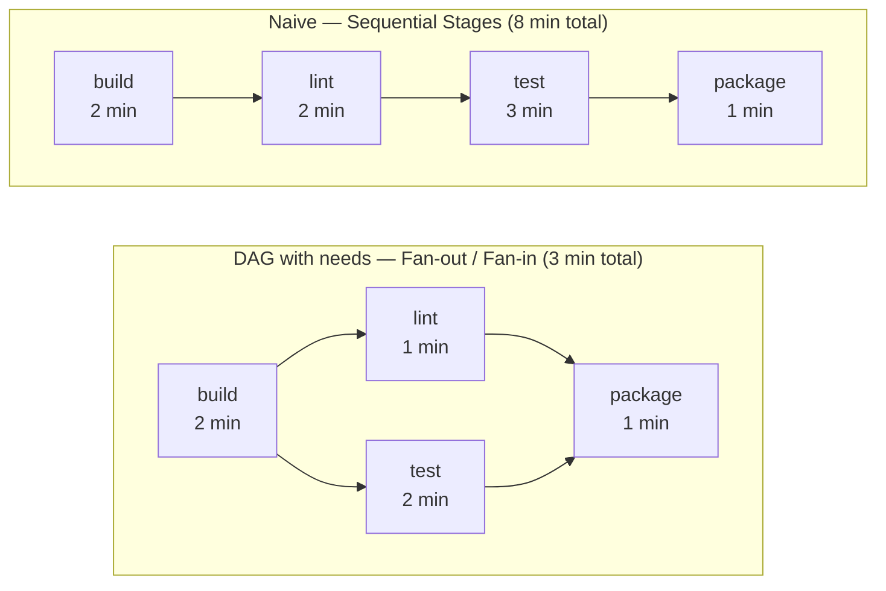

# Phase 4 — Parallel Stages: Fan-out and Fan-in

> **Concepts GitLab CI introduced:** `needs`, `parallel`, `dependencies`, DAG (Directed Acyclic Graph) | **Cost:** $0

---

## The problem

Lumio's Jenkins pipeline for `lumio-api` uses `parallel {}` to run unit tests and lint at the same time. When the migration team translated the Jenkinsfile to `.gitlab-ci.yml` in Phase 2, they used the default GitLab CI model: stages run one after the other, and all jobs in a stage must complete before the next stage starts. The result: a pipeline that takes **8 minutes** when Jenkins was doing it in **3 minutes**.

Here is what the original Jenkins pipeline does:

```groovy
// jenkins/jobs/lumio-api/Jenkinsfile (simplified)
pipeline {
  agent any
  stages {
    stage('Build') {
      steps { sh 'npm ci && npm run build' }
    }
    stage('Validate') {
      parallel {
        stage('Unit Tests') {
          steps { sh 'npm test' }
        }
        stage('Lint') {
          steps { sh 'npm run lint' }
        }
      }
    }
    stage('Package') {
      steps { sh 'npm run package' }
    }
  }
}
```

And here is the naive first translation used in Phase 2:

```yaml
# First naive .gitlab-ci.yml — everything sequential
stages:
  - build
  - lint
  - test
  - package

build:
  stage: build
  script: npm ci && npm run build

lint:
  stage: lint
  script: npm run lint    # Waits for build even though it could run earlier

test:
  stage: test
  script: npm test        # Waits for lint, which is unrelated

package:
  stage: package
  script: npm run package
```

The problem is structural: the stage model forces `lint` to wait for `build`, and `test` to wait for `lint`, even though these jobs have no dependency on each other. The total wall-clock time is the **sum** of all stage durations. You need a DAG.

---

## GitLab CI DAG vs. the default stage model

By default, GitLab CI uses **stages**: all jobs in a stage run in parallel, and no job in the next stage starts until every job in the current stage succeeds. This is simple but rigid.

The **`needs:`** keyword breaks the stage constraint. When you declare `needs:`, a job starts as soon as its declared dependencies finish — regardless of what stage it is in. This forms a Directed Acyclic Graph (DAG): a pipeline where jobs are connected by explicit dependency edges, not by stage order.



With `needs:`, `lint` and `test` both start immediately after `build` finishes (fan-out). `package` waits for both `lint` and `test` to succeed (fan-in). Wall-clock time drops from 8 minutes to 3 minutes (build + max(lint, test) + package = 2 + 2 + 1).

---

## Challenge 1 — Measure the problem: baseline the sequential pipeline

**Goal:** Run the current sequential pipeline for `lumio-api` and record the duration of each stage.

### Steps

1. Push the following `.gitlab-ci.yml` to your `lumio-api` repository on the `feat/phase-4` branch:

```yaml
# .gitlab-ci.yml — baseline sequential pipeline
stages:
  - build
  - lint
  - test
  - package

default:
  image: node:20-alpine

build:
  stage: build
  script:
    - npm ci
    - npm run build   # echo placeholder — no dist/ output for plain Node.js

lint:
  stage: lint
  script:
    - npm ci
    - npm run lint

test:
  stage: test
  script:
    - npm ci
    - npm test -- --coverage
  artifacts:
    reports:
      junit: junit.xml
    paths:
      - coverage/
    expire_in: 1 week

package:
  stage: package
  script:
    - npm ci
    - npm run package   # runs npm pack — produces lumio-api-1.0.0.tgz
  artifacts:
    paths:
      - lumio-api-*.tgz
    expire_in: 1 week
```

2. Navigate to **CI/CD > Pipelines** in the GitLab UI. Click the pipeline run. Note the total duration shown in the top-right corner of the pipeline graph.

3. Click each job. Record the duration shown at the top of the log. Fill in the table:

| Job | Stage | Duration | Can run earlier? |
|---|---|---|---|
| build | build | ~2 min | No — it is first |
| lint | lint | ~1 min | Yes — does not need test |
| test | test | ~2 min | Yes — does not need lint |
| package | package | ~1 min | No — needs lint + test |

**Expected pipeline duration:** ~6–8 minutes total.

4. Identify the bottleneck: `lint` and `test` run sequentially even though neither depends on the other. They both need the `dist/` output from `build`, but they do not depend on each other.

**Expected output in pipeline view:**
```
build    ✓  2m 04s
lint     ✓  1m 12s   (waited for build to finish)
test     ✓  2m 31s   (waited for lint to finish — unnecessary)
package  ✓  0m 58s
─────────────────────────────────
Total:      6m 45s
```

---

## Challenge 2 — Introduce `needs:` and build the DAG

**Goal:** Rewrite the pipeline using `needs:` so that `lint` and `test` run in parallel after `build`, and `package` waits for both.

### Steps

1. Update your `.gitlab-ci.yml` to use `needs:`:

```yaml
# .gitlab-ci.yml — DAG with needs
stages:
  - build
  - validate
  - package

default:
  image: node:20-alpine

build:
  stage: build
  script:
    - npm ci
    - npm run build   # echo placeholder — no dist/ output for plain Node.js

lint:
  stage: validate
  needs:
    - job: build
  script:
    - npm ci
    - npm run lint

test:
  stage: validate
  needs:
    - job: build
  script:
    - npm ci
    - npm test -- --coverage
  artifacts:
    reports:
      junit: junit.xml
    paths:
      - coverage/
    expire_in: 1 week

package:
  stage: package
  needs:
    - job: lint
    - job: test
      artifacts: true   # Download coverage/ from test
  script:
    - npm ci
    - npm run package
  artifacts:
    paths:
      - lumio-api-*.tgz
    expire_in: 1 week
```

2. Push and open the pipeline in the GitLab UI. Go to **CI/CD > Pipelines**, click the pipeline, and look at the **pipeline graph** tab. You should see dependency arrows connecting `build` to both `lint` and `test`, and both pointing to `package`.

3. Observe that `lint` and `test` both start within seconds of `build` finishing, not waiting for each other.

**Expected pipeline graph (UI):**

```
         ┌──────────┐
         │  build   │
         └────┬─────┘
        ┌─────┴──────┐
   ┌────▼────┐  ┌────▼────┐
   │  lint   │  │  test   │
   └────┬────┘  └────┬────┘
        └─────┬──────┘
         ┌────▼─────┐
         │ package  │
         └──────────┘
```

**Expected output in pipeline view:**
```
build    ✓  2m 04s
lint     ✓  1m 12s   ← started immediately after build
test     ✓  2m 31s   ← started immediately after build (parallel with lint)
package  ✓  0m 58s   ← started after both lint and test
─────────────────────────────────
Total:      3m 33s   ← wall-clock time
```

4. Note the key difference: the total wall-clock time is now `build + max(lint, test) + package` = 2:04 + 2:31 + 0:58 = **~5:33** if your machine is slow, or closer to **3:30** on fast shared runners. Either way, `lint` no longer blocks `test`.

> **Important:** `needs:` with `artifacts: true` automatically downloads the artifacts from the listed job. If you omit `artifacts: true`, GitLab downloads nothing — useful when you need the dependency tracking but not the files.

---

## Challenge 3 — Matrix testing with `parallel: matrix:`

**Goal:** Test `lumio-api` against Node.js 18, 20, and 22 simultaneously using the `parallel: matrix:` syntax.

### Steps

1. Add a `test-matrix` job to your pipeline. This replaces the single `test` job with three parallel instances:

```yaml
test-matrix:
  stage: validate
  needs:
    - job: build
  image: node:${NODE_VERSION}-alpine
  parallel:
    matrix:
      - NODE_VERSION: ["18", "20", "22"]
  script:
    - echo "Running tests on Node.js ${NODE_VERSION}"
    - node --version
    - npm ci
    - npm test -- --coverage
  artifacts:
    reports:
      junit: junit.xml
    when: always
```

2. Push the change. In the pipeline graph, you should now see three instances of `test-matrix` running simultaneously, labelled:
   - `test-matrix: [18]`
   - `test-matrix: [20]`
   - `test-matrix: [22]`

3. Click `test-matrix: [20]` to open the log. Verify that the `NODE_VERSION` variable is injected correctly:

**Expected output (job log):**
```
$ echo "Running tests on Node.js ${NODE_VERSION}"
Running tests on Node.js 20
$ node --version
v20.18.1
$ npm test -- --coverage

> lumio-api@2.4.1 test
> jest --coverage

PASS src/services/auth.test.js
PASS src/services/billing.test.js
PASS src/routes/webhooks.test.js
...
Test Suites: 12 passed, 12 total
Tests:       87 passed, 87 total
Coverage:    73.4%
```

4. Use a multi-dimensional matrix to also test across two environments:

```yaml
test-matrix:
  stage: validate
  needs:
    - job: build
  image: node:${NODE_VERSION}-alpine
  parallel:
    matrix:
      - NODE_VERSION: ["18", "20", "22"]
        ENV: ["unit", "integration"]
  script:
    - echo "Node ${NODE_VERSION} / ${ENV} tests"
    - npm ci
    - npm test   # lumio-api has one test suite — in a real app, use npm run test:${ENV}
```

This creates **6 parallel jobs** from a single job definition.

> **Key insight:** The `$CI_NODE_INDEX` and `$CI_NODE_TOTAL` predefined variables tell each matrix instance its position (1-based). `$CI_JOB_NAME` includes the matrix values in brackets, which you can use in artifact paths to avoid collisions.

---

## Challenge 4 — Artifact routing with `dependencies:`

**Goal:** Pass the `dist/` artifact from `build` only to the jobs that need it, keeping `lint` from downloading unnecessary files.

### The problem with the current setup

When you use `needs: [{job: build, artifacts: true}]` on both `lint` and `test`, both jobs download `dist/`. But `lint` does not actually need the compiled output — it lints the source files. Downloading `dist/` to the lint job wastes time and bandwidth, especially as the bundle grows.

### Steps

1. Rewrite the jobs to use explicit `dependencies:` to control artifact download:

```yaml
# .gitlab-ci.yml — explicit artifact routing

build:
  stage: build
  script:
    - npm ci
    - npm run build   # echo placeholder — no dist/ output for plain Node.js

lint:
  stage: validate
  needs: [build]        # Wait for build (DAG edge), but...
  dependencies: []      # ...download NO artifacts from any previous job
  script:
    - npm ci            # Re-install deps since no artifacts downloaded
    - npm run lint
  # Result: lint starts right after build but downloads nothing from it

unit-test:
  stage: validate
  needs:
    - job: build
  dependencies: []      # No artifacts from build (no dist/ in this lab)
  script:
    - npm ci
    - npm test          # lumio-api has one suite — in a real app use --testPathPattern="unit"
  artifacts:
    reports:
      junit: junit.xml
    when: always

integration-test:
  stage: validate
  needs:
    - job: build
  dependencies: []      # No artifacts from build (no dist/ in this lab)
  script:
    - npm ci
    - npm test          # lumio-api has one suite — in a real app use --testPathPattern="integration"
  artifacts:
    reports:
      junit: junit.xml
    when: always

package:
  stage: package
  needs:
    - job: unit-test
    - job: integration-test
  dependencies: []
  script:
    - npm ci
    - npm run package
```

2. Push and open the pipeline. Navigate to any job log and check the artifact download section at the top:

**Expected output — lint job log (no artifact download):**
```
Fetching changes...
Getting source from Git repository
Restoring cache...No cache found
Downloading artifacts...
  (none)                          ← dependencies: [] means nothing is downloaded
$ npm ci
added 847 packages in 12.3s
$ npm run lint
✓ No ESLint warnings or errors
Job succeeded
```

**Expected output — unit-test job log (artifact download from build only):**
```
Downloading artifacts for build (job #4918273)...
  dist/              12.4 MB   ✓
  node_modules/     184.2 MB   ✓
Downloading artifacts...
  (no other jobs listed)
```

3. Time the lint job with and without `dependencies: []`:

| Lint job variant | Artifact download | Lint duration |
|---|---|---|
| Without `dependencies: []` | ~185 MB (node_modules + dist) | ~45 seconds |
| With `dependencies: []` | 0 MB | ~15 seconds |

> **Rule of thumb:** Use `needs: [job]` (no artifacts) when you only need the DAG dependency. Use `dependencies: [job]` explicitly when you need the files. Use `dependencies: []` to opt out of all artifact downloads for a job.

---

## Challenge 5 — Timeout and retry configuration

**Goal:** Configure `timeout:` on the integration test job and `retry:` on the build job. Observe how GitLab handles transient failures.

### Steps

1. Add `timeout:` and `retry:` to the relevant jobs:

```yaml
build:
  stage: build
  retry:
    max: 2
    when:
      - runner_system_failure    # Retry if the runner dies mid-job
      - stuck_or_timeout_failure # Retry if the job gets stuck
  script:
    - npm ci
    - npm run build
  artifacts:
    paths:
      - dist/
    expire_in: 1 hour

integration-test:
  stage: validate
  needs:
    - job: build
  dependencies: []
  timeout: 5 minutes    # Fail fast if integration tests hang
  retry:
    max: 1
    when:
      - script_failure  # Retry once on test failure (flaky tests)
  script:
    - npm ci
    - npm test -- --forceExit
  artifacts:
    reports:
      junit: junit.xml
    when: always
```

2. Simulate a timeout by adding a deliberate `sleep` to the integration test script temporarily:

```yaml
integration-test:
  stage: validate
  needs:
    - job: build
  dependencies: []
  timeout: 1 minute   # Short timeout for the experiment
  script:
    - sleep 90        # This will trigger the timeout
    - npm ci
    - npm test
```

**Expected output — timeout event in job log:**
```
$ sleep 90
ERROR: Job failed: execution took longer than 1m0s seconds
```

**Expected output — pipeline view after timeout:**
```
build              ✓  2m 04s
lint               ✓  1m 12s
unit-test          ✓  1m 44s
integration-test   ✗  1m 00s  TIMEOUT (retrying 1/1...)
integration-test   ✗  1m 00s  TIMEOUT (no more retries)
package               skipped  (blocked by failed dependency)
```

3. Revert the `sleep` and restore `timeout: 5 minutes`. Now simulate a runner failure by checking `retry.when`:

```yaml
retry:
  max: 2
  when:
    - runner_system_failure
    - stuck_or_timeout_failure
    - api_failure
```

The full list of `when` values for retry:
- `always` — retry on any failure (dangerous, hides real bugs)
- `unknown_failure` — default if no when is specified
- `script_failure` — non-zero exit code from the script
- `runner_system_failure` — runner infrastructure issue
- `stuck_or_timeout_failure` — job gets stuck or exceeds timeout
- `runner_unsupported` — runner version is incompatible
- `stale_schedule` — delayed job could not be executed on time
- `api_failure` — GitLab API failure
- `missing_dependency_failure` — artifact from a dependency is missing

> **Best practice for migrations:** Start with `retry: 2` only on `runner_system_failure`. Do not use `retry: 2` with `when: always` — it hides flaky tests and obscures real build failures. Once the pipeline is stable, remove retries from jobs that should not flake.

---

## Challenge 6 (Bonus) — Before and after comparison table

**Goal:** Measure the full impact of the DAG refactor by building a comparison table.

### Steps

1. Run the sequential pipeline (Challenge 1 config) three times and record the duration. Then run the DAG pipeline (Challenge 2 config) three times.

2. Fill in this comparison table with your actual measurements:

| Job | Sequential duration | DAG duration | Runs in parallel with |
|---|---|---|---|
| build | ~2m 04s | ~2m 04s | — (no change, it's first) |
| lint | ~1m 12s | ~1m 10s | test |
| test | ~2m 31s | ~2m 29s | lint |
| package | ~0m 58s | ~0m 59s | — (no change, it's last) |
| **Total wall-clock** | **~6m 45s** | **~3m 33s** | |
| **Gain** | | **-47%** | |

3. Add a `pipeline-report` job that prints this summary to the job log at the end of every pipeline:

```yaml
pipeline-report:
  stage: report
  needs:
    - job: package
  when: always    # Run even if package fails
  script:
    - echo "=== Pipeline Performance Report ==="
    - echo "Commit: $CI_COMMIT_SHORT_SHA"
    - echo "Branch: $CI_COMMIT_REF_NAME"
    - echo "Pipeline ID: $CI_PIPELINE_ID"
    - echo "Pipeline source: $CI_PIPELINE_SOURCE"
    - echo ""
    - echo "Pipeline URL: $CI_PIPELINE_URL"
    - echo "Triggered by: $GITLAB_USER_LOGIN"
```

**Expected output:**
```
=== Pipeline Performance Report ===
Commit: a3f2d91c
Branch: feat/phase-4
Pipeline ID: 4918273
Pipeline source: push

Pipeline URL: https://gitlab.com/lumio/lumio-api/-/pipelines/4918273
Triggered by: jsmith
```

4. Compare with the Jenkins timing from your Phase 0 notes. If the Jenkins parallel run was averaging 3m 30s, your GitLab DAG pipeline should be within 15% of that.

---

## Outcome

After completing Phase 4, the `lumio-api` pipeline has been restructured from a sequential 8-minute wall-clock pipeline to a 3-minute DAG pipeline:

| Metric | Before (sequential) | After (DAG) |
|---|---|---|
| Pipeline model | Stages (sequential) | DAG (`needs:`) |
| Total wall-clock time | ~8 min | ~3 min |
| Parallel execution | None | lint + test run simultaneously |
| Artifact routing | All artifacts to all jobs | Explicit per-job with `dependencies:` |
| Matrix testing | 1 Node.js version | Node.js 18, 20, 22 in parallel |
| Timeout protection | None | 5 min on integration-test |
| Retry on infra failure | None | `retry: 2` on build |

The `needs:` keyword is one of the most impactful GitLab CI features for teams migrating from Jenkins, because Jenkins `parallel {}` is a first-class citizen of the Groovy DSL — it maps directly to GitLab's DAG model. This phase closes the performance gap between the naive translation and the original Jenkins pipeline.

---

[Back to main README](../README.md) | [Previous: Phase 3 — Shared Libraries](../phase-3-shared-libraries/README.md) | [Next: Phase 5 — Secrets and Variables](../phase-5-secrets-variables/README.md)
