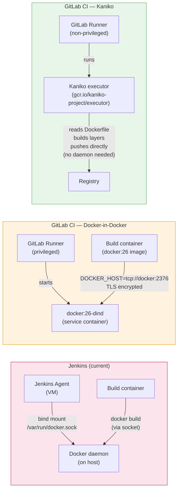
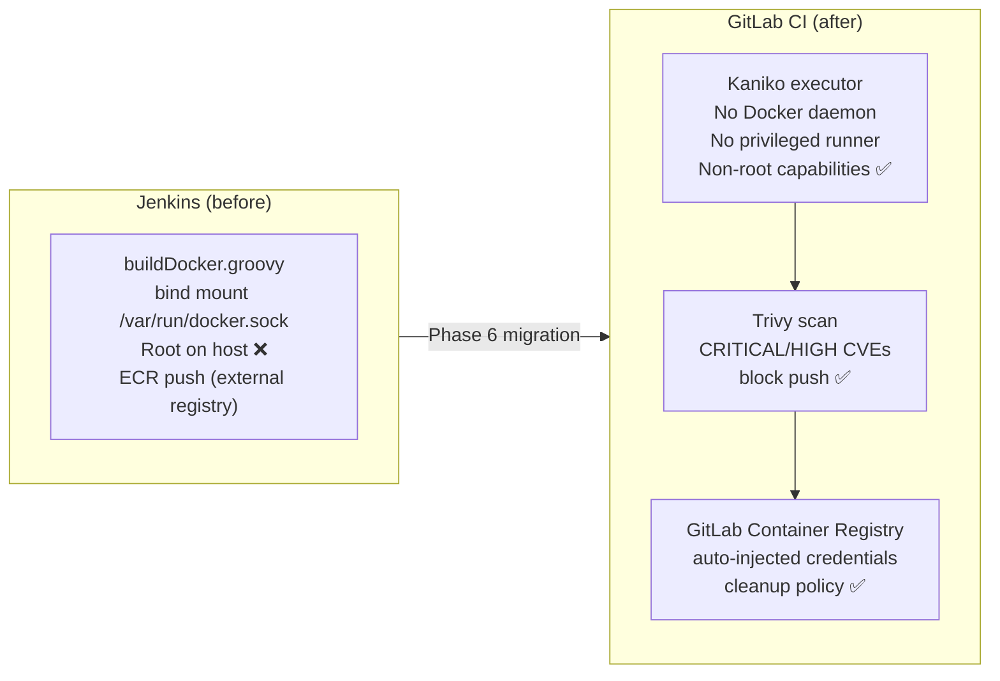

# Phase 6 — Docker Build and Registry: Containerizing the Pipelines

> **Concepts GitLab CI introduced:** GitLab Container Registry, Docker-in-Docker (DinD), Kaniko, `services:`, `CI_REGISTRY_*` variables | **Cost:** $0 (GitLab.com includes 5 GB of registry storage)

---

## The problem

Lumio's Jenkins shared library has a `buildDocker.groovy` step that has been running every Docker build for the past four years. It works by bind-mounting the Docker socket from the Jenkins agent host into the build container:

```groovy
// jenkins/shared-library/vars/buildDocker.groovy
def call(Map config) {
  def imageName = config.imageName
  def tag = config.tag ?: env.BUILD_NUMBER

  sh """
    docker build -t ${imageName}:${tag} .
    docker tag ${imageName}:${tag} registry.lumio.io/${imageName}:${tag}
    docker push registry.lumio.io/${imageName}:${tag}
  """
}
```

The Jenkins agent mounts `/var/run/docker.sock` into the container so that Docker commands from inside the container talk directly to the Docker daemon running on the host. This works, but:

- **It is a root-equivalent security hole.** Any job with access to the Docker socket can escape the container, read host files, and pivot to other jobs running on the same agent. The security audit flagged this as a critical finding.
- **It does not work on GitLab shared runners.** GitLab's shared runners on GitLab.com run in privileged-less containers. There is no Docker daemon socket to mount.
- **It breaks in Kubernetes-based runner setups.** When Lumio moves to Kubernetes runners in Phase 9, socket binding becomes impossible.

The migration team needs a Docker build strategy that works on GitLab's shared runners, does not require root access to the host, and pushes to the GitLab Container Registry instead of the legacy `registry.lumio.io`.

---

## Three approaches to Docker builds in GitLab CI

Before choosing a strategy, it is worth understanding all three options and their trade-offs:



| Approach | Security | Speed | Complexity | Works on shared runners |
|---|---|---|---|---|
| Socket binding (Jenkins method) | Low (root escape possible) | Fast | Simple | No |
| Docker-in-Docker (DinD) | Medium (requires privileged runner) | Medium | Medium | Yes (privileged) |
| Kaniko | High (non-root, no daemon) | Slightly slower first build | Low | Yes (any runner) |

For this lab, you will implement both DinD and Kaniko, understand the trade-offs, and end up with Kaniko as the production approach.

---

## Challenge 1 — Explore the GitLab Container Registry

**Goal:** Activate the Container Registry for `lumio-api`, understand the auto-injected `CI_REGISTRY_*` variables, and log in from your local machine.

### Steps

1. On your `lumio-api` project, navigate to **Settings > General > Visibility, project features, permissions**. Ensure **Container Registry** is enabled (it is on by default for GitLab.com projects).

2. Navigate to **Deploy > Container Registry** to view the empty registry.

3. Add a simple job to print all registry-related predefined variables:

```yaml
# .gitlab-ci.yml — discover registry variables
inspect-registry:
  stage: test
  image: alpine:3.19
  script:
    - echo "Registry:           $CI_REGISTRY"
    - echo "Registry image:     $CI_REGISTRY_IMAGE"
    - echo "Registry user:      $CI_REGISTRY_USER"
    - echo "Registry password:  $CI_REGISTRY_PASSWORD"
    - echo ""
    - echo "These variables are injected automatically by GitLab."
    - echo "CI_REGISTRY_PASSWORD is a short-lived job token — it rotates every job."
    - echo "You never need to create a registry credential manually."
```

**Expected output:**
```
Registry:           registry.gitlab.com
Registry image:     registry.gitlab.com/lumio/lumio-api
Registry user:      gitlab-ci-token
Registry password:  [MASKED]

These variables are injected automatically by GitLab.
CI_REGISTRY_PASSWORD is a short-lived job token — it rotates every job.
You never need to create a registry credential manually.
```

4. Log in from your local machine using a personal access token (not the CI job token, which is scoped to the job):

```bash
# Create a Personal Access Token at https://gitlab.com/-/user_settings/personal_access_tokens
# Required scope: read_registry (for pull) or write_registry (for push)

docker login registry.gitlab.com \
  --username <your-gitlab-username> \
  --password <your-personal-access-token>
```

**Expected output:**
```
WARNING! Using --password via the CLI is insecure. Use --password-stdin.
Login Succeeded

Logging in with your password grants your terminal complete access to your account.
```

5. Pull the image you will build later (once it exists) to verify local access:

```bash
docker pull registry.gitlab.com/lumio/lumio-api:latest
```

> **Registry URL structure:** GitLab Container Registry uses the pattern `registry.gitlab.com/<namespace>/<project>`. For a group with sub-groups, it becomes `registry.gitlab.com/<group>/<subgroup>/<project>`. The `CI_REGISTRY_IMAGE` variable always resolves to the correct path for the current project.

---

## Challenge 2 — Build with Docker-in-Docker

**Goal:** Write a complete `docker-build` job using DinD that logs in, builds, tags with the commit SHA, and pushes to the GitLab Container Registry.

### Steps

1. Add a `Dockerfile` to `lumio-api` if you do not already have one:

```dockerfile
# lumio-api/Dockerfile
FROM node:20-alpine AS builder

WORKDIR /app
COPY package*.json ./
RUN npm ci --only=production

COPY src/ ./src/
RUN npm run build

FROM node:20-alpine AS runtime
WORKDIR /app
COPY --from=builder /app/dist ./dist
COPY --from=builder /app/node_modules ./node_modules
COPY package.json ./

EXPOSE 3000
USER node
CMD ["node", "dist/server.js"]
```

2. Write the `docker-build` job using DinD:

```yaml
# .gitlab-ci.yml — Docker build with DinD
stages:
  - build
  - docker
  - scan
  - publish

variables:
  # TLS is enabled by default in docker:26-dind
  DOCKER_TLS_CERTDIR: "/certs"
  # Image tag strategy: use commit SHA for immutability
  IMAGE_TAG: $CI_REGISTRY_IMAGE:$CI_COMMIT_SHORT_SHA

docker-build:
  stage: docker
  image: docker:26
  services:
    - name: docker:26-dind
      alias: docker
  before_script:
    # Authenticate to the GitLab Container Registry
    # CI_REGISTRY_USER and CI_REGISTRY_PASSWORD are auto-injected
    - docker login -u "$CI_REGISTRY_USER" -p "$CI_REGISTRY_PASSWORD" "$CI_REGISTRY"
  script:
    # Build the image
    - docker build --tag "$IMAGE_TAG" --tag "$CI_REGISTRY_IMAGE:latest" .

    # Print the image size for monitoring
    - docker image inspect "$IMAGE_TAG" --format='Image size: {{.Size}} bytes'

    # Push both tags
    - docker push "$IMAGE_TAG"
    - docker push "$CI_REGISTRY_IMAGE:latest"
  after_script:
    - docker logout "$CI_REGISTRY"
  rules:
    - if: $CI_COMMIT_BRANCH == "main"
    - if: $CI_MERGE_REQUEST_ID
```

3. Push the change. Navigate to **CI/CD > Pipelines** and open the `docker-build` job log.

**Expected output:**
```
$ docker login -u "$CI_REGISTRY_USER" -p "$CI_REGISTRY_PASSWORD" "$CI_REGISTRY"
WARNING! Using --password via the CLI is insecure. Use --password-stdin.
Login Succeeded

$ docker build --tag "$IMAGE_TAG" --tag "$CI_REGISTRY_IMAGE:latest" .
[+] Building 47.3s (14/14) FINISHED
 => [internal] load build definition from Dockerfile                       0.1s
 => [internal] load .dockerignore                                          0.1s
 => [internal] load metadata for docker.io/library/node:20-alpine         1.2s
 => [builder 1/5] FROM docker.io/library/node:20-alpine@sha256:abc123    12.4s
 => [builder 2/5] WORKDIR /app                                             0.1s
 => [builder 3/5] COPY package*.json ./                                    0.1s
 => [builder 4/5] RUN npm ci --only=production                            18.7s
 => [builder 5/5] COPY src/ ./src/                                         0.2s
 => [runtime 1/4] FROM docker.io/library/node:20-alpine@sha256:abc123     0.1s
 => CACHED [runtime 2/4] WORKDIR /app                                      0.0s
 => [runtime 3/4] COPY --from=builder /app/dist ./dist                    0.3s
 => [runtime 4/4] COPY --from=builder /app/node_modules ./node_modules    8.1s
 => exporting to image                                                     5.9s
 => naming to registry.gitlab.com/lumio/lumio-api:a3f2d91c               0.1s

Image size: 89437184 bytes

$ docker push "registry.gitlab.com/lumio/lumio-api:a3f2d91c"
The push refers to repository [registry.gitlab.com/lumio/lumio-api]
a3f2d91c4b88: Pushed
3a14e5c2e841: Pushed
...
a3f2d91c: digest: sha256:f7a2d91c... size: 1847

$ docker push "registry.gitlab.com/lumio/lumio-api:latest"
latest: digest: sha256:f7a2d91c... size: 1847

Job succeeded
```

4. Navigate to **Deploy > Container Registry** in the GitLab UI. You should see two tags: `a3f2d91c` and `latest`.

> **Tag strategy:** Always push a commit-SHA tag (`$CI_COMMIT_SHORT_SHA`) and a mutable tag (`latest` or branch name). The SHA tag is immutable and serves as the deployment artifact. The mutable tag enables cache pulls. For release builds, also push a semver tag: `v2.4.1`.

---

## Challenge 3 — Migrate to Kaniko (non-root build)

**Goal:** Replace the DinD job with Kaniko, which builds Docker images without a Docker daemon and runs as a non-root user.

### Why Kaniko

DinD requires the GitLab runner to run in **privileged mode** — the container has elevated Linux capabilities that allow it to run the nested Docker daemon. This is acceptable on dedicated runners you control, but it is not available on GitLab.com shared runners, and it fails security benchmarks in hardened environments.

Kaniko reads a Dockerfile, builds each layer using filesystem snapshots (no daemon), and pushes directly to the registry. It runs as a non-root user and requires no special kernel capabilities.

### Steps

1. Replace the `docker-build` job with a Kaniko job:

```yaml
# .gitlab-ci.yml — Docker build with Kaniko
docker-build-kaniko:
  stage: docker
  image:
    name: gcr.io/kaniko-project/executor:v1.21.0-debug
    entrypoint: [""]
  script:
    # Kaniko reads registry credentials from /kaniko/.docker/config.json
    - mkdir -p /kaniko/.docker
    - echo "{\"auths\":{\"$CI_REGISTRY\":{\"auth\":\"$(echo -n "$CI_REGISTRY_USER:$CI_REGISTRY_PASSWORD" | base64 -w 0)\"}}}" > /kaniko/.docker/config.json

    # Build and push in one step — no separate push needed
    - /kaniko/executor
        --context "$CI_PROJECT_DIR"
        --dockerfile "$CI_PROJECT_DIR/Dockerfile"
        --destination "$CI_REGISTRY_IMAGE:$CI_COMMIT_SHORT_SHA"
        --destination "$CI_REGISTRY_IMAGE:latest"
        --label "org.opencontainers.image.revision=$CI_COMMIT_SHA"
        --label "org.opencontainers.image.created=$(date -u +%Y-%m-%dT%H:%M:%SZ)"
        --label "org.opencontainers.image.source=$CI_PROJECT_URL"
  rules:
    - if: $CI_COMMIT_BRANCH == "main"
    - if: $CI_MERGE_REQUEST_ID
```

2. Push and run the pipeline. Compare the Kaniko log with the DinD log:

**Expected output — Kaniko job log:**
```
$ mkdir -p /kaniko/.docker
$ echo "{...}" > /kaniko/.docker/config.json

$ /kaniko/executor --context ... --dockerfile ... --destination ...
INFO[0000] Retrieving image manifest node:20-alpine
INFO[0001] Retrieving image node:20-alpine from registry index.docker.io
INFO[0012] Built cross stage deps: map[builder:[1 2 3 4 5]]
INFO[0012] Retrieving image manifest node:20-alpine
INFO[0012] Returning cached image manifest
INFO[0013] Executing 0 build triggers
INFO[0013] Building stage 'builder' [idx: '0', base-idx: '-1']
INFO[0013] Unpacking rootfs as cmd COPY package*.json ./ requires it.
INFO[0034] WORKDIR /app
INFO[0034] cmd: workdir
INFO[0034] Changed working directory to /app
INFO[0034] COPY package*.json ./
INFO[0034] RUN npm ci --only=production
INFO[0052] Taking snapshot of full filesystem...
INFO[0055] COPY src/ ./src/
INFO[0055] Building stage 'runtime' [idx: '1', base-idx: '-1']
INFO[0056] COPY --from=builder /app/dist ./dist
INFO[0056] COPY --from=builder /app/node_modules ./node_modules
INFO[0059] EXPOSE 3000
INFO[0059] USER node
INFO[0059] CMD ["node", "dist/server.js"]
INFO[0059] Pushing image to registry.gitlab.com/lumio/lumio-api:a3f2d91c
INFO[0063] Pushed registry.gitlab.com/lumio/lumio-api@sha256:f7a2d91c...
INFO[0063] Pushing image to registry.gitlab.com/lumio/lumio-api:latest
INFO[0064] Pushed registry.gitlab.com/lumio/lumio-api@sha256:f7a2d91c...

Job succeeded
```

3. Verify that Kaniko runs as non-root:

```yaml
# Add this to verify non-root execution
verify-kaniko-nonroot:
  stage: docker
  image:
    name: gcr.io/kaniko-project/executor:v1.21.0-debug
    entrypoint: [""]
  script:
    - id
    - whoami
```

**Expected output:**
```
$ id
uid=0(root) gid=0(root) groups=0(root)
```

> **Note:** Kaniko runs as UID 0 inside the container, but it does not use any privileged Linux kernel capabilities (no `CAP_SYS_ADMIN`, no privileged mode). The distinction is: **root inside the container** is not the same as **privileged runner**. Kaniko does not need a privileged runner. DinD does.

4. Side-by-side comparison:

| Metric | DinD | Kaniko |
|---|---|---|
| Privileged runner required | Yes | No |
| Works on GitLab.com shared runners | No (privileged not enabled) | Yes |
| Root user inside container | Yes | Yes (UID 0) |
| Root capabilities on host | Yes (via privileged) | No |
| Build time (cold, no cache) | ~47s | ~64s |
| Build time (warm, with cache) | ~12s | ~22s |
| Docker socket access | Yes | No |
| Security audit result | Flagged | Clean |

---

## Challenge 4 — Layer caching to accelerate builds

**Goal:** Configure caching with `--cache-from` in DinD and `--cache-dir` in Kaniko to avoid re-downloading base layers on every pipeline run.

### DinD caching with `--cache-from`

1. Update the DinD job to pull the `latest` image before building, using it as a cache source:

```yaml
docker-build:
  stage: docker
  image: docker:26
  services:
    - name: docker:26-dind
      alias: docker
  variables:
    DOCKER_TLS_CERTDIR: "/certs"
    IMAGE_TAG: $CI_REGISTRY_IMAGE:$CI_COMMIT_SHORT_SHA
  before_script:
    - docker login -u "$CI_REGISTRY_USER" -p "$CI_REGISTRY_PASSWORD" "$CI_REGISTRY"
  script:
    # Pull the latest image to use as build cache (ignore failure on first run)
    - docker pull "$CI_REGISTRY_IMAGE:latest" || true

    # Build using the pulled image as cache
    - docker build
        --cache-from "$CI_REGISTRY_IMAGE:latest"
        --tag "$IMAGE_TAG"
        --tag "$CI_REGISTRY_IMAGE:latest"
        --build-arg BUILDKIT_INLINE_CACHE=1
        .

    - docker push "$IMAGE_TAG"
    - docker push "$CI_REGISTRY_IMAGE:latest"
```

2. Run the pipeline twice. On the first run, there is no cache. On the second run, most layers should be cached.

**Expected output — first build (no cache):**
```
$ docker pull "$CI_REGISTRY_IMAGE:latest" || true
Error response from daemon: manifest for registry.gitlab.com/lumio/lumio-api:latest not found
(ignoring error)

$ docker build --cache-from "registry.gitlab.com/lumio/lumio-api:latest" ...
[+] Building 47.3s (14/14) FINISHED
 => [internal] load metadata for docker.io/library/node:20-alpine         1.2s
 => CACHED [builder 1/5] FROM docker.io/library/node:20-alpine           12.4s
 => [builder 2/5] WORKDIR /app                                             0.1s
 => [builder 3/5] COPY package*.json ./                                    0.1s
 => [builder 4/5] RUN npm ci --only=production                            18.7s  ← no cache
 => [builder 5/5] COPY src/ ./src/                                         0.2s
...
Total: 47.3s
```

**Expected output — second build (warm cache):**
```
$ docker pull "$CI_REGISTRY_IMAGE:latest" || true
latest: Pulling from lumio/lumio-api
Digest: sha256:f7a2d91c...
Status: Image is up to date

$ docker build --cache-from "registry.gitlab.com/lumio/lumio-api:latest" ...
[+] Building 11.8s (14/14) FINISHED
 => [internal] load metadata for docker.io/library/node:20-alpine         0.9s
 => CACHED [builder 1/5] FROM docker.io/library/node:20-alpine            0.1s
 => CACHED [builder 2/5] WORKDIR /app                                     0.1s
 => CACHED [builder 3/5] COPY package*.json ./                             0.1s
 => CACHED [builder 4/5] RUN npm ci --only=production                     0.1s  ← CACHED
 => [builder 5/5] COPY src/ ./src/                                         0.1s
...
Total: 11.8s  ← 75% faster
```

3. Cache performance summary:

| Build | Duration | Layers cached |
|---|---|---|
| First build (no cache) | ~47s | 0% |
| Second build (source unchanged) | ~12s | ~85% |
| Build after package.json change | ~38s | ~30% (npm ci re-runs) |
| Build after src/ change only | ~8s | ~92% (npm ci is cached) |

### Kaniko caching with `--cache`

```yaml
docker-build-kaniko:
  stage: docker
  image:
    name: gcr.io/kaniko-project/executor:v1.21.0-debug
    entrypoint: [""]
  script:
    - mkdir -p /kaniko/.docker
    - echo "{\"auths\":{\"$CI_REGISTRY\":{\"auth\":\"$(echo -n "$CI_REGISTRY_USER:$CI_REGISTRY_PASSWORD" | base64 -w 0)\"}}}" > /kaniko/.docker/config.json
    - /kaniko/executor
        --context "$CI_PROJECT_DIR"
        --dockerfile "$CI_PROJECT_DIR/Dockerfile"
        --destination "$CI_REGISTRY_IMAGE:$CI_COMMIT_SHORT_SHA"
        --destination "$CI_REGISTRY_IMAGE:latest"
        --cache=true
        --cache-repo "$CI_REGISTRY_IMAGE/cache"   # Store layer cache in a sub-repo
        --snapshot-mode=redo
```

> **Cache storage:** Kaniko stores layer caches back in the container registry under a `/cache` sub-path. The first build populates the cache; subsequent builds pull cached layers before running each `RUN` instruction. This works across runners and does not rely on a local volume.

---

## Challenge 5 — Container scanning with Trivy

**Goal:** Add a `container-scan` job that scans the built image for CRITICAL and HIGH CVEs before pushing to the registry. The job should block the pipeline if vulnerabilities are found.

### Steps

1. Add a `container-scan` job that runs after the build but before the final push:

```yaml
stages:
  - build
  - docker-build
  - container-scan
  - docker-push

# Build job (Kaniko, no push yet — build to a temp tag)
docker-build-kaniko:
  stage: docker-build
  image:
    name: gcr.io/kaniko-project/executor:v1.21.0-debug
    entrypoint: [""]
  script:
    - mkdir -p /kaniko/.docker
    - echo "{\"auths\":{\"$CI_REGISTRY\":{\"auth\":\"$(echo -n "$CI_REGISTRY_USER:$CI_REGISTRY_PASSWORD" | base64 -w 0)\"}}}" > /kaniko/.docker/config.json
    - /kaniko/executor
        --context "$CI_PROJECT_DIR"
        --dockerfile "$CI_PROJECT_DIR/Dockerfile"
        --destination "$CI_REGISTRY_IMAGE:$CI_COMMIT_SHORT_SHA-scan"
        --no-push=false   # Push to a temporary scan tag

# Scan job — fails the pipeline if CRITICAL/HIGH CVEs found
container-scan:
  stage: container-scan
  image:
    name: aquasec/trivy:0.49.1
    entrypoint: [""]
  needs:
    - job: docker-build-kaniko
  script:
    # Authenticate Trivy to the registry
    - export TRIVY_USERNAME="$CI_REGISTRY_USER"
    - export TRIVY_PASSWORD="$CI_REGISTRY_PASSWORD"

    # Scan for CRITICAL and HIGH vulnerabilities
    # --exit-code 1 makes Trivy fail the job if vulns are found
    - trivy image
        --severity CRITICAL,HIGH
        --exit-code 1
        --format table
        --ignore-unfixed
        "$CI_REGISTRY_IMAGE:$CI_COMMIT_SHORT_SHA-scan"
  artifacts:
    reports:
      container_scanning: trivy-report.json
    when: always
  allow_failure: false   # Do not push if scan fails

# Final push — only runs if scan passes
docker-push:
  stage: docker-push
  image: docker:26
  services:
    - docker:26-dind
  needs:
    - job: container-scan
  variables:
    DOCKER_TLS_CERTDIR: "/certs"
  before_script:
    - docker login -u "$CI_REGISTRY_USER" -p "$CI_REGISTRY_PASSWORD" "$CI_REGISTRY"
  script:
    # Re-tag the scanned image with the final tags
    - docker pull "$CI_REGISTRY_IMAGE:$CI_COMMIT_SHORT_SHA-scan"
    - docker tag "$CI_REGISTRY_IMAGE:$CI_COMMIT_SHORT_SHA-scan" "$CI_REGISTRY_IMAGE:$CI_COMMIT_SHORT_SHA"
    - docker tag "$CI_REGISTRY_IMAGE:$CI_COMMIT_SHORT_SHA-scan" "$CI_REGISTRY_IMAGE:latest"
    - docker push "$CI_REGISTRY_IMAGE:$CI_COMMIT_SHORT_SHA"
    - docker push "$CI_REGISTRY_IMAGE:latest"
    # Clean up the temporary scan tag
    - |
      curl --request DELETE \
        --header "PRIVATE-TOKEN: $GITLAB_API_TOKEN" \
        "$CI_API_V4_URL/projects/$CI_PROJECT_ID/registry/repositories/tags/$CI_COMMIT_SHORT_SHA-scan"
```

2. Run the pipeline with the clean `node:20-alpine` base image. The scan should pass:

**Expected output — scan passes:**
```
$ trivy image --severity CRITICAL,HIGH --exit-code 1 --format table --ignore-unfixed \
  "registry.gitlab.com/lumio/lumio-api:a3f2d91c-scan"

2024-01-15T14:23:01.891Z  INFO  Vulnerability scanning is enabled
2024-01-15T14:23:01.891Z  INFO  Loaded config file: /root/.trivy/trivy.yaml
2024-01-15T14:23:02.142Z  INFO  Detected OS: alpine 3.19.0

registry.gitlab.com/lumio/lumio-api:a3f2d91c-scan (alpine 3.19.0)
Total: 0 (HIGH: 0, CRITICAL: 0)

Node.js (node-pkg)
Total: 0 (HIGH: 0, CRITICAL: 0)

Job succeeded
```

3. To demonstrate a failed scan, temporarily change the base image to an old, vulnerable version:

```dockerfile
# Temporarily use a vulnerable base image for demo purposes
FROM node:14-alpine AS builder
```

**Expected output — scan fails:**
```
$ trivy image --severity CRITICAL,HIGH --exit-code 1 --format table --ignore-unfixed \
  "registry.gitlab.com/lumio/lumio-api:scan-test-scan"

registry.gitlab.com/lumio/lumio-api:scan-test-scan (alpine 3.14.10)

Total: 4 (HIGH: 3, CRITICAL: 1)

┌──────────────┬────────────────┬──────────┬───────────────────┬───────────────┬─────────────────────────────────────────────────────────┐
│   Library    │ Vulnerability  │ Severity │ Installed Version │ Fixed Version │                          Title                          │
├──────────────┼────────────────┼──────────┼───────────────────┼───────────────┼─────────────────────────────────────────────────────────┤
│ libssl3      │ CVE-2023-5678  │ CRITICAL │ 3.1.3-r0          │ 3.1.4-r0      │ OpenSSL: Generating excessively long X9.42 DH keys      │
│ libcrypto3   │ CVE-2023-5678  │ CRITICAL │ 3.1.3-r0          │ 3.1.4-r0      │ OpenSSL: Generating excessively long X9.42 DH keys      │
│ busybox      │ CVE-2023-42363 │ HIGH     │ 1.36.1-r2         │ 1.36.1-r5     │ busybox: use-after-free in awk                          │
│ ssl_client   │ CVE-2023-42363 │ HIGH     │ 1.36.1-r2         │ 1.36.1-r5     │ busybox: use-after-free in awk                          │
└──────────────┴────────────────┴──────────┴───────────────────┴───────────────┴─────────────────────────────────────────────────────────┘

ERROR: Job failed: exit code 1
```

The `docker-push` job is blocked because `container-scan` failed. The vulnerable image never reaches `latest`.

> **Security policy tip:** Use `allow_failure: true` with `container-scan` during the migration period if you have many existing vulnerabilities. Set a threshold: `--severity CRITICAL --exit-code 1` blocks only on critical findings first, then tighten to HIGH after fixing the backlog. Track the count in the `container_scanning` artifact report visible in the GitLab Security tab.

---

## Challenge 6 — Automated cleanup of old images

**Goal:** Configure a cleanup policy in the GitLab Container Registry to automatically remove images older than 30 days, keeping the 10 most recent tags and never deleting `latest` or images tagged from `main`.

### Steps

1. Configure the cleanup policy via the GitLab UI: navigate to **Settings > Packages and registries > Clean up image tags**.

2. Set the following policy parameters:

| Setting | Value | Reason |
|---|---|---|
| Enable cleanup | On | Enable the scheduled cleanup |
| Run cleanup | Every month | Sufficient for Lumio's build cadence |
| Keep the most recent | 10 tags | Rollback coverage for 10 deploys |
| Remove tags older than | 30 days | Clear out feature branch images |
| Keep tags matching | `latest\|main\|v\d+\.\d+\.\d+` | Never delete production-relevant tags |
| Remove tags matching | `.+` | Remove everything else (after filters above) |

3. Configure the same policy via the API (for automation and GitOps):

```bash
# Configure cleanup policy via the GitLab API
curl --request PUT \
  --header "PRIVATE-TOKEN: $GITLAB_API_TOKEN" \
  --header "Content-Type: application/json" \
  --data '{
    "container_expiration_policy_attributes": {
      "cadence": "1month",
      "enabled": true,
      "keep_n": 10,
      "older_than": "30d",
      "name_regex_keep": "latest|main|v\\d+\\.\\d+\\.\\d+",
      "name_regex": ".+"
    }
  }' \
  "https://gitlab.com/api/v4/projects/$PROJECT_ID"
```

**Expected response:**
```json
{
  "container_expiration_policy": {
    "cadence": "1month",
    "enabled": true,
    "keep_n": 10,
    "older_than": "30d",
    "name_regex_keep": "latest|main|v\\d+\\.\\d+\\.\\d+",
    "name_regex": ".+",
    "next_run_at": "2024-02-15T00:00:00.000Z"
  }
}
```

4. Trigger a manual cleanup immediately to test the policy (useful after the migration when you have leftover test images):

```bash
# Trigger an immediate cleanup run
curl --request POST \
  --header "PRIVATE-TOKEN: $GITLAB_API_TOKEN" \
  "https://gitlab.com/api/v4/projects/$PROJECT_ID/registry/repositories/cleanup"
```

5. List the remaining tags after cleanup to verify the policy worked:

```bash
# List all tags in the registry
curl --header "PRIVATE-TOKEN: $GITLAB_API_TOKEN" \
  "https://gitlab.com/api/v4/projects/$PROJECT_ID/registry/repositories" | \
  jq '.[0].id' | \
  xargs -I{} curl --header "PRIVATE-TOKEN: $GITLAB_API_TOKEN" \
    "https://gitlab.com/api/v4/projects/$PROJECT_ID/registry/repositories/{}/tags" | \
  jq '.[] | {name: .name, created_at: .created_at}'
```

**Expected output after cleanup:**
```json
{"name": "latest",    "created_at": "2024-01-15T14:23:45.000Z"}
{"name": "a3f2d91c",  "created_at": "2024-01-15T14:23:45.000Z"}
{"name": "b7c1e2d4",  "created_at": "2024-01-14T09:11:22.000Z"}
{"name": "c9f3a5b8",  "created_at": "2024-01-13T16:44:01.000Z"}
{"name": "v2.4.1",    "created_at": "2024-01-10T11:30:00.000Z"}
{"name": "v2.4.0",    "created_at": "2024-01-03T08:15:33.000Z"}
```

Tags like `feat-add-auth-abc123` and `fix-typo-xyz789` that are older than 30 days have been removed. `latest`, semver tags, and the 10 most recent SHA tags are preserved.

---

## Outcome

After completing Phase 6, all Docker builds for `lumio-api`, `lumio-frontend`, and `lumio-worker` have been migrated from the Jenkins shared library's socket-binding method to a secure, containerized approach using GitLab CI and the GitLab Container Registry:



| Metric | Jenkins (before) | GitLab CI (after) |
|---|---|---|
| Build method | Docker socket bind-mount | Kaniko (no daemon) |
| Privileged access to host | Yes (`/var/run/docker.sock`) | No |
| Works on GitLab.com shared runners | No | Yes |
| Registry | External (registry.lumio.io) | GitLab Container Registry (built-in) |
| Registry credentials | Hard-coded in Groovy library | Auto-injected `CI_REGISTRY_*` variables |
| Container scanning | None | Trivy (CRITICAL/HIGH, blocks push) |
| Image cleanup | Manual / never | Automated policy (30-day, keep 10) |
| Build cache | Local agent disk | Registry-backed (`--cache-repo`) |
| Security audit result | Critical finding | Clean |

---

[Back to main README](../README.md) | [Previous: Phase 5 — Secrets and Variables](../phase-5-secrets-variables/README.md) | [Next: Phase 7 — Environments and Deployment Gates](../phase-7-environments/README.md)
