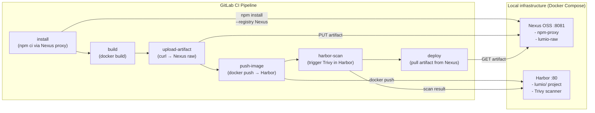

# Phase 6b — Artifact Registries: Nexus and Harbor

> **Concepts covered:** Nexus OSS as npm proxy and artifact store, artifact promotion pattern, Harbor as private container registry, Harbor built-in Trivy scanning, robot accounts, registry integration in GitLab CI | **Cost:** $0 — Nexus OSS and Harbor Community Edition are both free

---

## The problem

Lumio's Jenkins setup does not build against npmjs.com directly and does not push Docker images to Docker Hub. Both of those would be security and reliability risks in a production shop.

Instead they run two pieces of infrastructure:

```
Lumio artifact infrastructure (Jenkins era):

  Nexus OSS (nexus.lumio.internal:8081)
  ├── npm-proxy        → proxies https://registry.npmjs.org
  │                      all CI npm installs hit Nexus, not the internet
  ├── npm-hosted       → internal npm packages (not yet used by lumio-api)
  └── lumio-raw        → generic artifact store
                         build job uploads lumio-api-1.0.3.tgz
                         deploy job downloads lumio-api-1.0.3.tgz
                         (build and deploy are fully decoupled)

  Harbor (registry.lumio.io)
  └── lumio/           → private container registry project
      ├── lumio-api:1.0.3
      ├── lumio-frontend:2.1.0
      └── lumio-worker:0.8.1
```

The Jenkins pipeline uses `buildDocker.groovy` to push to `registry.lumio.io` (Harbor). Jenkins install jobs set `npm_config_registry=http://nexus.lumio.internal:8081/repository/npm-proxy/` so every `npm install` pulls from the Nexus cache.

The migration question is not "replace Nexus and Harbor with GitLab-native features" — that would be a separate project. The question is: **how do we make GitLab CI talk to the existing Nexus and Harbor infrastructure while the migration runs?**

GitLab has its own Package Registry and Container Registry. Those are the long-term destination. But many organisations cannot migrate artifact stores and container registries at the same time as CI/CD. This phase covers the integration path: GitLab CI pipelines that push to Harbor and pull from Nexus, exactly as the Jenkins pipelines did.

---

## GitLab native vs Nexus/Harbor — when to use which

| | GitLab Package Registry | Nexus OSS |
|---|---|---|
| npm proxy (cache npmjs.com) | No | Yes |
| Internal npm packages | Yes | Yes |
| Generic artifact store | Yes (generic packages) | Yes (raw repos) |
| Maven / Gradle | Yes | Yes |
| No extra infrastructure | Yes | No — needs a server |
| Works out of the box on GitLab.com | Yes | No |

| | GitLab Container Registry | Harbor |
|---|---|---|
| Private Docker images | Yes | Yes |
| Built-in Trivy scanning | GitLab Ultimate only | Yes (free) |
| RBAC / project isolation | Basic | Fine-grained |
| Image signing (Cosign/Notary) | No | Yes |
| Proxy cache (Docker Hub mirror) | No | Yes |
| Runs on your infrastructure | Yes (self-managed only) | Yes |

**Verdict:** If you are starting fresh on GitLab.com, use GitLab's native registries. If you are migrating from Jenkins and already have Nexus and Harbor, integrate them into GitLab CI first — then migrate the artifact stores as a separate project.

---

## What you will build



---

## Prerequisites

- Docker and Docker Compose installed locally
- Phase 6 completed — Docker builds and GitLab Container Registry working
- A way for GitLab CI runners to reach your local Nexus and Harbor:
  - **Option A (recommended after Phase 9):** Self-managed GitLab runner running on the same machine as Docker Compose — uses `host.docker.internal` or `localhost`
  - **Option B:** Expose Nexus and Harbor with ngrok HTTP tunnels — free, no credit card (HTTP tunnels only)

> **Runner access note:** GitLab.com shared runners run in the cloud. They cannot reach `localhost` on your machine. If you have not completed Phase 9 (local runner setup), use the ngrok approach described at the end of each challenge's Step 1.

---

## Challenge 1 — Run Nexus and configure the npm proxy

**Goal:** Start Nexus OSS locally, create an npm proxy repository, and verify that `npm install` routes through it.

### Step 1 — Start Nexus

```bash
cd phase-6b-artifact-registries
docker compose -f docker-compose.nexus.yml up -d
```

Nexus takes 60–90 seconds to start. Wait for the health check:

```bash
docker compose -f docker-compose.nexus.yml ps
# State should be: healthy
```

Then open `http://localhost:8081`.

### Step 2 — Get the initial admin password

On first boot, Nexus generates a random admin password:

```bash
docker exec nexus cat /nexus-data/admin.password
```

Log in at `http://localhost:8081` with `admin` and that password. On first login, Nexus will prompt you to set a new password and choose whether to enable anonymous access. **Enable anonymous read** for the lab — it lets the npm proxy work without authentication for reads.

### Step 3 — Create the npm proxy repository

In Nexus UI: **Settings (gear icon) → Repository → Repositories → Create repository**

Select **npm (proxy)**:

```
Name:           npm-proxy
Remote storage: https://registry.npmjs.org
```

Click **Create repository**.

Then create the artifact store:

**Create repository → raw (hosted)**:

```
Name:           lumio-raw
Deployment policy: Allow redeploy
```

Click **Create repository**.

### Step 4 — Test the proxy manually

```bash
npm install --registry http://localhost:8081/repository/npm-proxy/ lodash
```

Go back to Nexus → **Browse → npm-proxy** — you will see `lodash` cached.

### Step 5 — Expose Nexus to GitLab CI (ngrok approach)

If using GitLab.com shared runners:

```bash
ngrok http 8081
# Nexus is now at https://abc123.ngrok-free.app
```

> HTTP tunnels are free on ngrok. The URL changes every session — for a stable URL upgrade to a paid plan or use a self-managed ngrok alternative. For the lab, you will add the current URL as a CI variable each session.

### Step 6 — Add CI variables

In **lumio-api → Settings → CI/CD → Variables**, add:

| Key | Value | Example |
|---|---|---|
| `NEXUS_URL` | Nexus base URL | `http://localhost:8081` or `https://abc123.ngrok-free.app` |
| `NEXUS_USER` | Admin username | `admin` |
| `NEXUS_PASSWORD` | Admin password | (masked) |

### Step 7 — Update the install job to use the npm proxy

In `lumio-api/.gitlab-ci.yml`, update the install job:

```yaml
install:
  stage: install
  image: node:18-alpine
  cache:
    key:
      files:
        - package-lock.json
    paths:
      - node_modules/
    policy: push
  variables:
    npm_config_registry: "$NEXUS_URL/repository/npm-proxy/"
  script:
    - npm ci --prefer-offline
  rules:
    - if: $CI_PIPELINE_SOURCE == "merge_request_event"
    - if: $CI_COMMIT_BRANCH == "main"
```

> Setting `npm_config_registry` as a CI variable overrides the default registry for all `npm` commands in the job. No `.npmrc` file changes required.

Push and watch the install job. In the Nexus UI, packages will appear in **Browse → npm-proxy** as they are cached.

---

## Challenge 2 — Artifact promotion with Nexus raw repository

**Goal:** Upload the build artifact (a `.tgz` tarball) to Nexus after the build, then download it in the deploy job — decoupling build from deploy so that the exact same artifact is promoted through staging to production without rebuilding.

### The artifact promotion pattern

In Jenkins + Nexus, the pattern is:

```
build job  →  produces lumio-api-1.0.3.tgz
           →  uploads  to Nexus lumio-raw/lumio-api/1.0.3/lumio-api-1.0.3.tgz

deploy job →  downloads lumio-api-1.0.3.tgz from Nexus
           →  deploys   the exact same artifact that was tested
```

This is different from how GitLab CI artifacts work — GitLab artifacts are ephemeral (they expire and are tied to specific pipeline runs). Nexus gives you a permanent, versioned store. If a production issue appears at 2am and you need to roll back, you fetch the previous version from Nexus directly, without needing to rerun the pipeline.

### Step 1 — Add an upload-artifact job

```yaml
upload-artifact:
  stage: build
  image: alpine:3.19
  before_script:
    - apk add --no-cache curl
  script:
    - ARTIFACT_VERSION=$CI_COMMIT_SHORT_SHA
    - ARTIFACT_NAME="lumio-api-${ARTIFACT_VERSION}.tgz"
    # Pack the application source (excluding node_modules)
    - tar --exclude=node_modules --exclude=coverage --exclude=.git
        -czf $ARTIFACT_NAME src/ package.json package-lock.json Dockerfile
    # Upload to Nexus raw repository
    - |
      curl -sf -u "$NEXUS_USER:$NEXUS_PASSWORD" \
        --upload-file "$ARTIFACT_NAME" \
        "$NEXUS_URL/repository/lumio-raw/lumio-api/$ARTIFACT_VERSION/$ARTIFACT_NAME"
    - echo "Artifact uploaded: $NEXUS_URL/repository/lumio-raw/lumio-api/$ARTIFACT_VERSION/$ARTIFACT_NAME"
  artifacts:
    reports: {}
  rules:
    - if: $CI_COMMIT_BRANCH == "main"
  needs:
    - job: build
      artifacts: false
```

### Step 2 — Download the artifact in deploy

```yaml
deploy-staging:
  stage: deploy-staging
  image: alpine/k8s:1.29.14
  environment:
    name: staging
    url: https://staging.lumio.internal
  before_script:
    - apk add --no-cache curl
  script:
    - ARTIFACT_VERSION=$CI_COMMIT_SHORT_SHA
    - ARTIFACT_NAME="lumio-api-${ARTIFACT_VERSION}.tgz"
    # Download the artifact from Nexus (same version that was built and tested)
    - |
      curl -sf -u "$NEXUS_USER:$NEXUS_PASSWORD" \
        -O "$NEXUS_URL/repository/lumio-raw/lumio-api/$ARTIFACT_VERSION/$ARTIFACT_NAME"
    - echo "Deploying $ARTIFACT_NAME from Nexus"
    # ... kubectl set image etc.
    - kubectl config use-context $KUBE_CONTEXT_STAGING
    - kubectl set image deployment/lumio-api lumio-api=$APP_IMAGE -n lumio-staging
    - kubectl rollout status deployment/lumio-api -n lumio-staging --timeout=120s
  rules:
    - if: $CI_COMMIT_BRANCH == "main"
  needs:
    - job: build
      artifacts: true
    - job: upload-artifact
      artifacts: false
```

### Step 3 — Verify in Nexus

After the pipeline runs, open **Nexus → Browse → lumio-raw**. You will see:

```
lumio-raw/
└── lumio-api/
    └── a3f9b12/
        └── lumio-api-a3f9b12.tgz   (uploaded by build job)
```

### Step 4 — Roll back using Nexus

To simulate a rollback, download a previous version directly:

```bash
PREVIOUS_SHA=<previous commit SHA>
curl -u admin:yourpassword \
  http://localhost:8081/repository/lumio-raw/lumio-api/$PREVIOUS_SHA/lumio-api-$PREVIOUS_SHA.tgz \
  -O
```

> This is the core value of the Nexus artifact store: every build artifact is permanently retrievable by its exact version, independent of whether the GitLab pipeline that built it still exists.

---

## Challenge 3 — Harbor as a private container registry

**Goal:** Run Harbor locally, create a project and robot account, and push Docker images from GitLab CI to Harbor instead of (or alongside) the GitLab Container Registry.

### Step 1 — Download and install Harbor

Harbor is installed via its official offline installer — it generates a Docker Compose file tailored to your configuration.

```bash
# Download Harbor offline installer (v2.10 — check https://github.com/goharbor/harbor/releases for latest)
curl -LO https://github.com/goharbor/harbor/releases/download/v2.10.3/harbor-offline-installer-v2.10.3.tgz
tar xzf harbor-offline-installer-v2.10.3.tgz
cd harbor
```

Copy the lab-ready configuration file:

```bash
cp ../phase-6b-artifact-registries/harbor.yml harbor.yml
```

Review `harbor.yml` — for the lab, it is configured for HTTP on port 80 with hostname `localhost`. No HTTPS changes are needed.

Run the installer:

```bash
sudo ./install.sh --with-trivy
```

`--with-trivy` enables Harbor's built-in vulnerability scanner. The installer generates a `docker-compose.yml` and starts all Harbor components.

After install (takes 1–2 minutes), open `http://localhost`. Log in with:
- Username: `admin`
- Password: `Harbor12345` (set in `harbor.yml`)

### Step 2 — Create a project in Harbor

In the Harbor UI, click **+ New Project**:

```
Project Name:  lumio
Access Level:  Private
```

Click **OK**. This creates a namespace under `localhost/lumio/`.

### Step 3 — Create a robot account

Robot accounts are service accounts for CI/CD — they have scoped permissions and do not expire unless you set an expiry.

**Projects → lumio → Robot Accounts → + New Robot Account**

```
Name:        gitlab-ci
Expiration:  Never (or 365 days)
Permissions:
  ✓ Push repository
  ✓ Pull repository
  ✓ Create tag
  ✓ Delete tag
```

Click **Add**. Harbor shows the robot account name and secret — copy both immediately (shown once only):

```
Name:   robot$lumio+gitlab-ci
Secret: <generated secret>
```

### Step 4 — Add Harbor credentials to GitLab CI

In **lumio-api → Settings → CI/CD → Variables**, add:

| Key | Value | Masked |
|---|---|---|
| `HARBOR_HOST` | `localhost` or ngrok URL | No |
| `HARBOR_USER` | `robot$lumio+gitlab-ci` | No |
| `HARBOR_PASSWORD` | `<robot account secret>` | Yes |

### Step 5 — Expose Harbor to GitLab CI runners (ngrok approach)

If using GitLab.com shared runners:

```bash
ngrok http 80
# Harbor is now at https://xyz789.ngrok-free.app
# Set HARBOR_HOST to xyz789.ngrok-free.app in CI variables (no https://)
```

> Harbor's Docker registry protocol requires the host without the scheme. The docker CLI prefixes `https://` automatically. For HTTP (local lab without ngrok), you need to configure the Docker daemon to allow insecure registries — see Step 6.

### Step 6 — Allow insecure registry (local HTTP only)

If Harbor is on HTTP (no ngrok, no TLS), Docker must be told to allow it. In the CI job, configure the Docker daemon before login:

```yaml
build:
  stage: build
  image: docker:24
  services:
    - name: docker:24-dind
      command: ["--insecure-registry=host.docker.internal:80"]
```

> When using ngrok, Harbor gets a real HTTPS URL — skip this step entirely.

### Step 7 — Update the build job to push to Harbor

```yaml
variables:
  HARBOR_IMAGE: "$HARBOR_HOST/lumio/lumio-api:$CI_COMMIT_SHORT_SHA"
  # Keep pushing to GitLab registry too — both run in parallel during migration
  APP_IMAGE: "$CI_REGISTRY_IMAGE/lumio-api:$CI_COMMIT_SHORT_SHA"

build:
  stage: build
  image: docker:24
  services:
    - docker:24-dind
  script:
    # Push to GitLab Container Registry (existing)
    - docker login -u $CI_REGISTRY_USER -p $CI_REGISTRY_PASSWORD $CI_REGISTRY
    - docker build -t $APP_IMAGE .
    - docker push $APP_IMAGE
    # Also push to Harbor (migration parallel run)
    - docker login -u $HARBOR_USER -p $HARBOR_PASSWORD $HARBOR_HOST
    - docker tag $APP_IMAGE $HARBOR_IMAGE
    - docker push $HARBOR_IMAGE
    - echo "Image pushed to Harbor: $HARBOR_IMAGE"
  rules:
    - if: $CI_COMMIT_BRANCH == "main"
```

> During the migration parallel run, you push to both registries. Once Harbor is the sole target and Jenkins is decommissioned, remove the GitLab registry push.

### Step 8 — Verify in Harbor

After the pipeline runs, open **Harbor → Projects → lumio → Repositories**. You will see:

```
lumio/lumio-api
  ├── a3f9b12   (latest push)
  ├── 9779c1a
  └── ddb81a8
```

Each tag links to a vulnerability scan report (triggered automatically if Trivy is configured — see Challenge 4).

---

## Challenge 4 — Harbor's built-in Trivy scanning

**Goal:** Configure Harbor to automatically scan images with Trivy on push, block deployments if critical vulnerabilities are found, and surface scan results in the Harbor UI.

### How Harbor scanning works

```
docker push harbor/lumio/lumio-api:abc123
                │
                ▼
         Harbor receives image
                │
                ▼
         Trivy scans image layers
         (in Harbor, not in your pipeline)
                │
                ▼
    ┌───────────────────────────┐
    │  Scan result in Harbor UI │
    │  Vulnerabilities: 3       │
    │  HIGH: 1  CRITICAL: 0     │
    │  Status: Passed           │
    └───────────────────────────┘
                │
                ▼
    Image pull blocked if policy
    requires zero critical CVEs
```

This is different from the Trivy fs scan in Phase 8 (which scans `package-lock.json` before build). Harbor scans the **built image layers** — it catches OS-level CVEs (Alpine packages) in addition to npm vulnerabilities.

### Step 1 — Configure automatic scanning on push

In Harbor: **Administration → Interrogation Services → Scanners** — verify `Trivy` is listed and set as default.

Then: **Projects → lumio → Configuration**

```
Automatically scan images on push:  ✓ Enabled
```

From this point on, every `docker push` triggers a Trivy scan automatically.

### Step 2 — Set a vulnerability policy

**Projects → lumio → Configuration → Deployment Security**

```
Prevent vulnerable images from running:  ✓ Enabled
Severity threshold:                      Critical
```

With this policy, any image with at least one **Critical** CVE cannot be pulled. `docker pull` returns a 403 until the vulnerability is resolved or the CVE is marked as accepted in the Harbor UI.

### Step 3 — Add a scan check to the CI pipeline

Harbor's API lets you fetch scan results so the pipeline can fail fast without waiting for a pull-time block.

```yaml
harbor-scan-check:
  stage: dynamic-scan
  image: alpine:3.19
  before_script:
    - apk add --no-cache curl jq
  script:
    - |
      echo "Waiting for Harbor Trivy scan to complete..."
      for i in $(seq 1 20); do
        SCAN_STATUS=$(curl -sf -u "$HARBOR_USER:$HARBOR_PASSWORD" \
          "https://$HARBOR_HOST/api/v2.0/projects/lumio/repositories/lumio-api/artifacts/$CI_COMMIT_SHORT_SHA" \
          | jq -r '.scan_overview | to_entries[0].value.scan_status // "Not scanned"')
        echo "Scan status: $SCAN_STATUS (attempt $i)"
        [ "$SCAN_STATUS" = "Success" ] && break
        sleep 15
      done
    - |
      SCAN_RESULT=$(curl -sf -u "$HARBOR_USER:$HARBOR_PASSWORD" \
        "https://$HARBOR_HOST/api/v2.0/projects/lumio/repositories/lumio-api/artifacts/$CI_COMMIT_SHORT_SHA" \
        | jq -r '.scan_overview | to_entries[0].value')
      CRITICAL=$(echo "$SCAN_RESULT" | jq -r '.summary.summary.CRITICAL // 0')
      HIGH=$(echo "$SCAN_RESULT" | jq -r '.summary.summary.HIGH // 0')
      echo "Critical: $CRITICAL  High: $HIGH"
      if [ "$CRITICAL" -gt 0 ]; then
        echo "CRITICAL vulnerabilities found — failing pipeline"
        exit 1
      fi
      echo "Scan passed (no critical CVEs)"
  rules:
    - if: $CI_COMMIT_BRANCH == "main"
  needs:
    - job: build
      artifacts: true
```

### Step 4 — View scan results

In Harbor: **Projects → lumio → lumio-api → <tag>** → click the **Vulnerabilities** tab.

```
Scan completed: 2026-04-27 10:14:32

Severity   Count   Fixed
Critical   0       —
High       1       ✓ (fix: upgrade alpine 3.18 → 3.19)
Medium     3       ✓
Low        7       —
```

Click any finding to see the CVE ID, affected package, installed version, and the fix version.

### Step 5 — Compare with Phase 6 Trivy (phase-by-phase progression)

| | Phase 6 Trivy image scan | Phase 8 Trivy fs scan | Phase 6b Harbor scan |
|---|---|---|---|
| What is scanned | Built image (all layers) | `package-lock.json` only | Built image (all layers) |
| Who runs Trivy | GitLab CI job | GitLab CI job | Harbor (on push) |
| Result location | GitLab artifact | GitLab artifact | Harbor UI |
| Can block pipeline | Yes (`--exit-code 1`) | Yes (`--exit-code 1`) | Yes (API check job) |
| Can block deploy | No | No | Yes (Harbor deployment policy) |
| CVE acceptance workflow | No | No | Yes (in Harbor UI) |

---

## Challenge 5 (Bonus) — Harbor as a Docker Hub proxy cache

Harbor can act as a pull-through proxy for Docker Hub, ghcr.io, quay.io, and other public registries. All `docker pull node:18-alpine` requests in CI go through Harbor instead of hitting Docker Hub directly — bypassing Docker Hub rate limits and caching images locally.

### Step 1 — Create a proxy cache endpoint in Harbor

**Administration → Registries → New Endpoint**

```
Provider:     Docker Hub
Name:         dockerhub
Endpoint URL: https://hub.docker.com
Access ID:    (your Docker Hub username — optional, increases rate limit)
Access secret: (Docker Hub access token — optional)
```

Click **Test Connection** → **OK**.

### Step 2 — Create a proxy project

**+ New Project**

```
Project Name:  dockerhub-proxy
Access Level:  Public
Proxy Cache:   ✓ Enabled
Registry:      dockerhub
```

### Step 3 — Update CI jobs to pull base images through Harbor

In your `.gitlab-ci.yml`, replace image references:

```yaml
# Before
install:
  image: node:18-alpine

# After — pulls through Harbor proxy cache
install:
  image: $HARBOR_HOST/dockerhub-proxy/library/node:18-alpine
```

The first pull fetches from Docker Hub and caches in Harbor. All subsequent pulls are served from the local Harbor cache — faster and immune to Docker Hub rate limits.

> This is particularly valuable when running self-managed runners (Phase 9) where all jobs on the same runner fleet share the Harbor cache.

---

## Nexus vs GitLab Package Registry — migration decision

Once Harbor and Nexus are integrated with GitLab CI, you have two running systems. The decision of whether to migrate away from Nexus to GitLab's Package Registry is separate from the CI/CD migration and should be made on its own timeline.

| Reason to keep Nexus | Reason to migrate to GitLab Package Registry |
|---|---|
| Nexus serves non-GitLab consumers (Gradle, Maven, other tools) | Simplify infrastructure — one less server |
| Nexus has years of cached packages (cold start cost) | All artifacts visible in GitLab project UI |
| Team is already managing Nexus (no new ops burden) | No separate Nexus admin required |
| Nexus proxy cache reduces egress cost | GitLab Package Registry is always available on GitLab.com |

**Migration path if you decide to move:** GitLab has a [Package Registry migration guide](https://docs.gitlab.com/ee/user/packages/package_registry/) and supports uploading existing packages via the API. The npm proxy replacement is the hardest part — GitLab does not proxy npmjs.com, so `npm install` always hits the internet unless your runners have local caching.

---

## Outcome

After completing this phase, Lumio's GitLab CI pipelines integrate with the same artifact infrastructure the Jenkins pipelines used:

| Jenkins behaviour | GitLab CI equivalent |
|---|---|
| `npm install` via Nexus npm proxy | `npm_config_registry` variable in install job |
| Build artifact uploaded to Nexus raw | `curl --upload-file` to `lumio-raw` repo |
| Deploy pulls artifact from Nexus | `curl -O` in deploy job (exact version) |
| `docker push registry.lumio.io` | `docker push $HARBOR_HOST/lumio/lumio-api:$SHA` |
| Nightly Trivy scan in Jenkins | Harbor auto-scan on push + `harbor-scan-check` job |

The parallel run pattern holds: both systems produce the same artifacts and push to both registries. Jenkins is decommissioned for these jobs only after the GitLab CI versions have been stable for two weeks.
