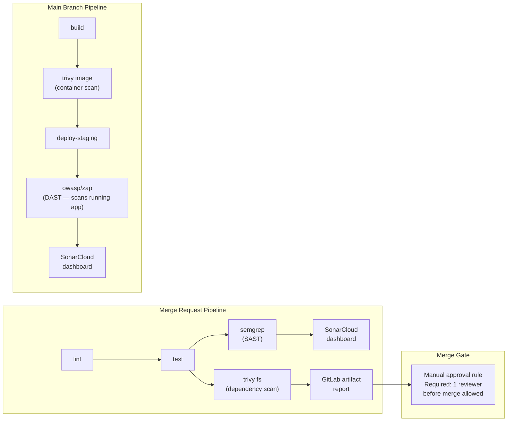

# Phase 8 — Security Scanning with Free Tools

> **Concepts covered:** SAST, dependency scanning, container scanning, DAST, MR pipelines, MR approval rules, SonarCloud dashboard | **Cost:** $0 — all tools used here are free

---

## The problem

Lumio's security scanning setup is a graveyard of Jenkins plugin integrations. Four separate tools, four separate configurations, four separate places where results appear — and none of them talk to each other.

```
Current Lumio security stack (Jenkins):

  Plugin 1: OWASP Dependency-Check    → results in Jenkins build log + HTML report
  Plugin 2: SonarQube Scanner         → results in SonarQube server (separate login)
  Plugin 3: Anchore                   → results in Anchore Enterprise (yet another login)
  Plugin 4: OWASP ZAP                 → results in ZAP HTML report attached to build
```

The last time the OWASP Dependency-Check plugin was updated, it broke the Anchore plugin because both tried to write to the same temp directory. The ZAP scan runs against production because nobody updated the target URL when staging was moved. SonarQube has 847 open findings nobody has looked at in three months because the dashboard requires a VPN and a separate account.

GitLab CI integrates with best-in-class open source security tools natively — no plugins, no separate servers that need VPN access. This phase replaces all four Jenkins plugins with free, production-grade tools.

---

## How SonarQube / SonarCloud works

SonarQube is a code quality and security analysis platform. SonarCloud is the hosted version — same engine, no server to run.

The flow has three parts:

```
Your repo                CI pipeline               SonarCloud
──────────               ───────────               ──────────
sonar-project.properties ──► sonar-scanner    ──►  receives analysis
src/                         (runs in CI job)       stores results
package-lock.json                                   computes Quality Gate
                                                    displays dashboard
```

1. **Scanner** — the `sonar-scanner` CLI runs inside your CI job. It reads your source files, test coverage reports, and `sonar-project.properties`, then sends the analysis payload to SonarCloud.

2. **Quality Gate** — a set of conditions (e.g. zero new critical issues, coverage above 80%) that SonarCloud evaluates after each analysis. The result is either **Passed** or **Failed**. You define the thresholds; SonarCloud enforces them.

3. **Dashboard** — findings, coverage trends, duplications, and security hotspots are aggregated in the SonarCloud UI. Unlike the Jenkins SonarQube setup, no VPN or separate server is needed — results are at `sonarcloud.io`.

The scanner never runs code — it performs static analysis only. It reads files, applies rules, and reports. Nothing is executed.

---

## Why not GitLab Ultimate security features?

GitLab's native Security tab in MRs, the Group Security Dashboard, and scan result policies all require **GitLab Ultimate** (~$99/user/month). The scanning jobs themselves (SAST, dependency scanning, container scanning) run on Free, but the UI that makes findings actionable is gated.

This phase uses the same underlying scanners GitLab Ultimate uses — Semgrep for SAST, Trivy for dependencies and containers, OWASP ZAP for DAST — but surfaces results through **SonarCloud** (free for public repos) and GitLab artifact reports.

| Jenkins plugin | GitLab Ultimate | This phase (free) |
|---|---|---|
| SonarQube Scanner | `Security/SAST.gitlab-ci.yml` + Security tab | Semgrep + SonarCloud dashboard |
| OWASP Dependency-Check | `Security/Dependency-Scanning.gitlab-ci.yml` | Trivy filesystem scan |
| Anchore Enterprise | `Security/Container-Scanning.gitlab-ci.yml` | Trivy image scan (Phase 6) |
| OWASP ZAP (misconfigured) | `DAST.gitlab-ci.yml` | OWASP ZAP Docker (in-pipeline) |
| 4 separate dashboards | Group Security Dashboard | SonarCloud project dashboard |
| No MR blocking | Scan result policies | MR approval rules (Free) |

---

## What you will build



---

## Prerequisites

- `lumio-api` project from previous phases with a working pipeline
- SonarCloud account (free at [sonarcloud.io](https://sonarcloud.io) — sign in with GitLab)
- Rancher Desktop running (for local testing)

---

## Challenge 1 — Set up SonarCloud

**Goal:** Connect `lumio-api` to SonarCloud to get a persistent security and code quality dashboard — free for public projects, no server to maintain.

### Step 1 — Create a GitLab Personal Access Token for SonarCloud

SonarCloud needs a GitLab PAT to read your projects and namespace.

In GitLab: **User avatar → Edit profile → Access tokens → Add new token**

```
Token name: sonarcloud
Scopes:     ✓ api
            ✓ read_user
Expiration: (one year or no expiry)
```

Click **Create personal access token** and copy the value — you will paste it into SonarCloud in the next step.

### Step 2 — Create a SonarCloud account and set up the project

1. Go to [sonarcloud.io](https://sonarcloud.io) and click **Log in with GitLab**
2. Authorise SonarCloud to access your GitLab account
3. If prompted to create an organization, choose **GitLab** → paste the PAT from step 1 → select your namespace (`lumio4615817`) → click **"Create organization"**
4. Click **"+"** (top right) → **"Analyze new project"**
5. If you see **"No repositories found"** (common when the repo is under a personal namespace), click **"Create a project manually"** at the bottom of the page:
   ```
   Organization:   lumio4615817
   Project key:    lumio4615817_lumio-api
   Display name:   lumio-api
   Visibility:     Public
   ```
6. Click **"Set up"** → choose **"With GitLab CI"** as the analysis method
7. SonarCloud generates a `SONAR_TOKEN` — copy it for the next step

### Step 3 — Generate a SonarCloud token

In SonarCloud: **My Account → Security → Generate Tokens**

```
Token name: lumio-api-ci
Type:       Project Analysis Token
Project:    lumio-api
```

Click **Generate** and copy the token — shown once only.

### Step 4 — Add the token to GitLab CI variables

In **lumio-api → Settings → CI/CD → Variables**, add:

| Key | Value | Masked |
|---|---|---|
| `SONAR_TOKEN` | `<token from step 2>` | Yes |
| `SONAR_HOST_URL` | `https://sonarcloud.io` | No |

### Step 5 — Add `sonar-project.properties` to the repo

```bash
cat > sonar-project.properties << 'EOF'
sonar.projectKey=lumio4615817_lumio-api
sonar.organization=lumio4615817
sonar.sources=src
sonar.exclusions=node_modules/**,coverage/**
EOF

git add sonar-project.properties
git commit -m "chore: add SonarCloud project configuration"
git push origin main
```

> Coverage and test report paths (`sonar.javascript.lcov.reportPaths`, `sonar.testExecutionReportPaths`) are omitted here — they require the `test` job to run first and produce the artifact files. Add them back in Challenge 5 once the full pipeline is wired up with a `test` job that has `needs:` on `sonarcloud-scan`.

### Step 6 — Add the SonarCloud scan job to `.gitlab-ci.yml`

```yaml
sonarcloud-scan:
  stage: test
  image: sonarsource/sonar-scanner-cli:latest
  variables:
    SONAR_USER_HOME: "${CI_PROJECT_DIR}/.sonar"
    GIT_DEPTH: 0   # full clone required for blame data
  cache:
    key: sonar-cache
    paths:
      - .sonar/cache
  script:
    - sonar-scanner
  rules:
    - if: $CI_PIPELINE_SOURCE == "merge_request_event"
    - if: $CI_COMMIT_BRANCH == "main"
```

### Step 7 — Set the main branch in SonarCloud

SonarCloud defaults to `master` as the main branch. If your repo uses `main`, results will be stored but not shown on the project dashboard.

Fix it before pushing: **SonarCloud → Project → Administration → Branches and Pull Requests** → rename `master` to `main`.

### Step 8 — Push and view the dashboard

```bash
git add .gitlab-ci.yml
git commit -m "ci: add SonarCloud scan job"
git push origin main
```

After the pipeline runs, go to **sonarcloud.io → lumio-api**. You will see:

```
lumio-api

Quality Gate:  ● Passed

Bugs            0
Vulnerabilities 0
Security Hotspots  2
Code Smells     14
Coverage        72.4%
Duplications    3.2%
```

Click **Security Hotspots** to see findings with remediation guidance.

---

## SonarCloud best practices

### `sonar-project.properties`

The minimal config works, but a production-grade setup should separate source from tests, exclude generated files, and configure coverage properly. Here is the recommended configuration for `lumio-api`:

```properties
sonar.projectKey=lumio4615817_lumio-api
sonar.organization=lumio4615817

# Source and test directories
sonar.sources=src
sonar.tests=src
sonar.test.inclusions=**/*.test.js,**/*.spec.js
sonar.sourceEncoding=UTF-8

# Exclusions
sonar.exclusions=node_modules/**,coverage/**,**/*.test.js,**/*.spec.js
sonar.coverage.exclusions=**/*.test.js,**/*.spec.js
sonar.cpd.exclusions=**/*.test.js,**/*.spec.js

# Coverage — uncomment once the test job is wired up in Challenge 5
# sonar.javascript.lcov.reportPaths=coverage/lcov.info
# sonar.testExecutionReportPaths=test-results/junit.xml
```

| Property | Why |
|---|---|
| `sonar.tests` + `sonar.test.inclusions` | Tells SonarCloud which files are tests — they are excluded from issue counts and duplications |
| `sonar.exclusions` | Prevents test files appearing as source code findings |
| `sonar.coverage.exclusions` | Stops test files dragging down coverage percentage |
| `sonar.cpd.exclusions` | Prevents test boilerplate triggering false duplication alerts |
| `sonar.sourceEncoding` | Avoids encoding-related false positives on special characters |

### CI job

Two important additions to the `sonarcloud-scan` job once the `test` job is in place:

```yaml
sonarcloud-scan:
  stage: test
  image: sonarsource/sonar-scanner-cli:latest
  variables:
    SONAR_USER_HOME: "${CI_PROJECT_DIR}/.sonar"
    GIT_DEPTH: 0
    SONAR_SCANNER_OPTS: "-Xmx512m"   # cap memory on shared runners
  cache:
    key: sonar-cache
    paths:
      - .sonar/cache
  needs:
    - job: test        # ensures coverage/lcov.info exists before scan runs
      artifacts: true
  script:
    - sonar-scanner -Dsonar.qualitygate.wait=true   # fail CI if Quality Gate fails
  rules:
    - if: $CI_PIPELINE_SOURCE == "merge_request_event"
    - if: $CI_COMMIT_BRANCH == "main"
```

| Addition | Why |
|---|---|
| `needs: [test]` | Guarantees coverage report exists before the scanner runs — without this, coverage is always 0% |
| `sonar.qualitygate.wait=true` | Makes the CI job fail if the Quality Gate fails — enforces the gate rather than just reporting |
| `SONAR_SCANNER_OPTS: "-Xmx512m"` | Prevents the JVM from consuming all memory on a shared GitLab runner (2GB RAM) |

### Quality Gate

SonarCloud's default Quality Gate ("Sonar way") evaluates **new code only** — it won't block a merge because of pre-existing technical debt, only new issues introduced in the current MR. This is the right default for a project with existing issues.

To customise it: **SonarCloud → Organization → Quality Gates → Create** and set conditions that match your team's standards:

```
New code conditions (recommended starting point):
  Coverage on new code          ≥ 80%
  Duplications on new code      ≤ 3%
  New critical issues           = 0
  New blocker issues            = 0
  New security hotspots reviewed = 100%
```

> Don't set coverage to 100% on day one — the team will work around it. Start at 60–70% and raise it as coverage improves.

---

## Challenge 2 — Add SAST with Semgrep

**Goal:** Add static analysis that catches security bugs in JavaScript — hardcoded secrets, injection risks, prototype pollution — and surface findings in both SonarCloud and as a GitLab artifact.

### Step 1 — Add the Semgrep job

```yaml
semgrep-sast:
  stage: test
  image: semgrep/semgrep:latest
  script:
    - semgrep ci
      --config=p/javascript
      --config=p/nodejs
      --config=p/secrets
      --json
      --output=semgrep-report.json
      || true   # don't fail pipeline — findings reported separately
  artifacts:
    when: always
    paths:
      - semgrep-report.json
    expire_in: 7 days
  rules:
    - if: $CI_PIPELINE_SOURCE == "merge_request_event"
    - if: $CI_COMMIT_BRANCH == "main"
```

> `|| true` prevents the job from failing the pipeline. This is intentional while you establish a baseline — findings go into the artifact for review. Once you are ready to enforce a hard block, replace `|| true` with `--error` (see Step 4).

### Step 2 — Push to a feature branch and open a MR

```bash
git checkout -b feat/add-security-scanning
git add .gitlab-ci.yml
git commit -m "ci: add Semgrep SAST"
git push origin feat/add-security-scanning
```

Open a Merge Request from `feat/add-security-scanning` to `main`.

### Step 3 — Review the Semgrep artifact

After the pipeline runs, go to the job page and download `semgrep-report.json`. Findings look like:

```json
{
  "results": [
    {
      "check_id": "javascript.lang.security.audit.node-child-process-injection",
      "path": "src/utils/exec.js",
      "start": { "line": 14 },
      "extra": {
        "message": "User-controlled data used in child_process.exec()",
        "severity": "ERROR"
      }
    }
  ]
}
```

### Step 4 — Enforce a hard block on findings

By default the job uses `|| true` so it never fails the pipeline. Before introducing a test vulnerability, switch to `--error` so Semgrep actually blocks:

```yaml
semgrep-sast:
  script:
    - semgrep ci
      --config=p/javascript
      --config=p/nodejs
      --config=p/secrets
      --json
      --output=semgrep-report.json
      # --error is not needed: semgrep ci exits non-zero on findings by default
      # just remove || true to enforce the hard block
```

> **Why SonarCloud alone won't block on secrets:** SonarCloud flags hardcoded credentials as **Security Hotspots**, not Vulnerabilities. Hotspots require manual review and only block the Quality Gate if you add `Security Hotspots Reviewed on new code = 100%` as a condition. Semgrep with `--error` is the more reliable hard gate for secrets in CI.

Now introduce the test vulnerability:

```bash
cat > src/utils/demo-vuln.js << 'EOF'
// DO NOT MERGE — security gate demo only
const ADMIN_TOKEN = 'lumio-admin-token-hardcoded-xK9mP2';
module.exports = { ADMIN_TOKEN };
EOF

git add src/utils/demo-vuln.js
git commit -m "test: hardcoded credential for Semgrep demo"
git push origin feat/add-security-scanning
```

The `semgrep-sast` job will now **fail** with:

```
Findings:
  src/utils/demo-vuln.js:2  secrets.hardcoded-token
  Hardcoded secret 'ADMIN_TOKEN' detected.

Exiting with error because findings were found.
ERROR: Job failed: exit code 1
```

Fix it:

```bash
cat > src/utils/demo-vuln.js << 'EOF'
const ADMIN_TOKEN = process.env.ADMIN_TOKEN;
if (!ADMIN_TOKEN) throw new Error('ADMIN_TOKEN env var is not set');
module.exports = { ADMIN_TOKEN };
EOF

git add src/utils/demo-vuln.js
git commit -m "fix: read ADMIN_TOKEN from env var"
git push origin feat/add-security-scanning
```

The re-run passes with zero findings.

### Step 5 — Also configure SonarCloud to flag Security Hotspots

In **SonarCloud → Organization → Quality Gates → your gate**, add:

```
Security Hotspots Reviewed on new code = 100%
```

This ensures any hardcoded secret that SonarCloud detects as a hotspot also requires manual sign-off before the Quality Gate passes — a second layer on top of the Semgrep hard block.

---

## Challenge 3 — Dependency scanning with Trivy

**Goal:** Scan `package-lock.json` directly for known CVEs before the Docker image is even built — catching dependency vulnerabilities earlier than a container scan.

### Step 1 — Add the Trivy filesystem scan job

```yaml
trivy-fs-scan:
  stage: test
  image:
    name: aquasec/trivy:latest
    entrypoint: [""]
  script:
    - trivy fs
      --exit-code 0
      --severity HIGH,CRITICAL
      --format json
      --output trivy-fs-report.json
      .
    - trivy fs
      --exit-code 0
      --severity HIGH,CRITICAL
      --format table
      .
  artifacts:
    when: always
    paths:
      - trivy-fs-report.json
    expire_in: 7 days
  rules:
    - if: $CI_PIPELINE_SOURCE == "merge_request_event"
    - if: $CI_COMMIT_BRANCH == "main"
```

> `--exit-code 0` prevents a hard pipeline failure. Adjust to `1` once you have a clean baseline and want to enforce zero HIGH/CRITICAL.

### Step 2 — Push and review findings

```bash
git add .gitlab-ci.yml
git commit -m "ci: add Trivy filesystem dependency scan"
git push origin feat/add-security-scanning
```

The job output will look like:

```
2026-04-25T10:12:00Z INFO Detected OS: none
2026-04-25T10:12:00Z INFO Number of language-specific files: 1

package-lock.json (npm)
=======================
Total: 3 (HIGH: 2, CRITICAL: 1)

┌──────────────┬────────────────┬──────────┬────────────────────┬──────────┐
│   Library    │ Vulnerability  │ Severity │ Installed Version  │ Fix      │
├──────────────┼────────────────┼──────────┼────────────────────┼──────────┤
│ lodash       │ CVE-2021-23337 │ CRITICAL │ 4.17.19            │ 4.17.21  │
│ minimatch    │ CVE-2022-3517  │ HIGH     │ 3.0.4              │ 3.0.5    │
│ tar          │ CVE-2021-37701 │ HIGH     │ 6.1.11             │ 6.1.13   │
└──────────────┴────────────────┴──────────┴────────────────────┴──────────┘
```

### Step 3 — Fix the critical vulnerability

```bash
npm install lodash@4.17.21 minimatch@3.0.5
npm audit fix
git add package.json package-lock.json
git commit -m "fix: upgrade vulnerable dependencies (lodash, minimatch)"
git push origin feat/add-security-scanning
```

The Trivy scan re-runs and the critical finding is gone.

### Step 4 — Compare with the Phase 6 Trivy container scan

| | Phase 6 Trivy (image scan) | Phase 8 Trivy (fs scan) |
|---|---|---|
| What it scans | Built Docker image layers | `package-lock.json` directly |
| When it runs | After `docker build` | Before build — on every MR |
| OS-level CVEs | Yes (Alpine packages) | No |
| npm CVEs | Yes (in image) | Yes (earlier) |
| Speed | Slow (pulls image) | Fast (scans lock file) |

Both complement each other — run fs scan on MRs for speed, image scan on main for completeness.

---

## Challenge 4 — DAST with OWASP ZAP

**Goal:** Run dynamic application security testing against a live instance of `lumio-api` started inside the CI pipeline — no external URL, no ngrok required.

### Step 1 — Add a start-app + ZAP scan job

```yaml
dast-zap:
  stage: dynamic-scan
  image: docker:24
  services:
    - docker:24-dind
  variables:
    APP_PORT: "3000"
    ZAP_TARGET: "http://docker:3000"
  script:
    # Start the app in the background using the image built in the build stage
    - docker run -d --name lumio-app -p 3000:3000 $APP_IMAGE
    # Wait for the app to be ready
    - |
      for i in $(seq 1 20); do
        docker run --rm --network host curlimages/curl:latest
          curl -sf http://localhost:3000/ && break
        echo "Waiting for app... ($i)"
        sleep 3
      done
    # Run ZAP baseline scan (passive only — safe for staging)
    - docker run --rm --network host
        -v $(pwd):/zap/wrk
        ghcr.io/zaproxy/zaproxy:stable
        zap-baseline.py
        -t http://localhost:3000
        -r zap-report.html
        -J zap-report.json
        -I   # don't fail on warnings
  artifacts:
    when: always
    paths:
      - zap-report.html
      - zap-report.json
    expire_in: 7 days
  rules:
    - if: $CI_COMMIT_BRANCH == "main"
  needs:
    - job: build
      artifacts: true
```

> `zap-baseline.py` runs a passive scan only — it crawls and observes but does not attack. Safe to run against any environment. Use `zap-full-scan.py` for active testing against a dedicated test environment.

### Step 2 — Add `dast` to your stages

```yaml
stages:
  - install
  - lint
  - test
  - build
  - deploy-staging
  - dynamic-scan
  - deploy-production
```

### Step 3 — Push to main and review findings

After the pipeline runs, download `zap-report.html` from the job artifacts and open it in a browser. Findings will look like:

```
ZAP Scanning Report — lumio-api

Risk Level   Alert                              Instances
Medium       X-Frame-Options header missing     3
Medium       Content Security Policy missing    1
Low          Server leaks version via header    1
             X-Powered-By: Express
Informational Timestamp disclosure              2
```

### Step 4 — Fix the medium findings

```javascript
// src/app.js — add security headers
const helmet = require('helmet');
app.use(helmet());   // sets X-Frame-Options, CSP, and 14 other headers
```

```bash
npm install helmet
git add src/app.js package.json package-lock.json
git commit -m "fix: add helmet middleware for security headers"
git push origin main
```

The next ZAP scan will show those findings resolved.

---

## Challenge 5 — MR pipelines and approval rules

**Goal:** Separate MR pipelines (security scanning only) from main branch pipelines (build + deploy), and require a manual approval before security findings can be merged.

### Step 1 — Full `.gitlab-ci.yml` with split rules

```yaml
stages:
  - install
  - lint
  - test
  - build
  - deploy-staging
  - dynamic-scan
  - deploy-production

variables:
  KUBE_CONTEXT_STAGING: "lumio4615817/lumio-api:lumio-staging-agent"
  KUBE_CONTEXT_PROD: "lumio4615817/lumio-api:lumio-staging-agent"
  APP_IMAGE: "$CI_REGISTRY_IMAGE/lumio-api:$CI_COMMIT_SHORT_SHA"

# ---- MR + main ----

install:
  stage: install
  image: node:18-alpine
  cache:
    key:
      files:
        - package-lock.json
    paths:
      - node_modules/
    policy: push
  script:
    - npm ci --prefer-offline
  rules:
    - if: $CI_PIPELINE_SOURCE == "merge_request_event"
    - if: $CI_COMMIT_BRANCH == "main"

lint:
  stage: lint
  image: node:18-alpine
  cache:
    key:
      files:
        - package-lock.json
    paths:
      - node_modules/
    policy: pull
  script:
    - npm run lint -- --format=junit --output-file=reports/eslint.xml
  artifacts:
    when: always
    reports:
      junit: reports/eslint.xml
  rules:
    - if: $CI_PIPELINE_SOURCE == "merge_request_event"
    - if: $CI_COMMIT_BRANCH == "main"

test:
  stage: test
  image: node:18-alpine
  cache:
    key:
      files:
        - package-lock.json
    paths:
      - node_modules/
    policy: pull
  script:
    - npm test -- --ci --coverage --reporters=default --reporters=jest-junit
  artifacts:
    when: always
    reports:
      junit: test-results/junit.xml
      coverage_report:
        coverage_format: cobertura
        path: coverage/cobertura-coverage.xml
    paths:
      - coverage/
    expire_in: 7 days
  coverage: '/Statements\s*:\s*(\d+(?:\.\d+)?)%/'
  rules:
    - if: $CI_PIPELINE_SOURCE == "merge_request_event"
    - if: $CI_COMMIT_BRANCH == "main"

# ---- Security scanning (MR + main) ----

sonarcloud-scan:
  stage: test
  image: sonarsource/sonar-scanner-cli:latest
  variables:
    SONAR_USER_HOME: "${CI_PROJECT_DIR}/.sonar"
    GIT_DEPTH: 0
  cache:
    key: sonar-cache
    paths:
      - .sonar/cache
  script:
    - sonar-scanner
  rules:
    - if: $CI_PIPELINE_SOURCE == "merge_request_event"
    - if: $CI_COMMIT_BRANCH == "main"

semgrep-sast:
  stage: test
  image: semgrep/semgrep:latest
  script:
    - semgrep ci
      --config=p/javascript
      --config=p/nodejs
      --config=p/secrets
      --json
      --output=semgrep-report.json
      || true
  artifacts:
    when: always
    paths:
      - semgrep-report.json
    expire_in: 7 days
  rules:
    - if: $CI_PIPELINE_SOURCE == "merge_request_event"
    - if: $CI_COMMIT_BRANCH == "main"

trivy-fs-scan:
  stage: test
  image:
    name: aquasec/trivy:latest
    entrypoint: [""]
  script:
    - trivy fs --exit-code 0 --severity HIGH,CRITICAL --format json --output trivy-fs-report.json .
    - trivy fs --exit-code 0 --severity HIGH,CRITICAL --format table .
  artifacts:
    when: always
    paths:
      - trivy-fs-report.json
    expire_in: 7 days
  rules:
    - if: $CI_PIPELINE_SOURCE == "merge_request_event"
    - if: $CI_COMMIT_BRANCH == "main"

# ---- Build + deploy (main only) ----

build:
  stage: build
  image: docker:24
  services:
    - docker:24-dind
  script:
    - docker login -u $CI_REGISTRY_USER -p $CI_REGISTRY_PASSWORD $CI_REGISTRY
    - docker build -t $APP_IMAGE .
    - docker push $APP_IMAGE
  rules:
    - if: $CI_COMMIT_BRANCH == "main"

deploy-staging:
  stage: deploy-staging
  image: alpine/k8s:1.29.14
  environment:
    name: staging
    url: https://staging.lumio.internal
  script:
    - kubectl config use-context $KUBE_CONTEXT_STAGING
    - kubectl set image deployment/lumio-api lumio-api=$APP_IMAGE -n lumio-staging
    - kubectl rollout status deployment/lumio-api -n lumio-staging --timeout=120s
  rules:
    - if: $CI_COMMIT_BRANCH == "main"
  needs:
    - job: build
      artifacts: true

dast-zap:
  stage: dynamic-scan
  image: docker:24
  services:
    - docker:24-dind
  script:
    - docker run -d --name lumio-app -p 3000:3000 $APP_IMAGE
    - |
      for i in $(seq 1 20); do
        docker run --rm --network host curlimages/curl:latest curl -sf http://localhost:3000/ && break
        echo "Waiting for app... ($i)"
        sleep 3
      done
    - docker run --rm --network host -v $(pwd):/zap/wrk
        ghcr.io/zaproxy/zaproxy:stable
        zap-baseline.py -t http://localhost:3000 -r zap-report.html -J zap-report.json -I
  artifacts:
    when: always
    paths:
      - zap-report.html
      - zap-report.json
    expire_in: 7 days
  rules:
    - if: $CI_COMMIT_BRANCH == "main"
  needs:
    - job: build
      artifacts: true

deploy-production:
  stage: deploy-production
  image: alpine/k8s:1.29.14
  environment:
    name: production
    url: https://app.lumio.io
  when: manual
  script:
    - kubectl config use-context $KUBE_CONTEXT_PROD
    - kubectl set image deployment/lumio-api lumio-api=$APP_IMAGE -n lumio-production
    - kubectl rollout status deployment/lumio-api -n lumio-production --timeout=180s
  rules:
    - if: $CI_COMMIT_BRANCH == "main"
      when: manual
    - when: never
  needs:
    - job: build
      artifacts: true
```

### Step 2 — Observe the two pipeline types

After pushing to a feature branch and opening a MR:

```
MR Pipeline — source: merge_request_event

  ● install          ✓ passed    0m 22s
  ● lint             ✓ passed    0m 18s
  ● test             ✓ passed    1m 47s
  ● sonarcloud-scan  ✓ passed    1m 03s
  ● semgrep-sast     ✓ passed    0m 54s
  ● trivy-fs-scan    ✓ passed    0m 31s
  — build            skipped    (main only)
  — deploy-staging   skipped    (main only)
  — dast-zap         skipped    (main only)
```

After merge to main:

```
Main Pipeline — source: push

  ● install          ✓ passed    0m 22s
  ● lint             ✓ passed    0m 18s
  ● test             ✓ passed    1m 47s
  ● sonarcloud-scan  ✓ passed    1m 03s
  ● semgrep-sast     ✓ passed    0m 54s
  ● trivy-fs-scan    ✓ passed    0m 31s
  ● build            ✓ passed    2m 14s
  ● deploy-staging   ✓ passed    1m 04s
  ● dast-zap         ✓ passed    7m 43s
  ▶ deploy-production  [manual]
```

### Step 3 — Add an MR approval rule

Navigate to **lumio-api → Settings → Merge requests → Approval rules** and click **Add approval rule**:

```
Rule name:          Security review
Approvals required: 1
Eligible approvers: (your user or a group)
```

Click **Save changes**. Now every MR requires at least one approval before the merge button is active — giving reviewers time to check the Semgrep and Trivy artifacts.

---

## Challenge 6 (Bonus) — Self-hosted SonarQube Community

If your repo is private and SonarCloud is not an option, run SonarQube Community Edition locally via Docker and expose it with an ngrok HTTP tunnel (HTTP tunnels are free on ngrok — only TCP costs money).

### Step 1 — Start SonarQube via Docker

```bash
docker run -d \
  --name sonarqube \
  -p 9000:9000 \
  sonarqube:community
```

Wait ~60 seconds for startup, then open `http://localhost:9000`. Default credentials: `admin` / `admin` (change on first login).

### Step 2 — Expose via ngrok HTTP tunnel (free)

```bash
ngrok http 9000
```

ngrok prints a public URL like:

```
Forwarding  https://abc123.ngrok-free.app -> localhost:9000
```

> HTTP tunnels are free on ngrok — no credit card required. Only TCP tunnels (used for Kubernetes API in step 5 of Phase 7) require a card.

### Step 3 — Create a project and token in SonarQube

1. Log in at `https://abc123.ngrok-free.app`
2. Click **Create project manually** → name it `lumio-api`
3. Go to **My Account → Security → Generate Token** → copy the token

### Step 4 — Update CI variables

Update the GitLab CI variables:

| Key | Value |
|---|---|
| `SONAR_TOKEN` | `<token from SonarQube>` |
| `SONAR_HOST_URL` | `https://abc123.ngrok-free.app` |

> The ngrok URL changes every session on the free plan. For a stable URL, pin it with a paid ngrok plan or use a self-hosted ngrok alternative like [frp](https://github.com/fatedier/frp).

### Step 5 — Update `sonar-project.properties`

```properties
sonar.projectKey=lumio-api
sonar.sources=src
sonar.exclusions=node_modules/**,coverage/**
sonar.javascript.lcov.reportPaths=coverage/lcov.info
```

The `sonarcloud-scan` job in your `.gitlab-ci.yml` works unchanged — it reads `SONAR_HOST_URL` from the CI variable and points to your self-hosted instance.

---

## Outcome

After completing this phase, Lumio has replaced four Jenkins plugins with free, maintained, production-grade tools:

| Old Jenkins setup | This phase (free) |
|---|---|
| SonarQube plugin + SonarQube server (VPN required) | SonarCloud (cloud, no VPN) or SonarQube Community + ngrok HTTP |
| OWASP Dependency-Check (JVM-based, slow) | Trivy filesystem scan (fast, scans lock file before build) |
| Anchore Enterprise (paid license) | Trivy image scan (Phase 6 — free) |
| OWASP ZAP (misconfigured, targeting prod) | OWASP ZAP baseline scan against in-pipeline app instance |
| No MR blocking | MR approval rules (Free tier) |
| 4 separate dashboards | SonarCloud project dashboard + GitLab artifact reports |

Security findings now appear before code reaches main — in the MR pipeline, in SonarCloud, and in downloadable artifact reports. No paid license required. No plugins to maintain.

---

[Back to main README](../README.md) | [Previous: Phase 7 — Environments and Deployment Gates](../phase-7-environments/README.md) | [Next: Phase 9 — GitLab Runners](../phase-9-runners/README.md)
