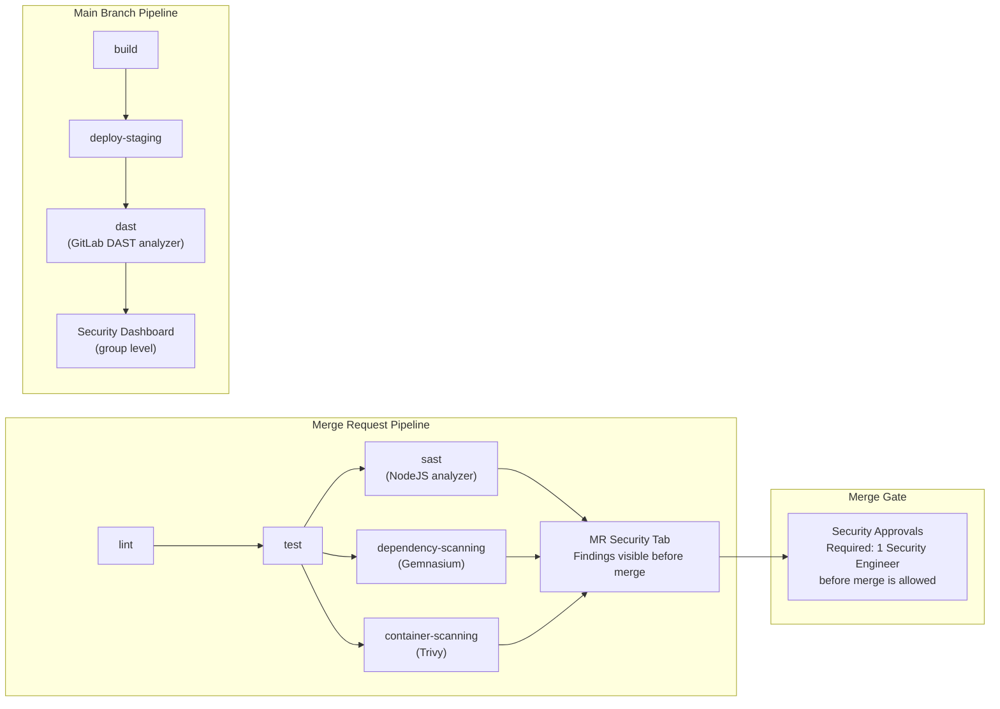

# Phase 8 — GitLab-Native Features: What Jenkins Cannot Do

> **Concepts GitLab CI introduced:** SAST, Dependency Scanning, Container Scanning, DAST, Merge Request pipelines, MR approval rules, Security Dashboard | **Cost:** GitLab Ultimate trial for SAST/DAST

---

## The problem

Lumio's security scanning setup is a graveyard of Jenkins plugin integrations. Four separate tools, four separate configurations, four separate places where results appear — and none of them talk to each other.

```
Current Lumio security stack (Jenkins):

  Plugin 1: OWASP Dependency-Check    → results in Jenkins build log + HTML report
  Plugin 2: SonarQube Scanner         → results in SonarQube server (separate login)
  Plugin 3: Anchore                   → results in Anchore Enterprise (yet another login)
  Plugin 4: OWASP ZAP                 → results in ZAP HTML report attached to build
```

The last time the OWASP Dependency-Check plugin was updated, it broke the Anchore plugin because both tried to write to the same temp directory. The ZAP scan runs against production because nobody updated the target URL when staging was moved to a new domain six months ago. SonarQube has 847 open findings nobody has looked at in three months because the dashboard requires a VPN connection and a separate account.

The security audit that came back last quarter found four medium-severity vulnerabilities in `lumio-api` that had been reported by Dependency-Check for 14 weeks. Nobody saw them because the Jenkins build was still green — the Dependency-Check plugin was configured to warn, not fail.

GitLab CI integrates security scanning natively. No plugins. No separate dashboards. Findings appear directly in the Merge Request interface, blocking merges before vulnerable code reaches main. The Security Dashboard aggregates findings across all three Lumio applications in one place, and findings can be converted to GitLab Issues with a single click.

---

## Jenkins plugins vs GitLab CI native security

| | Jenkins | GitLab CI |
|---|---|---|
| **SAST** | SonarQube plugin (separate server, separate config, separate UI) | `template: Security/SAST.gitlab-ci.yml` — 2 lines |
| **Dependency scanning** | OWASP Dependency-Check plugin (JVM-based, slow, HTML output) | `template: Security/Dependency-Scanning.gitlab-ci.yml` — 2 lines |
| **Container scanning** | Anchore plugin (requires Anchore Enterprise license + agent) | `template: Security/Container-Scanning.gitlab-ci.yml` — 2 lines |
| **DAST** | OWASP ZAP (manual config, HTML report, no MR integration) | `template: DAST.gitlab-ci.yml` — 4 lines |
| **Results location** | 4 separate dashboards, 2 require VPN, 1 requires a paid license | Single Security tab in every MR + group Security Dashboard |
| **MR blocking** | Not possible without custom scripting | Native MR approval rules |
| **Cross-project overview** | Not available | Group Security Dashboard |
| **Plugin maintenance** | 4 plugins × quarterly updates × breakage risk | Zero — maintained by GitLab |

---

## What you will build



---

## Prerequisites for this phase

- GitLab Ultimate trial activated (free 30-day trial at gitlab.com/users/sign_up)
- The `lumio-api` project from previous phases
- Staging environment accessible at `https://staging.lumio.internal` (for DAST)

---

## Challenge 1 — Enable SAST on `lumio-api`

**Goal:** Add static application security testing to `lumio-api` using GitLab's native SAST template, find a real vulnerability, and fix it.

### Step 1 — Include the SAST template

```yaml
# .gitlab-ci.yml
include:
  - template: Security/SAST.gitlab-ci.yml

stages:
  - test
  - sast
```

That is the entire configuration needed to enable SAST for a Node.js project. GitLab auto-detects the language and runs the appropriate analyzer (NodeJS-Scan for JavaScript/TypeScript).

### Step 2 — Push to a feature branch and open a Merge Request

```bash
git checkout -b feat/add-sast
git add .gitlab-ci.yml
git commit -m "ci: enable GitLab SAST"
git push origin feat/add-sast
```

Then open a Merge Request from `feat/add-sast` to `main`. The MR pipeline will run the SAST analyzer automatically.

### Step 3 — Observe findings in the MR Security tab

In the MR, click the **Security** tab. GitLab surfaces findings inline:

```
Security findings — lumio-api (SAST)

● High     Hardcoded secret detected
           File: src/config/index.js   Line 14
           Rule: node_security.hardcoded_credentials
           Message: Hardcoded JWT secret key found: 'jwt_secret_lumio_dev_2021'

● Medium   SQL injection risk
           File: src/routes/users.js   Line 87
           Rule: node_security.sql_injection
           Message: User input used directly in query string without parameterization
```

### Step 4 — Fix the hardcoded secret

```javascript
// Before (src/config/index.js, line 14)
const JWT_SECRET = 'jwt_secret_lumio_dev_2021';

// After
const JWT_SECRET = process.env.JWT_SECRET;
if (!JWT_SECRET) {
  throw new Error('JWT_SECRET environment variable is not set');
}
```

```bash
git add src/config/index.js
git commit -m "fix: remove hardcoded JWT secret, use env var"
git push origin feat/add-sast
```

### Step 5 — Verify the finding is resolved

The MR pipeline re-runs. In the Security tab, the hardcoded secret finding is marked as `Fixed in this MR`. The count drops from 2 findings to 1.

```
Security findings — lumio-api (SAST)

✓ Fixed    Hardcoded secret detected                  [fixed in this MR]
● Medium   SQL injection risk
           File: src/routes/users.js   Line 87
```

---

## Challenge 2 — Enable Dependency Scanning

**Goal:** Add dependency vulnerability scanning to `lumio-api` using GitLab's Gemnasium analyzer, and compare the findings with Trivy output from Phase 6.

### Step 1 — Add the Dependency Scanning template

```yaml
# .gitlab-ci.yml
include:
  - template: Security/SAST.gitlab-ci.yml
  - template: Security/Dependency-Scanning.gitlab-ci.yml

stages:
  - test
  - sast
```

### Step 2 — Push and check the MR Security tab

After the pipeline runs, the Security tab will show dependency findings alongside SAST findings:

```
Security findings — lumio-api (Dependency Scanning)

● Critical  Remote code execution via prototype pollution
            Package: lodash 4.17.19   CVE-2021-23337
            Fix available: upgrade to 4.17.21

● High      Regular expression denial of service
            Package: minimatch 3.0.4  CVE-2022-3517
            Fix available: upgrade to 3.0.5 (via npm audit fix)

● Medium    Path traversal in tar
            Package: tar 6.1.11       CVE-2021-37701
            Fix available: upgrade to 6.1.13
```

### Step 3 — Compare with Phase 6 Trivy output

In Phase 6, Trivy scanned the Docker image. Gemnasium scans `package-lock.json` directly. Pull up the Phase 6 Trivy scan result and compare:

```
Phase 6 — Trivy (container scan):
  lodash 4.17.19 CVE-2021-23337          ✓ found
  minimatch 3.0.4 CVE-2022-3517         ✓ found
  tar 6.1.11 CVE-2021-37701             ✓ found
  openssl 3.0.2-0ubuntu1.6 CVE-2023-...  found (OS-level — not visible to Gemnasium)

Phase 8 — Gemnasium (dependency scan):
  lodash 4.17.19 CVE-2021-23337          ✓ found
  minimatch 3.0.4 CVE-2022-3517         ✓ found
  tar 6.1.11 CVE-2021-37701             ✓ found
  node_modules/express CVE-2024-43796   found (new — not in Docker image layers)
```

Gemnasium catches application-level CVEs from `package-lock.json` earlier — before the Docker image is even built. Both scanners complement each other.

### Step 4 — Fix the critical vulnerability

```bash
cd lumio-app/api
npm install lodash@4.17.21 minimatch@3.0.5 tar@6.1.13
npm audit fix
git add package.json package-lock.json
git commit -m "fix: upgrade vulnerable dependencies (lodash, minimatch, tar)"
git push origin feat/add-sast
```

The MR Security tab updates and marks all three findings as `Fixed in this MR`.

---

## Challenge 3 — Configure Merge Request pipelines

**Goal:** Separate MR pipelines (lint/test/security scan) from main branch pipelines (deploy), so security gates run before code merges but deployment only happens after merge.

### Step 1 — Understand the two pipeline sources

GitLab has distinct pipeline triggers controlled by `$CI_PIPELINE_SOURCE`:

| Trigger | `$CI_PIPELINE_SOURCE` value | When it runs |
|---|---|---|
| Push to a branch | `push` | Every `git push` |
| Merge Request opened or updated | `merge_request_event` | When a MR is created or a new commit is pushed to the source branch |
| Pipeline schedule | `schedule` | Cron-based |
| Manual trigger | `web` | Triggered from the UI |

### Step 2 — Refactor `.gitlab-ci.yml` with proper rules

```yaml
include:
  - template: Security/SAST.gitlab-ci.yml
  - template: Security/Dependency-Scanning.gitlab-ci.yml

stages:
  - lint
  - test
  - security
  - build
  - deploy-staging
  - deploy-production

# ---- Jobs that run ONLY on Merge Requests ----

lint:
  stage: lint
  image: node:20-alpine
  script:
    - npm ci --prefix lumio-app/api
    - npm run lint --prefix lumio-app/api
  rules:
    - if: $CI_PIPELINE_SOURCE == "merge_request_event"

test-unit:
  stage: test
  image: node:20-alpine
  script:
    - npm ci --prefix lumio-app/api
    - npm test --prefix lumio-app/api
  artifacts:
    reports:
      junit: lumio-app/api/test-results.xml
    coverage_report:
      coverage_format: cobertura
      path: lumio-app/api/coverage/cobertura-coverage.xml
  rules:
    - if: $CI_PIPELINE_SOURCE == "merge_request_event"
    - if: $CI_COMMIT_BRANCH == "main"

# SAST and Dependency Scanning inherit rules from the included templates.
# They run on MR pipelines by default.

# ---- Jobs that run ONLY on main (after merge) ----

build:
  stage: build
  image: docker:24
  services:
    - docker:24-dind
  script:
    - docker build -t $APP_IMAGE ./lumio-app/api
    - docker push $APP_IMAGE
  rules:
    - if: $CI_COMMIT_BRANCH == "main"

deploy-staging:
  stage: deploy-staging
  image: bitnami/kubectl:1.29
  environment:
    name: staging
    url: https://staging.lumio.internal
  script:
    - kubectl config use-context $KUBE_CONTEXT_STAGING
    - kubectl set image deployment/lumio-api lumio-api=$APP_IMAGE -n lumio-staging
    - kubectl rollout status deployment/lumio-api -n lumio-staging
  rules:
    - if: $CI_COMMIT_BRANCH == "main"
```

### Step 3 — Observe the two pipeline types

After pushing to a feature branch and opening a MR:

```
MR Pipeline #1861 — source: merge_request_event
  ● lint           ✓ passed    0m 28s
  ● test-unit      ✓ passed    1m 47s
  ● nodejs-scan    ✓ passed    2m 03s   (SAST)
  ● gemnasium-...  ✓ passed    1m 22s   (Dependency Scanning)
  — build          skipped    (rules: main only)
  — deploy-staging skipped    (rules: main only)
```

After the MR is merged to main:

```
Branch Pipeline #1862 — source: push (main)
  — lint           skipped    (rules: MR only)
  ● test-unit      ✓ passed    1m 47s
  ● build          ✓ passed    2m 14s
  ● deploy-staging ✓ passed    1m 04s
```

### Step 4 — Confirm the MR shows pipeline status inline

In the MR interface, GitLab shows the pipeline status as a checkmark before the merge button:

```
Merge Request: feat/add-sast → main

✓ Pipeline passed  (4 jobs)
✓ Security scan: 0 new findings
✓ All discussions resolved
✓ Approved by: Sara Chen

[ Merge ]
```

---

## Challenge 4 — Configure MR Approval Rules

**Goal:** Require approval from a Security Engineer before any MR with security findings can be merged, enforcing that vulnerabilities are reviewed before they reach main.

### Step 1 — Create a Security Engineer group (or use existing)

In your GitLab group (`lumio`), create a user group:

```
Group: lumio/security-engineers
Members: sara.chen@lumio.io, marcus.okafor@lumio.io
Role: Developer (minimum to review MRs)
```

### Step 2 — Configure Security Approvals in project settings

Navigate to **Settings > Merge requests > Approval rules**. Click **Add approval rule**:

```
Rule name:         Security findings approval
Approvals required: 1
Eligible approvers: lumio/security-engineers (group)
```

Click **Save changes**.

### Step 3 — Enable "Security Approvals" (GitLab Ultimate)

Navigate to **Security & Compliance > Policies** and create a new **Scan result policy**:

```yaml
# scan-result-policy.yml (stored in a separate compliance project)
type: scan_result_policy
name: Require security review for critical findings
description: Block merge if SAST or dependency scan finds critical/high vulnerabilities
enabled: true
rules:
  - type: scan_finding
    branches:
      - main
    scanners:
      - sast
      - dependency_scanning
    vulnerabilities_allowed: 0
    severity_levels:
      - critical
      - high
    vulnerability_states:
      - newly_detected
actions:
  - type: require_approval
    approvals_required: 1
    user_approvers_ids:
      - 42   # sara.chen user ID
      - 87   # marcus.okafor user ID
```

### Step 4 — Test with an intentional vulnerability

Create a branch that introduces a deliberately vulnerable code pattern:

```bash
git checkout -b test/security-gate-demo

# Add a hardcoded token to trigger SAST
cat >> lumio-app/api/src/utils/demo-vuln.js << 'EOF'
// DO NOT MERGE — security gate demonstration only
const ADMIN_TOKEN = 'lumio-admin-token-hardcoded-for-demo-xK9mP2';
module.exports = { ADMIN_TOKEN };
EOF

git add lumio-app/api/src/utils/demo-vuln.js
git commit -m "test: demo vuln for security gate validation — DO NOT MERGE"
git push origin test/security-gate-demo
```

Open a MR from `test/security-gate-demo` to `main`. After the pipeline runs, the MR shows:

```
⚠ Merge blocked — security approval required

Security findings in this MR:
  ● High   Hardcoded credential   src/utils/demo-vuln.js:2

Required approvals (0 / 1):
  Security findings approval:   ○ pending   (lumio/security-engineers)

A member of lumio/security-engineers must approve before this MR can be merged.
```

Attempting to merge without approval returns:

```
403 Forbidden
This merge request requires approval from the security-engineers group
before it can be merged.
```

### Step 5 — Approve as a Security Engineer and observe the gate lift

Log in as `sara.chen` and click **Approve**:

```
Required approvals (1 / 1):
  Security findings approval:   ✓ Sara Chen   2026-04-22 17:04 UTC

[ Merge ]  (now enabled)
```

---

## Challenge 5 — Activate DAST

**Goal:** Run dynamic application security testing against the Lumio staging instance after each deployment to main.

### Step 1 — Add the DAST template

```yaml
# .gitlab-ci.yml (add to the include section and stages)
include:
  - template: Security/SAST.gitlab-ci.yml
  - template: Security/Dependency-Scanning.gitlab-ci.yml
  - template: DAST.gitlab-ci.yml

stages:
  - lint
  - test
  - security
  - build
  - deploy-staging
  - dast
  - deploy-production
```

### Step 2 — Configure the DAST job

```yaml
dast:
  stage: dast
  variables:
    DAST_WEBSITE: "https://staging.lumio.internal"
    DAST_FULL_SCAN_ENABLED: "false"         # passive scan only for speed
    DAST_BROWSER_SCAN: "true"              # use browser-based scan
    DAST_CRAWL_TIMEOUT: "3m"
    DAST_AUTH_URL: "https://staging.lumio.internal/auth/login"
    DAST_USERNAME: "$DAST_TEST_USER"        # CI/CD variable (masked)
    DAST_PASSWORD: "$DAST_TEST_PASSWORD"    # CI/CD variable (masked)
    DAST_USERNAME_FIELD: "email"
    DAST_PASSWORD_FIELD: "password"
  needs: ["deploy-staging"]
  rules:
    - if: $CI_COMMIT_BRANCH == "main"
  environment:
    name: staging
```

### Step 3 — Push to main and observe the DAST scan

After deploy-staging completes, the DAST job runs the browser-based scanner against `https://staging.lumio.internal`:

```
dast   ✓ passed   7m 43s

Scanning: https://staging.lumio.internal
Pages crawled: 34
Requests made: 412
Active tests run: 0 (passive scan mode)

Findings:
  ● Medium   Cookie without Secure flag
             URL: https://staging.lumio.internal/
             Evidence: Set-Cookie: session=...; HttpOnly (Secure flag missing)

  ● Low      Server version disclosure
             URL: https://staging.lumio.internal/api/health
             Evidence: X-Powered-By: Express
```

### Step 4 — Review DAST findings in the pipeline

Navigate to the main pipeline view and click the **Security** tab. DAST findings appear alongside SAST and dependency scan findings:

```
Security findings — Pipeline #1864

Source        Severity   Finding
SAST          —          No findings
Dep. Scanning —          No findings
DAST          Medium     Cookie without Secure flag
DAST          Low        Server version disclosure
```

### Step 5 — Fix the medium finding

```javascript
// lumio-app/api/src/app.js — add Secure flag to session cookie
app.use(session({
  secret: process.env.SESSION_SECRET,
  resave: false,
  saveUninitialized: false,
  cookie: {
    secure: process.env.NODE_ENV === 'production',  // was: missing
    httpOnly: true,
    sameSite: 'strict'
  }
}));
```

```bash
git add lumio-app/api/src/app.js
git commit -m "fix: add Secure flag to session cookie"
git push origin main
```

The DAST scan on the next main pipeline run will mark the finding as resolved.

---

## Challenge 6 — Configure the Group Security Dashboard

**Goal:** Aggregate security findings from all three Lumio projects (`lumio-api`, `lumio-frontend`, `lumio-worker`) into a single group-level Security Dashboard, and create GitLab Issues from open findings.

### Step 1 — Ensure all three projects have security scanning enabled

```yaml
# lumio-frontend/.gitlab-ci.yml
include:
  - template: Security/SAST.gitlab-ci.yml
  - template: Security/Dependency-Scanning.gitlab-ci.yml

# lumio-worker/.gitlab-ci.yml
include:
  - template: Security/SAST.gitlab-ci.yml
  - template: Security/Dependency-Scanning.gitlab-ci.yml
  - template: Security/Container-Scanning.gitlab-ci.yml
```

Push the updated `.gitlab-ci.yml` files to each project's main branch and let the pipelines run.

### Step 2 — Access the Group Security Dashboard

Navigate to your GitLab group (`lumio`) and click **Security > Security Dashboard**:

```
Group Security Dashboard — lumio

Vulnerability count by severity (last 30 days):
  ██████████ Critical   2
  ████████████████ High   8
  ████████████████████████ Medium   14
  ████ Low   4

By project:
  lumio-api       ■ 0 Critical  ■ 3 High   ■ 7 Medium
  lumio-frontend  ■ 1 Critical  ■ 4 High   ■ 5 Medium
  lumio-worker    ■ 1 Critical  ■ 1 High   ■ 2 Medium
```

### Step 3 — Filter and sort findings

Use the filter bar to isolate critical findings:

```
Filter: Severity = Critical   Status = Detected

Results (2):

1. Remote code execution via prototype pollution
   Package: lodash 4.17.19   CVE-2021-23337
   Project: lumio-frontend
   Detected: 2026-04-20   Age: 2 days

2. Critical deserialization vulnerability
   Package: serialize-javascript 2.1.1   CVE-2020-7660
   Project: lumio-worker
   Detected: 2026-04-19   Age: 3 days
```

### Step 4 — Create a GitLab Issue from a finding

Click on the lodash finding and then **Create issue**:

```
Issue created automatically:

Title: [Security] Remote code execution via prototype pollution in lodash 4.17.19 (lumio-frontend)
Assignee: sara.chen
Labels: security, critical, dependency-scanning
Description:
  CVE-2021-23337 — CVSS 7.2 (High)
  Package: lodash 4.17.19
  Fix available: upgrade to 4.17.21

  Detected by: GitLab Dependency Scanning
  Pipeline: #1863
  Project: lumio/lumio-frontend

  ## Remediation steps
  Run `npm install lodash@4.17.21` and commit the updated package-lock.json.
```

### Step 5 — Observe the finding status update when fixed

When the fix is merged to main and the scanner re-runs, the Security Dashboard automatically updates the finding status:

```
1. Remote code execution via prototype pollution
   Status: ✓ Resolved   Fixed in: MR !47   2026-04-22
```

---

## Outcome

After completing this phase, Lumio has replaced four Jenkins plugins with zero-configuration GitLab-native security scanning:

| Old Jenkins setup | GitLab CI replacement |
|---|---|
| SonarQube Scanner plugin + SonarQube server | `include: template: Security/SAST.gitlab-ci.yml` |
| OWASP Dependency-Check plugin | `include: template: Security/Dependency-Scanning.gitlab-ci.yml` |
| Anchore plugin + Anchore Enterprise | `include: template: Security/Container-Scanning.gitlab-ci.yml` |
| OWASP ZAP plugin (misconfigured, targeting prod) | `include: template: DAST.gitlab-ci.yml` with `DAST_WEBSITE: staging URL` |
| 4 separate dashboards, 2 requiring VPN | Single Security tab in every MR + group Security Dashboard |
| No merge blocking | MR approval rules + scan result policies |
| No cross-project view | Group Security Dashboard with drill-down |

Security findings are now visible to developers in the Merge Request interface — before code reaches main, before a Docker image is pushed, and before anything touches a real environment. The security team has one dashboard instead of four. Plugin maintenance is eliminated. The Jenkins build that was green while 14-week-old CVEs sat unreviewed is a problem that can no longer happen.

---

[Back to main README](../README.md) | [Previous: Phase 7 — Environments and Deployment Gates](../phase-7-environments/README.md) | [Next: Phase 9 — GitLab Runners](../phase-9-runners/README.md)
