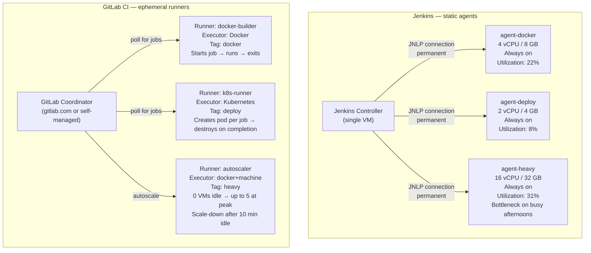

# Phase 9 — GitLab Runners: Replacing Jenkins Agents

> **Concepts GitLab CI introduced:** Runner types (shared, group, project), Executors (shell, Docker, Kubernetes), Runner autoscaling, Runner tags | **Cost:** $0 if self-hosted

---

## The problem

Lumio runs three Jenkins agents as permanently-on virtual machines. They were provisioned three years ago, sized for peak load, and have been running continuously ever since:

```
Jenkins agents (always on, always billed):

  agent-docker   — 4 vCPU, 8 GB RAM     Docker builds + ECR push
  agent-deploy   — 2 vCPU, 4 GB RAM     kubectl deploys to staging and production
  agent-heavy    — 16 vCPU, 32 GB RAM   Integration tests, E2E, load tests
```

A utilization audit from last month showed that `agent-docker` is busy 22% of the time. `agent-deploy` is busy 8% of the time. `agent-heavy` is busy 31% of the time — but when it is busy, jobs queue behind it because there is only one. The 16-core machine sits idle 69% of the time paying for compute that no pipeline is using.

When three engineers push to `main` within five minutes of each other (a normal occurrence during the afternoon sprint), `agent-heavy` becomes the bottleneck. Integration tests start queuing. Engineers wait. The one agent that should be the fastest becomes the one that introduces the most delay.

The ops engineer who manages these agents allocates roughly six hours per month to agent maintenance: OS patches, Docker version upgrades, disk cleanup, Jenkins agent JAR updates. It is not complex work, but it is toil that disappears completely when you move to ephemeral runners.

GitLab Runners solve this differently. Instead of three static agents, you define runner configurations and let them scale. A Kubernetes executor creates an ephemeral pod for each job and destroys it when the job finishes. An autoscaling configuration spins up VMs when the queue grows and terminates them when it empties. You pay for compute when jobs are actually running, not 24 hours a day.

---

## Jenkins agents vs GitLab Runners



---

## Challenge 1 — Install a GitLab Runner with Docker executor

**Goal:** Install a local GitLab Runner, register it against your `lumio-api` project, and run a CI job through it to confirm it works.

### Step 1 — Start a GitLab Runner container

```bash
# Create a persistent config volume
docker volume create gitlab-runner-config

# Start the runner container
docker run -d \
  --name gitlab-runner \
  --restart always \
  -v gitlab-runner-config:/etc/gitlab-runner \
  -v /var/run/docker.sock:/var/run/docker.sock \
  gitlab/gitlab-runner:latest
```

Expected output:
```
Unable to find image 'gitlab/gitlab-runner:latest' locally
latest: Pulling from gitlab/gitlab-runner
...
Status: Downloaded newer image for gitlab/gitlab-runner:latest
a3f7c2d1e8b9...
```

### Step 2 — Get the registration token from GitLab

Navigate to your `lumio-api` project: **Settings > CI/CD > Runners**. Under "New project runner", click **Create runner** and note:
- **GitLab URL:** `https://gitlab.com` (or your self-managed URL)
- **Runner authentication token:** `glrt-xxxxxxxxxxxxxxxxxxxx`

### Step 3 — Register the runner

```bash
docker exec -it gitlab-runner gitlab-runner register \
  --non-interactive \
  --url "https://gitlab.com" \
  --token "glrt-xxxxxxxxxxxxxxxxxxxx" \
  --executor "docker" \
  --docker-image "alpine:latest" \
  --description "lumio-local-docker-runner" \
  --tag-list "docker,local" \
  --run-untagged "false" \
  --locked "false"
```

Expected output:
```
Runtime platform                                    arch=amd64 os=linux pid=7 revision=853330f9 version=17.10.1
Running in system-mode.

Verifying runner... is valid                        runner=glrt-xxxx
Runner registered successfully. Feel free to start it, but if it's running already the config should be automatically reloaded!

Configuration (with the authentication token) was saved in "/etc/gitlab-runner/config.toml"
```

### Step 4 — Inspect the generated `config.toml`

```bash
docker exec gitlab-runner cat /etc/gitlab-runner/config.toml
```

Expected output:
```toml
concurrent = 1
check_interval = 0
shutdown_timeout = 0

[session_server]
  session_timeout = 1800

[[runners]]
  name = "lumio-local-docker-runner"
  url = "https://gitlab.com"
  id = 28471
  token = "glrt-xxxxxxxxxxxxxxxxxxxx"
  token_obtained_at = 2026-04-22T14:00:00Z
  token_expires_at = 0001-01-01T00:00:00Z
  executor = "docker"
  [runners.custom_build_dir]
  [runners.cache]
    MaxUploadedArchiveSize = 0
  [runners.docker]
    tls_verify = false
    image = "alpine:latest"
    privileged = false
    disable_entrypoint_overwrite = false
    oom_kill_disable = false
    disable_cache = false
    volumes = ["/cache"]
    shm_size = 0
    network_mtu = 0
```

### Step 5 — Verify the runner appears in GitLab

In **Settings > CI/CD > Runners**, under "Assigned project runners":

```
Runners assigned to this project

● lumio-local-docker-runner   #28471   last contact: just now
  Tags: docker, local
  Executor: docker
  Version: 17.10.1
  IP: 192.168.1.45
```

### Step 6 — Trigger a job and confirm it runs on your local runner

```bash
git commit --allow-empty -m "ci: trigger pipeline to test local runner"
git push origin main
```

In the pipeline view, click on a job and look at the runner assignment:

```
Running with gitlab-runner 17.10.1 (853330f9)
  on lumio-local-docker-runner xxxx (Executor: docker, Runner: #28471)
Preparing the "docker" executor
00:03
Using Docker executor with image node:20-alpine ...
Pulling docker image node:20-alpine ...
```

---

## Challenge 2 — Configure runner tags

**Goal:** Create runners with specific tags to route build jobs to `agent-docker` equivalents and deploy jobs to `agent-deploy` equivalents, mirroring Lumio's Jenkins agent specialization.

### Step 1 — Register a second runner with a `deploy` tag

```bash
docker run -d \
  --name gitlab-runner-deploy \
  --restart always \
  -v gitlab-runner-deploy-config:/etc/gitlab-runner \
  -v /var/run/docker.sock:/var/run/docker.sock \
  gitlab/gitlab-runner:latest

docker exec -it gitlab-runner-deploy gitlab-runner register \
  --non-interactive \
  --url "https://gitlab.com" \
  --token "glrt-yyyyyyyyyyyyyyyyyyyy" \
  --executor "docker" \
  --docker-image "bitnami/kubectl:1.29" \
  --description "lumio-deploy-runner" \
  --tag-list "deploy,kubernetes" \
  --run-untagged "false" \
  --locked "false"
```

### Step 2 — Assign tags to jobs in `.gitlab-ci.yml`

```yaml
build:
  stage: build
  image: docker:24
  tags:
    - docker          # runs on the docker-tagged runner only
  services:
    - docker:24-dind
  script:
    - docker build -t $APP_IMAGE ./lumio-app/api
    - docker push $APP_IMAGE
  rules:
    - if: $CI_COMMIT_BRANCH == "main"

deploy-staging:
  stage: deploy-staging
  image: bitnami/kubectl:1.29
  tags:
    - deploy          # runs on the deploy-tagged runner only
  environment:
    name: staging
    url: https://staging.lumio.internal
  script:
    - kubectl config use-context $KUBE_CONTEXT_STAGING
    - kubectl set image deployment/lumio-api lumio-api=$APP_IMAGE -n lumio-staging
  rules:
    - if: $CI_COMMIT_BRANCH == "main"
```

### Step 3 — Verify tag-based routing

Push a commit to main. In the pipeline view:

```
build          Runner: lumio-local-docker-runner (#28471, tags: docker, local)
deploy-staging Runner: lumio-deploy-runner (#28472, tags: deploy, kubernetes)
```

### Step 4 — Confirm a job with an unmatched tag stays pending

Create a test job with a non-existent tag:

```yaml
test-tag-routing:
  stage: test
  tags:
    - nonexistent-tag
  script:
    - echo "This should stay pending"
  rules:
    - if: $CI_COMMIT_BRANCH == "feat/tag-test"
```

Push to `feat/tag-test` and observe:

```
test-tag-routing   ⏳ pending   (stuck)

This job is stuck because no runners are online and available,
or no runners match all of the job's tags: nonexistent-tag.

Check your runners' tag configuration in Settings > CI/CD > Runners.
```

---

## Challenge 3 — Configure the Kubernetes executor

**Goal:** Install GitLab Runner on Lumio's `staging-cluster` Kubernetes cluster using Helm, replacing the need for a dedicated `agent-deploy` VM.

### Step 1 — Add the GitLab Helm repository

```bash
helm repo add gitlab https://charts.gitlab.io
helm repo update
```

Expected output:
```
"gitlab" has been added to your repositories
Hang tight while we grab the latest from your chart repositories...
...Successfully got an update from the "gitlab" chart repository
Update Complete. ⎈Happy Helming!⎈
```

### Step 2 — Create a `values.yaml` for the runner

```yaml
# gitlab/runners/helm/values.yaml
gitlabUrl: "https://gitlab.com"
runnerToken: "glrt-zzzzzzzzzzzzzzzzzzzz"

rbac:
  create: true

runners:
  config: |
    [[runners]]
      name = "lumio-k8s-runner"
      executor = "kubernetes"
      [runners.kubernetes]
        namespace = "gitlab-runner"
        image = "alpine:latest"
        privileged = false
        cpu_request = "100m"
        memory_request = "128Mi"
        cpu_limit = "500m"
        memory_limit = "512Mi"
        service_cpu_request = "100m"
        service_cpu_limit = "500m"
        service_memory_request = "128Mi"
        service_memory_limit = "256Mi"
        [runners.kubernetes.node_selector]
          "kubernetes.io/os" = "linux"
      [runners.cache]
        Type = "s3"
        Path = "gitlab-runner-cache"
        Shared = true
        [runners.cache.s3]
          ServerAddress = "minio.lumio.internal:9000"
          BucketName = "lumio-ci-cache"
          BucketLocation = "us-east-1"
          Insecure = false

tags: "kubernetes,deploy,k8s"
```

### Step 3 — Install the runner chart

```bash
kubectl create namespace gitlab-runner

helm install gitlab-runner gitlab/gitlab-runner \
  --namespace gitlab-runner \
  --values gitlab/runners/helm/values.yaml
```

Expected output:
```
NAME: gitlab-runner
LAST DEPLOYED: Tue Apr 22 14:00:00 2026
NAMESPACE: gitlab-runner
STATUS: deployed
REVISION: 1
TEST SUITE: None
NOTES:
Your GitLab Runner should now be registered against the GitLab instance
accessible at "https://gitlab.com"
```

### Step 4 — Verify the runner pods

```bash
kubectl get pods -n gitlab-runner
```

Expected output:
```
NAME                             READY   STATUS    RESTARTS   AGE
gitlab-runner-7d9f8b6c4-x2k9p   1/1     Running   0          47s
```

### Step 5 — Watch a job create an ephemeral pod

Trigger a pipeline and then watch the `gitlab-runner` namespace:

```bash
kubectl get pods -n gitlab-runner --watch
```

During a job run:
```
NAME                             READY   STATUS              RESTARTS   AGE
gitlab-runner-7d9f8b6c4-x2k9p   1/1     Running             0          2m
runner-zzzzzzzz-project-42-...   0/1     ContainerCreating   0          2s
runner-zzzzzzzz-project-42-...   1/1     Running             0          4s
runner-zzzzzzzz-project-42-...   0/1     Terminating         0          1m47s
```

The pod is created when the job starts and destroyed when it finishes. There is no persistent agent process. Each job gets a clean environment with no residue from previous runs.

---

## Challenge 4 — Configure distributed caching with S3/MinIO

**Goal:** Set up a shared cache bucket so all runners reuse `node_modules` and npm artifacts across jobs, measuring the build time reduction.

### Step 1 — Start MinIO locally (for local lab; use S3 in production)

```bash
docker run -d \
  --name minio \
  -p 9000:9000 \
  -p 9001:9001 \
  -e MINIO_ROOT_USER=lumio-ci \
  -e MINIO_ROOT_PASSWORD=lumio-ci-secret \
  -v minio-data:/data \
  minio/minio server /data --console-address ":9001"

# Create the cache bucket
docker exec minio mc alias set local http://localhost:9000 lumio-ci lumio-ci-secret
docker exec minio mc mb local/lumio-ci-cache
```

### Step 2 — Configure runner cache in `config.toml`

```bash
docker exec -it gitlab-runner vi /etc/gitlab-runner/config.toml
```

```toml
concurrent = 4
check_interval = 0

[[runners]]
  name = "lumio-local-docker-runner"
  url = "https://gitlab.com"
  token = "glrt-xxxxxxxxxxxxxxxxxxxx"
  executor = "docker"
  [runners.docker]
    tls_verify = false
    image = "alpine:latest"
    privileged = false
    volumes = ["/cache"]
  [runners.cache]
    Type = "s3"
    Path = "runner-cache"
    Shared = true
    [runners.cache.s3]
      ServerAddress = "host.docker.internal:9000"   # MinIO address from inside Docker
      AccessKey = "lumio-ci"
      SecretKey = "lumio-ci-secret"
      BucketName = "lumio-ci-cache"
      Insecure = true   # for local MinIO without TLS
```

### Step 3 — Enable caching in `.gitlab-ci.yml`

```yaml
test-unit:
  stage: test
  image: node:20-alpine
  tags:
    - docker
  cache:
    key:
      files:
        - lumio-app/api/package-lock.json
    paths:
      - lumio-app/api/node_modules/
    policy: pull-push
  script:
    - npm ci --prefix lumio-app/api
    - npm test --prefix lumio-app/api
```

### Step 4 — Measure the cache effectiveness

Run two consecutive pipelines and compare `npm ci` durations:

**First run (cache miss):**
```
$ npm ci --prefix lumio-app/api
npm warn reify lumio-api No description field
added 847 packages in 43s

Uploaded cache to S3: runner-cache/node:20-alpine-abc123.zip (148 MB)
Job succeeded    Duration: 2m 31s
```

**Second run (cache hit):**
```
Downloading cache from S3: runner-cache/node:20-alpine-abc123.zip (148 MB)
Extracted cache in 4.2s

$ npm ci --prefix lumio-app/api
npm warn reify lumio-api No description field
added 847 packages in 3s   (from cache)

Job succeeded    Duration: 0m 48s
```

Improvement: 43 seconds → 3 seconds for `npm ci`. Total job time: 2m 31s → 48s. **68% reduction.**

---

## Challenge 5 — Runner autoscaling

**Goal:** Replace Lumio's static `agent-heavy` (16-core VM always on) with an autoscaling runner configuration that creates VMs on demand and terminates them when idle.

### Step 1 — Install `gitlab-runner-autoscaler` (fleeting plugin)

GitLab's modern autoscaling approach uses the `fleeting` plugin architecture. For AWS:

```bash
# On the runner manager VM
gitlab-runner fleeting install
```

### Step 2 — Configure the autoscaling runner

```toml
# /etc/gitlab-runner/config.toml on the runner manager

concurrent = 20   # maximum total jobs across all VMs

[[runners]]
  name = "lumio-heavy-autoscaler"
  url = "https://gitlab.com"
  token = "glrt-wwwwwwwwwwwwwwwwwwww"
  executor = "docker-autoscaler"

  [runners.autoscaler]
    plugin = "fleeting-plugin-aws"
    capacity_per_instance = 1
    max_instances = 5
    min_instances = 0

    [runners.autoscaler.plugin_config]
      name            = "lumio-runner-asg"
      region          = "us-east-1"

    [runners.autoscaler.connector_config]
      username          = "ec2-user"
      use_external_addr = true

  [runners.docker]
    image = "node:20-alpine"

  [runners.cache]
    Type = "s3"
    Shared = true
    [runners.cache.s3]
      ServerAddress   = "s3.amazonaws.com"
      BucketName      = "lumio-runner-cache-prod"
      BucketLocation  = "us-east-1"
```

### Step 3 — Configure the AWS Auto Scaling Group

```bash
# Create a launch template for runner instances
aws ec2 create-launch-template \
  --launch-template-name lumio-runner-template \
  --launch-template-data '{
    "ImageId": "ami-0c55b159cbfafe1f0",
    "InstanceType": "c5.4xlarge",
    "IamInstanceProfile": {"Name": "GitLabRunnerInstanceProfile"},
    "UserData": "'"$(base64 -w0 runner-init.sh)"'"
  }'

# Create the Auto Scaling Group
aws autoscaling create-auto-scaling-group \
  --auto-scaling-group-name lumio-runner-asg \
  --launch-template LaunchTemplateName=lumio-runner-template,Version='$Latest' \
  --min-size 0 \
  --max-size 5 \
  --desired-capacity 0 \
  --vpc-zone-identifier "subnet-abc123,subnet-def456"
```

### Step 4 — Observe scale-up behavior under load

Push five commits in quick succession from different feature branches:

```bash
for i in {1..5}; do
  git checkout -b feat/load-test-$i
  git commit --allow-empty -m "ci: autoscaling load test $i"
  git push origin feat/load-test-$i
done
```

Watch the Auto Scaling Group:

```bash
watch -n 5 aws autoscaling describe-auto-scaling-groups \
  --auto-scaling-group-names lumio-runner-asg \
  --query 'AutoScalingGroups[0].{Desired:DesiredCapacity,InService:Instances[?LifecycleState==`InService`]|length(@),Pending:Instances[?LifecycleState==`Pending`]|length(@)}'
```

```
t+00  { "Desired": 0, "InService": 0, "Pending": 0 }
t+30  { "Desired": 3, "InService": 0, "Pending": 3 }   # scale-up triggered
t+90  { "Desired": 3, "InService": 3, "Pending": 0 }   # VMs ready
t+14m { "Desired": 0, "InService": 0, "Pending": 0 }   # idle timeout, scale to zero
```

### Step 5 — Compare costs

```
Lumio's current setup — agent-heavy (always on):
  Instance: c5.4xlarge (16 vCPU, 32 GB)
  On-demand price: $0.68/hour
  Monthly cost: $0.68 × 24 × 30 = $489.60/month
  Utilization: 31% — effective cost per used hour: $2.19

Autoscaling runner setup:
  Billing: only when instances are running
  Average daily job hours (from GitLab analytics): 4.2h/day
  Monthly compute: 4.2h × 30 days × $0.68 = $85.68/month
  Saving: $489.60 - $85.68 = $403.92/month (82% reduction)
```

---

## Challenge 6 — Runner security audit

**Goal:** Lock down the production deploy runner so only protected branches can use it, configure resource limits to prevent abuse, and verify the configuration.

### Step 1 — Mark the deploy runner as protected

Navigate to **Settings > CI/CD > Runners** and click on the `lumio-deploy-runner`. Enable:

```
✓ Protected — This runner will only run on pipelines triggered for protected branches and protected tags
```

Or via the API:

```bash
curl --request PUT \
  --header "PRIVATE-TOKEN: $PRIVATE_TOKEN" \
  --url "https://gitlab.com/api/v4/runners/28472" \
  --form "protected=true"
```

Expected response:
```json
{
  "id": 28472,
  "description": "lumio-deploy-runner",
  "active": true,
  "protected": true,
  "is_shared": false,
  "tag_list": ["deploy", "kubernetes"]
}
```

### Step 2 — Lock the runner to the project

```bash
curl --request PUT \
  --header "PRIVATE-TOKEN: $PRIVATE_TOKEN" \
  --url "https://gitlab.com/api/v4/runners/28472" \
  --form "locked=true"
```

A locked runner cannot be assigned to other projects. This prevents a compromised project from hijacking the production deploy runner.

### Step 3 — Configure resource limits in `config.toml`

```toml
[[runners]]
  name = "lumio-deploy-runner"
  url = "https://gitlab.com"
  token = "glrt-yyyyyyyyyyyyyyyyyyyy"
  executor = "docker"
  output_limit = 4096       # KB — max job log size, prevents runaway output
  maximum_timeout = 1800    # seconds — 30 min max per job
  [runners.docker]
    image = "bitnami/kubectl:1.29"
    privileged = false
    disable_cache = false
    volumes = ["/cache"]
    memory = "512m"           # hard memory limit per container
    cpus = "0.5"              # hard CPU limit per container
    network_mode = "bridge"
    security_opt = ["no-new-privileges"]
```

### Step 4 — Verify a non-protected branch cannot use the runner

Create a feature branch and add a job with the `deploy` tag:

```yaml
# Only on a feature branch — not protected
test-runner-protection:
  stage: deploy-staging
  tags:
    - deploy
  script:
    - echo "This should not run on an unprotected branch"
```

Push from a non-protected branch:

```bash
git checkout -b feat/runner-protection-test
git push origin feat/runner-protection-test
```

Expected pipeline result:

```
test-runner-protection   ⏳ pending   (stuck)

This job is stuck because the runner (#28472 lumio-deploy-runner) is
configured to run only on protected branches, but this pipeline was
triggered on an unprotected branch: feat/runner-protection-test.

To use this runner, merge to a protected branch (main, release/*).
```

### Step 5 — Verify the same job runs on `main`

```bash
git checkout main
git merge feat/runner-protection-test
git push origin main
```

The equivalent deploy job on `main` picks up the protected runner and runs successfully.

---

## Outcome

Lumio's three static Jenkins agents are replaced by purpose-built GitLab Runners:

| Jenkins agent | Equivalent GitLab Runner | Executor | Tags | Monthly cost |
|---|---|---|---|---|
| `agent-docker` — 4 vCPU, always on ($95/mo) | `lumio-local-docker-runner` | Docker | `docker` | $0 (local) or ~$19/mo (autoscaled c5.xlarge) |
| `agent-deploy` — 2 vCPU, always on ($47/mo) | `lumio-k8s-runner` (Helm on staging-cluster) | Kubernetes | `deploy`, `k8s` | $0 (uses existing cluster capacity) |
| `agent-heavy` — 16 vCPU, always on ($490/mo) | `lumio-heavy-autoscaler` | docker-autoscaler | `heavy` | ~$86/mo (4.2h/day average) |
| **Total** | | | | **$105/mo vs $632/mo — 83% reduction** |

Beyond cost, the operational model changes fundamentally. Jenkins agents accumulate state: leftover Docker images, old `node_modules` directories, Jenkins agent JAR files that drift out of sync. GitLab Runner's Docker and Kubernetes executors create a clean environment for every job. There is no agent state to clean up, no disk to monitor, no JNLP connection to troubleshoot when an agent silently disconnects.

The six hours per month Lumio's ops engineer spent on agent maintenance drops to zero.

---

[Back to main README](../README.md) | [Previous: Phase 8 — GitLab-Native Features](../phase-8-gitlab-native/README.md) | [Next: Phase 10 — GitOps and Infrastructure](../phase-10-gitops/README.md)
